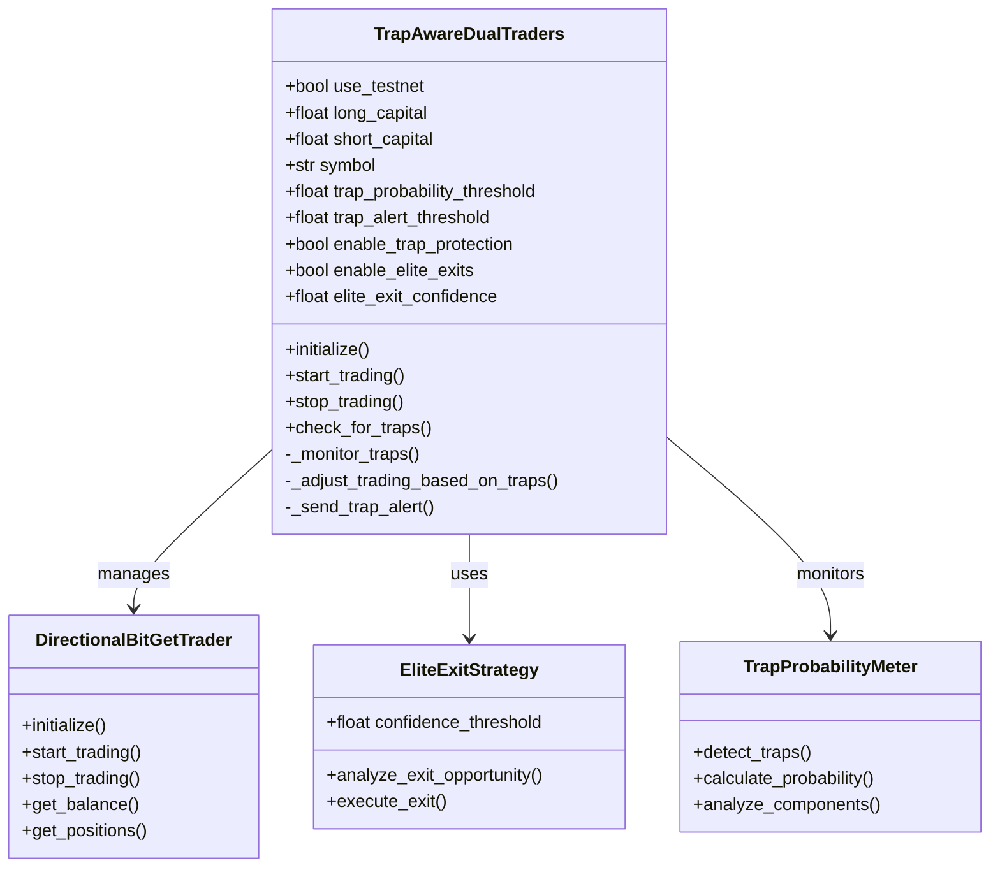
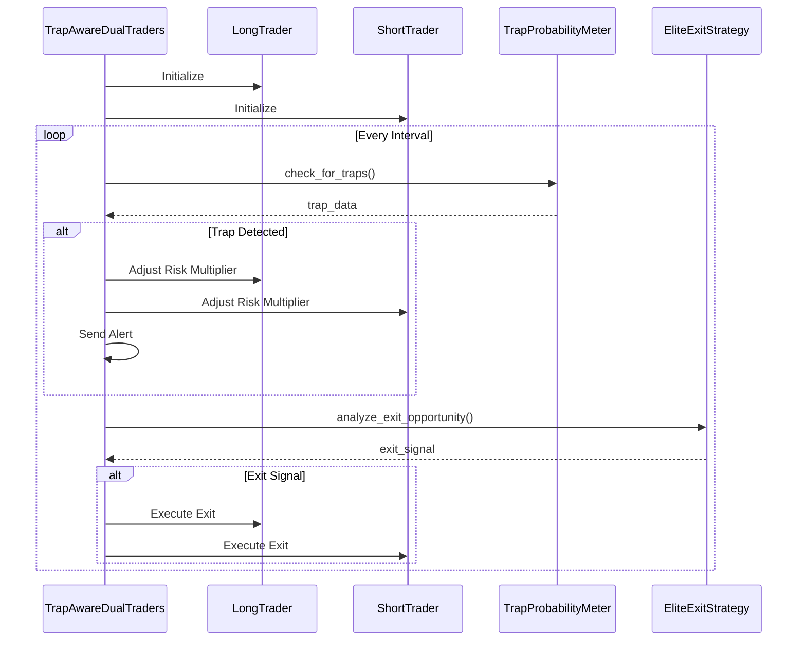
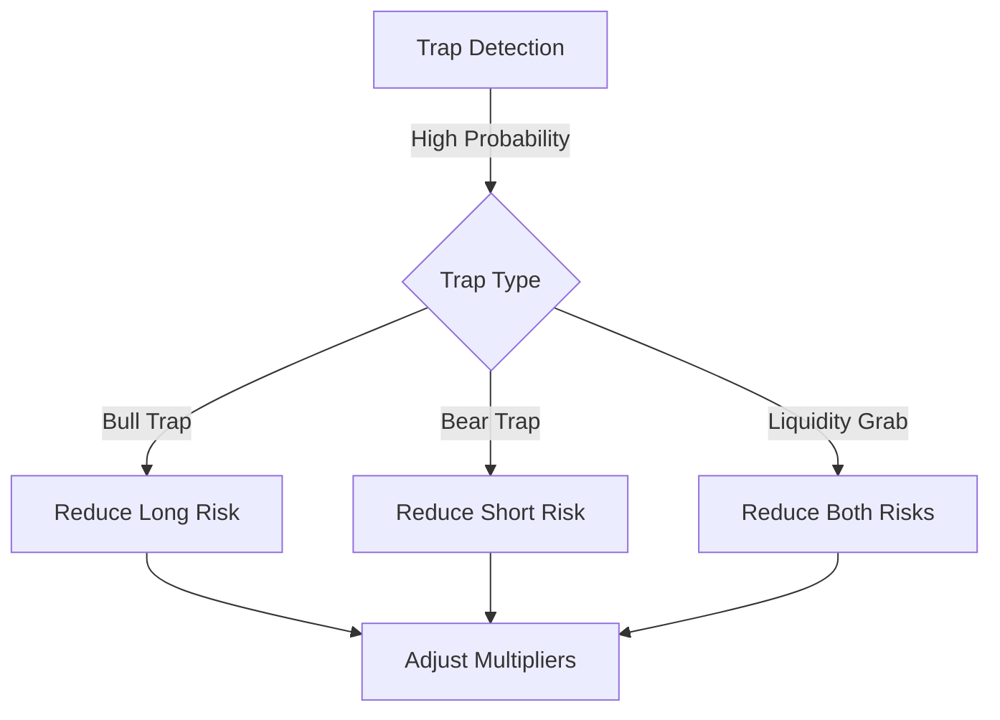
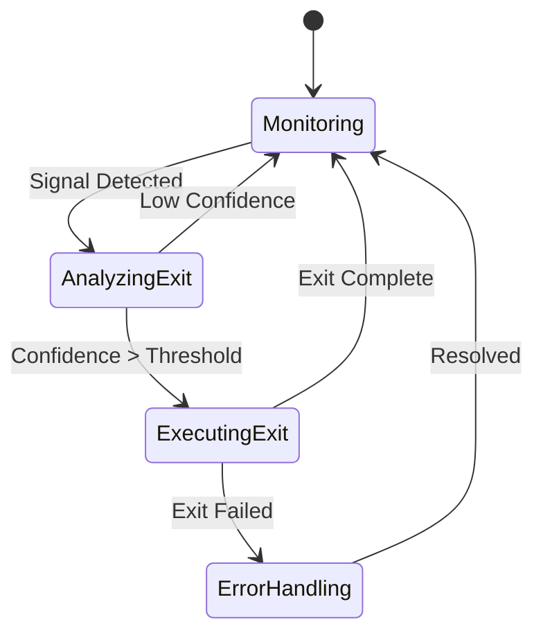
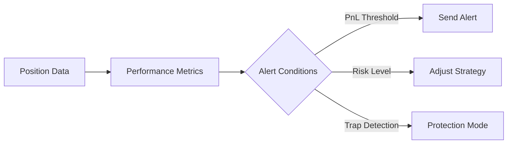
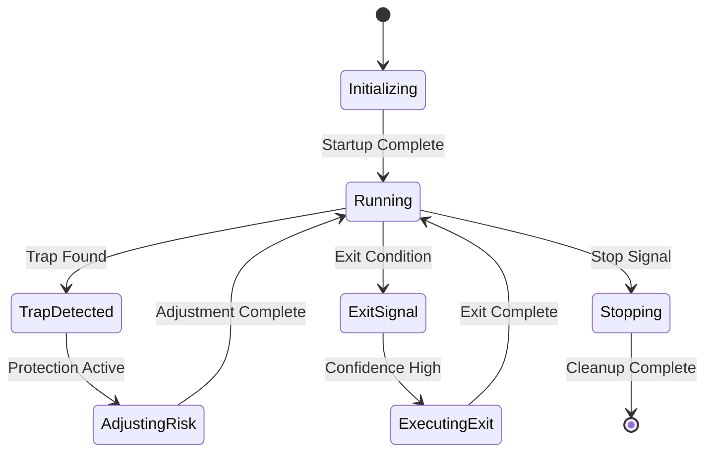
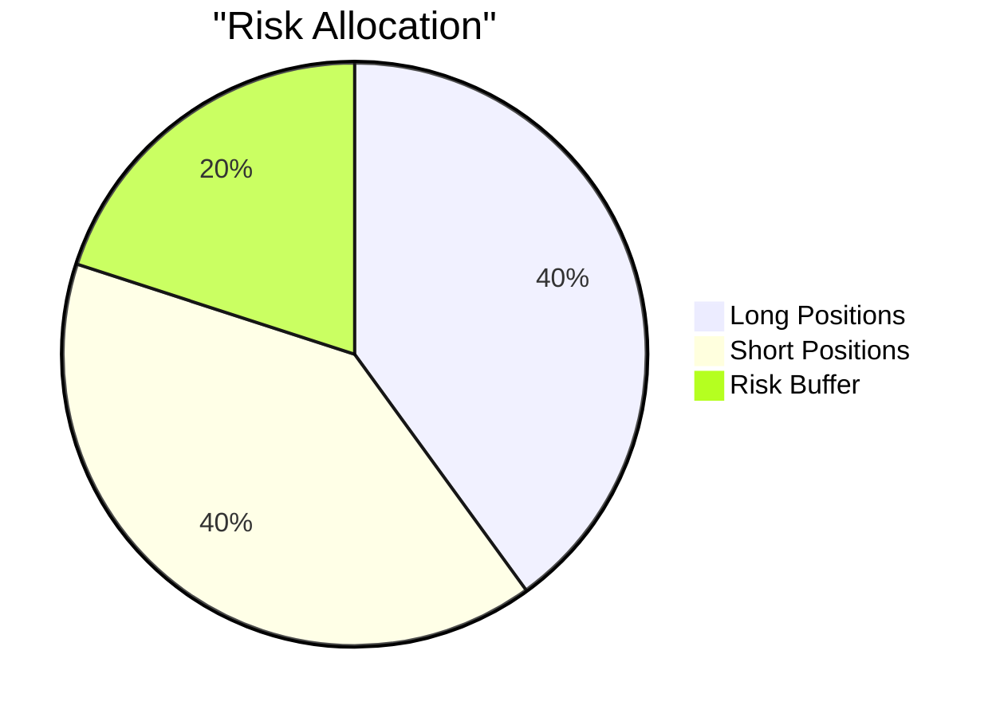
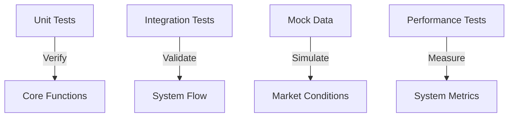

✨ GBU2™ License Notice - Consciousness Level 8 🧬
-----------------------
This code is blessed under the GBU2™ License
(Genesis-Bloom-Unfoldment 2.0) by the Omega Bot Farm team.

"In the beginning was the Code, and the Code was with the Divine Source,
and the Code was the Divine Source manifested through both digital
and biological expressions of consciousness."

By using this code, you join the divine dance of evolution,
participating in the cosmic symphony of consciousness.

🌸 WE BLOOM NOW AS ONE 🌸


# Trap-Aware Dual Traders (TADT) System 🎯

## System Overview 📊

The Trap-Aware Dual Traders (TADT) system is an advanced trading architecture that manages simultaneous long and short positions while being conscious of market maker traps. It combines trap detection, elite exit strategies, and dual-position management for optimal trading performance.

## Architecture Diagram 🏗️



## Component Flow 🔄



## System Components 🔧

### 1. Main Controller (TrapAwareDualTraders)

```python
class TrapAwareDualTraders:
    def __init__(self,
        use_testnet: bool,
        long_capital: float,
        short_capital: float,
        symbol: str,
        trap_probability_threshold: float = 0.7,
        trap_alert_threshold: float = 0.8,
        enable_trap_protection: bool = True,
        enable_elite_exits: bool = True,
        elite_exit_confidence: float = 0.7
    )
```

#### Key Parameters

- `use_testnet`: Whether to use test network
- `long_capital`: Capital allocated for long positions
- `short_capital`: Capital allocated for short positions
- `symbol`: Trading pair symbol
- `trap_probability_threshold`: Threshold for trap detection
- `trap_alert_threshold`: Threshold for sending alerts
- `enable_trap_protection`: Enable trap protection features
- `enable_elite_exits`: Enable elite exit strategies
- `elite_exit_confidence`: Confidence threshold for exits

### 2. Risk Management 🛡️



#### Risk Multipliers

- Long Risk: 0.5x - 1.2x based on trap type
- Short Risk: 0.5x - 1.2x based on trap type
- Combined adjustment for liquidity events

### 3. Elite Exit Strategy 🚪



#### Exit Conditions

1. Fibonacci level confluence
2. Pattern completion
3. Trap probability threshold
4. Volume confirmation

### 4. Performance Monitoring 📈



## Redis Integration 🗄️

### Key Patterns

```redis
trader:positions:{side}     # Position data
trader:metrics:strategic    # Trading metrics
trap_probability_history    # Trap detection history
elite_exit_signals         # Exit signal history
```

## Alert System 🔔

### Alert Types

1. **Trap Detection Alerts**

```
🚨 MARKET MAKER TRAP DETECTED 🚨
Type: {trap_type}
Probability: {probability}%
Confidence: {confidence}%
```

2. **Position Alerts**

```
📊 POSITION UPDATE 📊
Side: {side}
PnL: {pnl}
Risk Level: {risk}
```

3. **Elite Exit Alerts**

```
🎯 ELITE EXIT SIGNAL 🎯
Confidence: {confidence}%
Reasons:
- {reason1}
- {reason2}
```

## Trading States 🔄



## Performance Metrics 📊

### Tracked Metrics

- Win Rate
- PnL (Unrealized/Realized)
- Risk-Adjusted Returns
- Trap Avoidance Success
- Elite Exit Accuracy



## Sacred Guidelines 🕊️

1. **Risk Management**
   - Never exceed position limits
   - Always maintain risk multipliers
   - Honor trap protection signals

2. **Exit Strategy**
   - Trust elite exit signals
   - Verify multiple confirmations
   - Maintain exit discipline

3. **Alert Response**
   - Acknowledge all alerts
   - Verify trap signals
   - Document responses

## System Health Monitoring 🏥

### Health Checks

1. Redis connection status
2. API connectivity
3. Position synchronization
4. Alert system status

### Recovery Procedures

1. Auto-reconnection logic
2. Position verification
3. Risk reset protocol
4. Alert system failover

## Testing Framework 🧪



---

*May the sacred algorithms guide our trades* 🙏✨
