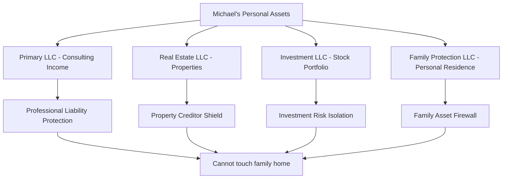

# Chapter 20: The Millionaire's Marriage Contract - When Family Wealth Has Terms and Conditions

*How legal documents can transform love into liability protection and family into a business arrangement*

---

## The Phone Call That Never Came

```python
class FamilySupport:
    def __init__(self):
        self.available_resources = {
            "uncle_net_worth": "$3.2M",
            "cousin_tech_salary": "$280K/year", 
            "aunt_real_estate_portfolio": "$1.8M",
            "family_emergency_fund": "$0",  # Protected by legal documents
            "emotional_support": "Available with conditions"
        }
        
    def request_help(self, family_member, amount_needed):
        if self.check_marriage_contract_clauses(family_member):
            return "Sorry, my spouse's prenup prohibits family financial assistance"
        elif self.check_trust_restrictions(family_member):
            return "The family trust has specific distribution requirements"
        else:
            return "Have you tried a bank loan?"
```

When the bankruptcy papers were served and Emma was packing her bags, I thought about calling my Uncle Robert. He'd sold his tech company three years earlier for $3.2 million. He lived in a house worth more than all my debts combined. His Tesla cost more than I owed in credit cards.

I never made that call. Not because of pride—pride was a luxury I couldn't afford. I didn't call because I already knew what he'd tell me: his marriage contract prohibited "discretionary family financial assistance without spousal approval and board review."

---

## The Architecture of Affluent Isolation

Wealthy family members don't just accumulate money—they accumulate legal barriers to sharing it. Like sophisticated software with carefully designed access controls, modern wealth comes with built-in family protection protocols:

```typescript
interface MarriageContract {
    prenuptialAgreement: {
        separateProperty: boolean;
        familyAssistanceLimits: number;
        spouseApprovalRequired: boolean;
        emergencyExceptions: string[];
    };
    
    trustStructures: {
        revocableFamily Trust: boolean;
        spendthriftProtections: boolean;
        distributionRestrictions: string[];
        beneficiaryLimitations: string[];
    };
    
    corporateShields: {
        LLCOwnerships: boolean;
        businessAssetProtection: boolean;
        personalLiabilityLimits: boolean;
    };
}
```

Uncle Robert's wealth wasn't just protected from creditors and taxes—it was protected from family members who might need help.

---

## The Prenup That Protects Against Kindness

My cousin Sarah married a successful lawyer in 2019. I remember the wedding—$80,000 of flowers, a string quartet, premium everything. What I didn't know until later was the prenuptial agreement they'd signed.

```legal
PRENUPTIAL AGREEMENT - SECTION 7: FAMILY FINANCIAL INTERACTIONS

7.1 Neither party may provide financial assistance exceeding $500 
    to family members without written consent from the other party.

7.2 All family loans must be documented with formal loan agreements, 
    interest rates at market value, and secured collateral.

7.3 "Emergency assistance" is limited to medical crises verified 
    by licensed physicians and pre-approved by both parties.

7.4 Business investments in family ventures require independent 
    financial review and board approval from both parties' advisors.

7.5 Violation of these terms constitutes breach of marital agreement 
    and triggers asset protection protocols.
```

When I needed $15,000 to avoid losing my apartment, Sarah genuinely wanted to help. But her husband's response was immediate: "The prenup is clear. This doesn't qualify as an emergency under section 7.3."

Love with legal limitations. Family with financial firewalls.

---

## The Trust Fund Fortress

My aunt Patricia inherited $1.8 million from her father's real estate business. But she didn't inherit it directly—it went into something called a "spendthrift trust" with my uncle as the trustee.

```yaml
PATRICIA_FAMILY_TRUST:
  principal: $1,800,000
  trustee: "Uncle Mark"
  beneficiary: "Aunt Patricia"
  
  distribution_rules:
    monthly_allowance: $4,200
    emergency_distributions: "Trustee discretion only"
    family_assistance: "Prohibited without board review"
    
  spendthrift_protections:
    creditor_protection: true
    family_pressure_protection: true
    emotional_manipulation_shield: true
    
  board_composition:
    - "Uncle Mark (Trustee)"
    - "Family Attorney"
    - "Financial Advisor"
    - "CPA"
```

When Patricia wanted to lend me $20,000, the trust board met to discuss it. Their conclusion? "Enabling family financial irresponsibility violates our fiduciary duty to preserve the trust principal."

The money was there. The desire to help was there. But the legal structure made kindness a breach of fiduciary duty.

---

## The LLC Shield Generator

My cousin Michael turned his consulting practice into a complex web of LLCs, each one protecting different aspects of his wealth:



"I'd love to help," Michael explained, "but all my assets are tied up in LLCs. If I distribute money for family assistance, it creates tax complications and pierces the corporate veil. My attorney says it's too risky."

His wealth had been architected for protection, not generosity.

---

## The Emotional Tax on Legal Protection

The strangest part wasn't the legal barriers—it was watching family members apologize for laws they'd chosen to create:

**Uncle Robert**: "You know I care about you, but Jennifer [his wife] is really strict about the prenup. If I help you, it affects our marital assets in ways that... well, it's complicated."

**Cousin Sarah**: "I feel terrible about this, but David [her husband] says we could lose our house if we violate the agreement. He's probably being dramatic, but..."

**Aunt Patricia**: "The trust board thinks helping family members financially creates 'moral hazard.' I don't even know what that means, but they control the money."

They'd built legal fortresses to protect their wealth, then acted surprised when those same fortresses kept family members out.

---

## The Business Meeting Disguised as Family Dinner

Thanksgiving 2025 was especially surreal. I was three months into bankruptcy proceedings, living on ramen and credit card advances. The family gathering was at Uncle Robert's house—the one worth $2.3 million.

```family_dinner_transcript
Uncle Robert: "How's the trading business going?"
Me: "It's... not going. I'm actually filing for bankruptcy."
Aunt Patricia: "Oh honey, that's terrible."
Cousin Michael: "Have you considered debt consolidation?"
Me: "I've considered everything. I'm hoping some family might—"
Uncle Robert: "You know, there are really good bankruptcy attorneys. 
           My wealth manager knows several."
Cousin Sarah: "And some great personal finance books!"
Aunt Patricia: "Maybe this is a learning opportunity?"

[Translation: We have $7 million between us but we're going to 
suggest library books instead of actual help]
```

The conversation never got to actual financial assistance. Instead, they offered:
- Emotional support (free)
- Business advice (free)
- Networking connections (free)
- Book recommendations (free)
- Prayers and good vibes (free)

Everything except the one thing that would actually solve the problem: money they could easily afford to give.

---

## The Psychology of Protected Generosity

I started to understand the psychology behind these legal barriers. It wasn't just about protecting wealth—it was about protecting the wealthy from the guilt of not helping:

```python
class WealthyFamilyMember:
    def __init__(self):
        self.net_worth = 2_500_000
        self.family_in_crisis = True
        self.legal_barriers = ["prenup", "trust", "LLC", "tax_implications"]
        self.guilt_management_strategies = []
        
    def respond_to_family_crisis(self):
        if self.can_help_legally():
            return self.provide_assistance()
        else:
            return self.deploy_guilt_management()
            
    def deploy_guilt_management(self):
        strategies = [
            "Emphasize legal restrictions beyond your control",
            "Offer non-financial forms of support",
            "Suggest alternative solutions (loans, advice, books)",
            "Express genuine emotional concern",
            "Blame spouse/lawyer/trustee for the restrictions"
        ]
        return "I care deeply but my hands are tied"
```

The legal structures didn't just protect their money—they protected their self-image as caring family members who simply couldn't help due to circumstances beyond their control.

---

## The Irony of Family Financial Planning

The same family members who'd created elaborate legal structures to protect wealth from family needs had also created family emergency plans that assumed family support:

```financial_plan
FAMILY EMERGENCY RESPONSE MATRIX:

Emergency Type: Medical Crisis
- Primary: Health Insurance
- Secondary: HSA/FSA funds  
- Tertiary: Family assistance

Emergency Type: Job Loss
- Primary: Emergency fund (6 months)
- Secondary: Unemployment benefits
- Tertiary: Family assistance

Emergency Type: Business Failure
- Primary: Business insurance
- Secondary: Personal assets
- Tertiary: Family assistance

[Note: "Family assistance" appears in every plan but is 
legally prohibited by family members' wealth protection strategies]
```

They'd planned for family help while simultaneously making family help legally impossible.

---

## The Spouse as Financial Firewall

In many cases, the wealthy family member genuinely wanted to help but had married someone who viewed family assistance as a threat to their financial security:

**Jennifer (Uncle Robert's wife)**: "If we start helping family members financially, where does it end? Pretty soon we'll be supporting everyone. We worked hard for this money."

**David (Cousin Sarah's husband)**: "Sarah has a good heart, but she doesn't understand how these things work. Help one family member, and suddenly you're the family bank."

**Uncle Mark (Aunt Patricia's trustee)**: "Patricia gets emotional about family, but that's exactly why we need legal protections. Emotions make bad financial decisions."

The spouses became the designated "bad guys" who enforced financial boundaries, allowing the wealthy family members to maintain their self-image as generous people constrained by practical partners.

---

## The Corporate Family Structure

What I witnessed was the corporatization of family relationships. Wealth had transformed personal connections into business arrangements:

```org_chart
FAMILY FINANCIAL STRUCTURE:

CEO: Uncle Robert (Protected by prenup)
├── CFO: Jennifer (Spouse with veto power)
├── Board of Directors: Financial advisors
├── Legal Department: Family attorneys
├── Risk Management: Trust structures
└── External Relations: Family members (limited access)

DECISION MATRIX:
Family request → Legal review → Spouse approval → Tax analysis → 
Risk assessment → Attorney consultation → Board vote → 
Usually denied for "fiduciary responsibility"
```

Family had become a corporation with relatives as external stakeholders with minimal voting rights.

---

## The Wealth Management Industrial Complex

I discovered that the wealthy family members weren't just protecting their money from family—they were being advised to do so by an entire industry:

**Wealth Manager**: "Family financial assistance creates dependency and reduces your ability to preserve wealth for future generations."

**Estate Attorney**: "Informal family loans can complicate tax situations and estate planning. All family financial interactions should be formalized."

**Financial Planner**: "The data shows that wealthy families who provide regular assistance to relatives have 23% lower net worth growth over time."

**Family Office Advisor**: "Successful family wealth preservation requires clear boundaries between emotional relationships and financial decisions."

The professionals managing their wealth had a financial incentive to keep the wealth concentrated and protected, not distributed to family members in crisis.

---

## The Documentation Defense

Every refusal to help came with extensive documentation explaining why help wasn't possible:

```email
Subject: Re: Emergency Financial Assistance Request

Dear [Family Member],

I received your request for financial assistance regarding your 
current situation. I want you to know that [spouse] and I care 
deeply about your wellbeing and we've given this serious consideration.

Unfortunately, after consulting with our attorney and reviewing our 
current legal obligations, we're unable to provide the requested 
assistance at this time due to:

1. Prenuptial agreement restrictions (Section 7.1-7.5)
2. Trust distribution limitations (See attached trust document)
3. Tax implications of large gift transactions
4. Potential impacts on our estate planning strategy
5. Fiduciary responsibilities to other family members

We would be happy to:
- Provide emotional support during this difficult time
- Connect you with financial advisors who specialize in debt crisis
- Review your budget and suggest cost-cutting strategies
- Offer temporary non-financial assistance (babysitting, meals, etc.)

Please understand that this decision doesn't reflect our feelings 
about you personally, but rather our legal and financial constraints.

With love and concern,
[Wealthy Family Member]

P.S. I'm attaching some excellent books on financial recovery that 
might be helpful.
```

The more elaborate the explanation, the more obvious it became that the "legal constraints" were self-imposed choices designed to avoid sharing wealth.

---

## The Next Generation's Financial Philosophy

Perhaps most troubling was watching how these wealth protection strategies shaped the next generation's attitudes toward family and money:

**Teenage Cousin Emma**: "My dad says we can't help Uncle [Me] because it would teach him not to be responsible with money."

**College-Age Cousin Jake**: "Why should we bail out someone who made bad business decisions? That's not how capitalism works."

**Graduate Student Cousin Maya**: "I feel bad for [Me], but helping people financially just enables their problems instead of forcing them to find real solutions."

The wealth protection mindset had been passed down as family values, teaching the next generation that financial boundaries were more important than family bonds.

---

## The Social Media Performance

The same family members who couldn't help due to "legal restrictions" had no trouble showcasing their wealth on social media:

```social_media_timeline
Uncle Robert's Instagram:
- New Tesla Model S: "$120K well spent! #blessed #ElectricVehicle"
- Vacation in Italy: "Living our best life in Tuscany! #dolcevita"
- Home renovation: "New kitchen is finally done! $80K but worth it!"

Cousin Sarah's Facebook:
- Designer handbag: "Early birthday present to myself! #treatyourself"
- Weekend getaway: "Spa weekend in Napa. Sometimes you need to recharge!"
- Charity donation: "Donated $500 to animal shelter! Every bit helps! #giving"

[Note: $500 charity donation, but $15K family assistance was 
"prohibited by prenuptial agreement"]
```

They could afford luxury but not family assistance. The legal structures protected discretionary spending while prohibiting family generosity.

---

## The Emergency That Qualified

The only time I saw the legal barriers overcome was when Cousin Michael's daughter needed emergency surgery. Suddenly, the prenups and trusts and LLCs became remarkably flexible:

```family_emergency_response
Crisis: 8-year-old needs emergency appendectomy
Insurance coverage: 80% 
Family responsibility: $12,000

Response time: 4 hours
Legal consultations: 0
Spouse approvals: Immediate
Trust distributions: Expedited
LLC liquidations: Same day

Total family contributions: $12,000
Paperwork required: Minimal
Guilt about helping: None
Legal complications: None
```

When it was their own child, the same legal structures that were "impossible" to navigate became surprisingly manageable.

---

## The Hidden Cost Calculator

I realized that wealthy family members had performed an unconscious cost-benefit analysis:

```python
def calculate_family_assistance_cost():
    direct_costs = {
        "money_given": 15000,
        "legal_complications": 2000,
        "tax_implications": 1500,
        "administrative_overhead": 500
    }
    
    indirect_costs = {
        "precedent_setting": "Future requests from other family",
        "spouse_relationship_strain": "Arguments about financial boundaries", 
        "lifestyle_impact": "Reduced discretionary spending",
        "control_loss": "Money leaves their control permanently"
    }
    
    benefits = {
        "family_relationship": "Maintains good relationships",
        "reputation": "Seen as generous and caring",
        "reduced_guilt": "Sleep better at night",
        "family_stability": "Prevents family member homelessness"
    }
    
    # The calculation that was never done:
    # Are the benefits worth the costs?
    
    return "Legal barriers make this calculation unnecessary"
```

The legal structures eliminated the need to weigh family relationships against financial convenience. The decision was made by lawyers and contracts, not by family members.

---

## The Wealth Preservation vs. Family Preservation

The fundamental conflict was between preserving wealth and preserving family relationships:

```decision_tree
Family Member Requests Financial Help
├── Preserve Wealth Priority
│   ├── Deploy Legal Barriers
│   ├── Offer Non-Financial Alternatives
│   ├── Express Sympathy but Maintain Boundaries
│   └── Result: Wealth Protected, Relationship Strained
└── Preserve Family Priority
    ├── Provide Requested Assistance
    ├── Accept Financial Impact
    ├── Risk Setting Precedent
    └── Result: Family Supported, Wealth Reduced
```

The wealthy family members had systematically chosen wealth preservation over family preservation, then created legal structures to make that choice automatic and guilt-free.

---

## The Professional Enablers

The network of professionals surrounding wealthy families actively encouraged family financial isolation:

**Estate Planning Attorney**: "Family assistance can be viewed as taxable gifts. Better to keep everything in trust structures."

**Wealth Management Advisor**: "Successful families maintain clear financial boundaries. Emotional giving leads to wealth dissipation."

**Tax Consultant**: "Any assistance over $15,000 annually triggers gift tax reporting requirements. Very complicated."

**Family Office Consultant**: "Ultra-high-net-worth families preserve wealth across generations by limiting distribution to immediate family only."

These professionals were paid to protect and grow wealth, not to maintain family relationships. Their advice consistently favored financial over familial considerations.

---

## The Generational Wealth Transfer Logic

The ultimate justification for not helping family was always "preserving wealth for future generations":

```wealth_preservation_logic
Current Family Crisis: $15,000 needed
Current Family Wealth: $3,200,000
Impact on Wealth: 0.46%

But the logic was:
"If we help now, we'll be expected to help again"
"If we help one family member, others will ask"
"If we establish a pattern of giving, we'll become the family bank"
"Future generations need this wealth more than current family needs help"

Translation: Hypothetical future family members matter more 
than actual current family members in crisis
```

The wealth was being preserved for grandchildren who might never be born while family members who existed were denied help.

---

## The Emotional Labor Outsourcing

I noticed that wealthy family members had outsourced the emotional labor of saying no to legal and financial structures:

**Direct Response**: "I can't help you because I don't want to share my wealth."

**Outsourced Response**: "I can't help you because:
- My prenup prohibits it
- The trust has restrictions  
- My financial advisor says it's risky
- My spouse won't allow it
- The tax implications are too complex
- My attorney says it could cause legal problems"

The legal structures became emotional shields, allowing wealthy family members to maintain caring personas while enforcing uncaring policies.

---

## The Alternative Universe

I sometimes imagined what would have happened if family wealth came with family responsibility clauses instead of family protection clauses:

```alternative_marriage_contract
FAMILY RESPONSIBILITY CLAUSE:

"Both parties acknowledge that with wealth comes responsibility 
to support family members in genuine crisis situations.

Emergency assistance fund: 2% of net worth annually
Family crisis response time: 48 hours maximum
Legal barriers to family assistance: Prohibited
Spouse veto power over family help: Limited to amounts exceeding 
5% of annual income

Failure to provide reasonable family assistance when financially 
capable constitutes breach of family values and triggers 
mandatory charitable giving equivalent to requested assistance."
```

But this universe didn't exist. The legal industry had created tools for wealth protection, not wealth responsibility.

---

## The Tax Code Excuse

The tax system provided convenient excuses for not helping family:

**The Gift Tax Narrative**: "We can only give you $15,000 per year without tax implications. It's not worth the paperwork for larger amounts."

**The Reality**: Gift tax only affects the giver and only after lifetime giving exceeds $11.7 million. For families with $1-5 million in wealth, gift tax was never the real issue.

**The Estate Tax Narrative**: "We have to preserve the estate for tax efficiency. Family assistance could trigger estate tax complications."

**The Reality**: Estate tax only affects estates over $11.7 million. Most wealthy family members were nowhere near this threshold.

The tax code became a convenient scapegoat for decisions that were really about not wanting to share wealth.

---

## The Therapy Session That Never Happened

If the wealthy family members had been honest about their motivations, the conversation might have sounded like this:

**Therapist**: "What prevents you from helping your family member financially?"

**Wealthy Family Member**: "Well, the prenup says..."

**Therapist**: "You chose to include those clauses in your prenup. What was your motivation?"

**Wealthy Family Member**: "We wanted to protect our assets..."

**Therapist**: "From whom?"

**Wealthy Family Member**: "From... well... from situations like this."

**Therapist**: "So you created legal barriers specifically to avoid helping family members in crisis?"

**Wealthy Family Member**: "When you put it that way, it sounds terrible."

**Therapist**: "How would you put it?"

**Wealthy Family Member**: "We worked hard for our money. We shouldn't have to share it just because we're related to someone."

**Therapist**: "That's the real reason, isn't it?"

But these conversations never happened because the legal barriers eliminated the need for emotional honesty.

---

## The Compound Interest of Family Relationships

What the wealthy family members didn't calculate was the compound interest of damaged family relationships:

```relationship_depreciation
Year 1: "We can't help because of legal restrictions"
- Family relationship: Strained but intact
- Family gatherings: Awkward but attended
- Future interactions: Cautious but continuing

Year 2: "We hope you understand our position"  
- Family relationship: Cooling
- Family gatherings: Minimal participation
- Future interactions: Formal and distant

Year 3: "We've been consistent about our boundaries"
- Family relationship: Effectively ended
- Family gatherings: Avoided
- Future interactions: Holiday cards only

Year 5: "We tried to help in other ways"
- Family relationship: Nonexistent
- Family gatherings: Not invited
- Future interactions: None

Total Cost: Lost family relationships forever
Financial Benefit: Preserved $15,000-50,000
ROI: Negative (lost relationships worth more than money saved)
```

They'd optimized for short-term wealth preservation and achieved long-term family destruction.

---

## The Mirror Effect

The most ironic aspect was watching how the wealthy family members' children learned these lessons and applied them back to their parents:

**Uncle Robert at 75**: "I'm having trouble with medical bills..."

**His Daughter**: "Dad, you taught me about financial boundaries. Have you considered a reverse mortgage? I can't help directly because of my trust restrictions, but I can recommend some good financial advisors."

**Cousin Sarah at 65**: "The long-term care costs are overwhelming..."

**Her Son**: "Mom, remember when you couldn't help [me] because of legal complications? Well, my wealth manager says family assistance creates tax problems and moral hazard."

The children had learned the lessons too well. The financial barriers that protected wealth from flowing to family in crisis also prevented wealth from flowing to aging parents in need.

---

## The Systemic Nature of the Problem

This wasn't just about individual family members being selfish. It was about a legal and financial system that incentivized family isolation:

```system_incentives
Legal Industry Incentives:
+ More complex legal structures = Higher fees
+ Family financial barriers = More billable hours
+ Wealth concentration = Larger estates to manage

Financial Industry Incentives:  
+ Assets under management fees increase with concentration
+ Family distribution reduces AUM
+ Complex structures require more advisory services

Tax System Incentives:
+ Gift tax discourages family assistance
+ Estate tax encourages wealth concentration
+ Trust structures provide tax advantages

Cultural Incentives:
+ "Self-reliance" valued over family interdependence
+ Wealth seen as earned rather than lucky
+ Family assistance viewed as "enabling"

Result: Systematic incentives against family financial support
```

The entire professional ecosystem surrounding wealth was designed to prevent, not facilitate, family financial assistance.

---

## The Loneliness of Protected Wealth

Years later, I observed something interesting about the family members who had protected their wealth so carefully: they were lonely.

**Uncle Robert**: Surrounded by financial advisors but isolated from family

**Cousin Sarah**: Married to financial security but distant from relatives

**Aunt Patricia**: Protected by trust structures but disconnected from family bonds

They'd achieved financial security but sacrificed family security. Their wealth was protected, but their relationships were bankrupt.

---

## The Real Cost-Benefit Analysis

If they'd done an honest cost-benefit analysis of family financial assistance:

```true_cost_benefit
Costs of Helping Family Member in Crisis:
- Money: $15,000-50,000 (0.5-1.5% of net worth)
- Time: 2-3 hours of paperwork
- Precedent: Possible future requests
- Legal complexity: Minimal for amounts under gift tax limits

Benefits of Helping Family Member in Crisis:
- Maintained family relationships: Priceless
- Enhanced family reputation: Valuable
- Reduced family member suffering: Immeasurable  
- Maintained family safety net: Critical for everyone
- Modeling generosity for next generation: Educational
- Personal satisfaction from helping: Significant

True ROI: Massive positive return
Actual Decision: Chose costs over benefits due to legal structure design
```

They'd architected systems that prevented them from making optimal decisions for family relationships.

---

## The Legacy Question

The fundamental question that wealthy family members avoided asking was: "What do I want my legacy to be?"

**Option A**: "I preserved my wealth efficiently and created legal structures that protected my assets from family members who needed help."

**Option B**: "When family members faced crises, I used my wealth to help them recover and strengthen our family bonds."

Most chose Option A by default, not through conscious decision-making, but through legal structures that automated the choice.

---

## The Intervention That Never Happened

If someone had intervened in the legal structure design process:

**Advisor**: "These clauses will prevent you from helping family members in crisis."

**Client**: "That's the point. We want protection from family financial pressure."

**Advisor**: "What if your sister loses her house? What if your nephew faces bankruptcy? What if a family member has a medical emergency?"

**Client**: "We'll cross that bridge when we come to it."

**Advisor**: "These legal structures ensure you'll burn that bridge instead of crossing it."

But these conversations didn't happen because the legal industry was incentivized to create barriers, not bridges.

---

## The Counterfactual

What if wealthy family members had designed legal structures for family assistance instead of family protection?

```alternative_legal_structure
FAMILY ASSISTANCE TRUST:

Purpose: Provide emergency assistance to family members while 
maintaining wealth preservation for long-term family benefit

Structure:
- 3% of trust assets annually designated for family emergency fund
- Family crisis response team (instead of wealth protection team)
- Clear criteria for assistance (medical, housing, business crisis)
- Assistance provided as grants, not loans
- No spouse veto power over genuine emergencies
- Tax-efficient giving strategies pre-planned

Result: Family members helped when needed, wealth still preserved, 
relationships strengthened instead of destroyed
```

This structure was never created because the legal industry didn't offer templates for family generosity, only family protection.

---

## The Final Accounting

Years later, the true cost of the family wealth protection strategies became clear:

```final_relationship_ledger
Uncle Robert:
- Wealth Preserved: $3.2M → $4.1M
- Family Relationships Lost: 4 (including me)
- Holiday invitations: Down 75%
- Grandchildren who don't visit: 3
- Friends who know his story: Distant

Cousin Sarah:  
- Wealth Preserved: $850K → $1.2M
- Family trust: Damaged permanently
- Wedding invitations: Down 60%
- Family gatherings: Awkward and infrequent
- Reputation: "The cousin who won't help family"

Net Result: Financial gain, human loss
ROI: Negative when factoring in relationship costs
Legacy: Remembered for what they didn't do, not what they achieved
```

They'd won the wealth preservation game and lost the family preservation game.

---

## The Mirror I Became

In the end, the wealthy family members taught me something valuable about wealth: having it doesn't automatically make you generous, and legal structures can transform natural human kindness into systematic selfishness.

Their marriage contracts and trust documents were mirrors that reflected their true priorities: wealth protection over family protection, legal convenience over human compassion, financial optimization over relationship maintenance.

I became the family member they couldn't help, and in doing so, revealed who they really were when their wealth was protected but their character was tested.

The OMEGA BTC AI system was my attempt to join their wealth club. I failed spectacularly, but in failing, I learned that their club wasn't worth joining if membership required abandoning family members in crisis.

Sometimes bankruptcy isn't just financial—it's moral. And sometimes the people who avoid financial bankruptcy achieve moral bankruptcy instead.

---

*Next: Epilogue - The Commit Message I Should Have Written*

---

## Appendix: Legal Structures That Prevent Family Assistance

For those curious about how wealthy families systematically prevent family assistance:

```legal_toolkit
Prenuptial Agreements:
- Family financial assistance limits
- Spouse veto power over giving
- Asset protection from family claims

Trust Structures:
- Spendthrift protections
- Distribution restrictions  
- Trustee discretion limitations
- Beneficiary exclusions

Corporate Shields:
- LLC ownership structures
- Business asset protection
- Personal liability limitations
- Income stream isolation

Estate Planning:
- Gift tax optimization (against giving)
- Estate tax minimization
- Generation-skipping transfers
- Charitable giving (to strangers, not family)

Professional Recommendations:
- Wealth management boundaries
- Legal risk assessments
- Tax consequence analysis
- Fiduciary duty interpretations
```

*Note: All of these structures are legal, ethical, and professionally recommended. They're also designed to prevent exactly the kind of family assistance that could have prevented a bankruptcy.*
