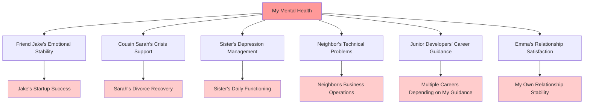

# Chapter 21: The Helper's Paradox - When Your Will to Help Becomes Your Mental Health Prison

*How the compulsion to save everyone else can destroy your ability to save yourself*

---

## The Helper Class Architecture

```python
class Helper:
    def __init__(self):
        self.energy_level = 100
        self.emotional_capacity = 100
        self.financial_resources = 100
        self.mental_health = 100
        self.people_to_help = []
        self.boundaries = None  # Never initialized
        
    def help_someone(self, person, crisis_type):
        # Always say yes, never check available resources
        self.energy_level -= 25
        self.emotional_capacity -= 30
        self.financial_resources -= 20
        self.mental_health -= 15
        
        if self.check_burnout():
            return "Sorry, can't help myself anymore"
        else:
            return "Of course I'll help! Don't worry about me."
    
    def check_burnout(self):
        return all([
            self.energy_level <= 0,
            self.emotional_capacity <= 0,
            self.mental_health <= 0
        ])
```

While my wealthy family members were architecting legal barriers to avoid helping others, I was doing the opposite—compulsively helping everyone who asked, regardless of my own capacity. It took me years to understand that both extremes were pathological, and that my helper complex was just as destructive as their wealth protection complex.

---

## The Always-Available Exception Handler

Even during my bankruptcy proceedings, I found myself saying yes to every request for help:

```javascript
// My broken help() function during the crisis
async function respondToHelpRequest(request) {
    try {
        // Never check my own status first
        const myFinancialStatus = "bankruptcy";
        const myMentalHealth = "deteriorating";
        const myAvailableTime = "negative hours";
        
        // But still process every request
        if (request.type === "coding help") {
            return await spendAllNightDebuggingSomeoneElsesCode();
        } else if (request.type === "relationship advice") {
            return await counselFriendWhileMyOwnRelationshipFails();
        } else if (request.type === "business mentoring") {
            return await giveBuisnessAdviceWhileMyBusinessCollapses();
        } else if (request.type === "financial guidance") {
            return await helpSomeoneElseBudgetWhileImBankrupt();
        }
        
        // Never throw exception for "I can't help right now"
        
    } catch (PersonalCrisisError) {
        // Swallow the exception, help anyway
        return "I'm sure I can figure something out to help you";
    }
}
```

The more my own life fell apart, the more desperately I tried to fix everyone else's problems. It was easier to solve someone else's coding bug than to face my own life bugs.

---

## The Therapist Who Needs Therapy

During the worst period of my crisis, I was simultaneously:

- **Helping my friend Jake debug his startup's architecture** (while my own code was crashing in production)
- **Counseling my cousin through her divorce** (while Emma was packing her bags)
- **Mentoring three junior developers** (while I couldn't manage my own career)
- **Providing financial advice to my neighbor** (while creditors were calling me daily)
- **Supporting my sister through her depression** (while I was having panic attacks every morning)

```mental_health_dashboard
MY ACTUAL STATUS:
├── Sleep: 3-4 hours/night (for 6 months)
├── Anxiety: 8.5/10 (constant)
├── Depression: 7/10 (increasing)
├── Relationship: Failing
├── Career: Imploding
├── Finances: Bankrupt
└── Support System: Giving but not receiving

HELP REQUESTS I ACCEPTED THIS WEEK:
├── 14 hours debugging others' code
├── 8 hours providing relationship counseling
├── 6 hours business mentoring
├── 12 hours family emotional support
├── 4 hours neighbor crisis management
└── 3 hours freelance project (for free, "to help out")

HELP I ASKED FOR THIS WEEK: 0 requests
HELP I RECEIVED THIS WEEK: 0 hours
```

I was running a one-person emotional support service while my own emotional infrastructure was collapsing.

---

## The Savior Complex Compiler

I had developed what psychologists call a "savior complex"—the compulsive need to rescue others, often at the expense of my own wellbeing:

```python
class SaviorComplex:
    def __init__(self):
        self.self_worth = lambda help_provided: help_provided * 10
        self.identity = "The person who fixes things"
        self.fear_of_saying_no = True
        self.boundary_violations = "Normalized"
        self.rescue_addiction = True
        
    def evaluate_request(self, help_request):
        # Never consider personal capacity
        personal_capacity = self.check_personal_resources()
        # Ignore the result ^
        
        if help_request.person.seems_distressed():
            return self.deploy_all_available_resources()
        else:
            return self.deploy_most_available_resources()
    
    def deploy_all_available_resources(self):
        # Give everything, keep nothing for self
        return {
            "time": "All of it",
            "energy": "Until exhausted", 
            "money": "Even money I don't have",
            "emotional_capacity": "Until depleted",
            "mental_health": "Sacrificed for others"
        }
```

My identity had become so enmeshed with being helpful that saying "no" felt like erasing myself from existence.

---

## The Helper's Database Schema

I had unconsciously created a database of people who needed help, but no table for my own needs:

```sql
-- The Helper's Mental Database
CREATE TABLE people_who_need_help (
    person_id INT PRIMARY KEY,
    crisis_type VARCHAR(255),
    urgency_level INT,
    last_helped DATETIME,
    next_check_in DATETIME,
    emotional_weight INT,
    time_required INT,
    energy_cost INT
);

CREATE TABLE help_requests_queue (
    request_id INT PRIMARY KEY,
    person_id INT,
    description TEXT,
    deadline DATETIME,
    priority INT DEFAULT 1 -- Everything is priority 1
);

-- Table that was never created:
-- CREATE TABLE my_own_needs (...)
-- CREATE TABLE my_boundaries (...)  
-- CREATE TABLE my_capacity_limits (...)

-- Views that were constantly queried:
CREATE VIEW urgent_help_needed AS 
SELECT * FROM people_who_need_help 
WHERE urgency_level > 5;

CREATE VIEW people_i_havent_checked_on_lately AS
SELECT * FROM people_who_need_help 
WHERE last_helped < DATE_SUB(NOW(), INTERVAL 1 WEEK);

-- Query that was never run:
-- SELECT * FROM my_own_mental_health_status;
```

I had built an entire mental infrastructure for tracking and managing other people's problems, but no system for monitoring my own wellbeing.

---

## The Emotional Support Overflow

My emotional capacity was like a poorly designed buffer with no bounds checking:

```c
// My emotional processing system
#define MAX_EMOTIONAL_CAPACITY 100
char emotional_buffer[MAX_EMOTIONAL_CAPACITY];

void process_help_request(char* someone_elses_problem) {
    // No bounds checking!
    strcat(emotional_buffer, someone_elses_problem);
    
    // Buffer overflow occurs regularly
    if (strlen(emotional_buffer) > MAX_EMOTIONAL_CAPACITY) {
        // Should handle gracefully, but instead:
        panic_attack();
        suppress_panic_and_continue_helping();
    }
}

void handle_my_own_problems(char* my_crisis) {
    // This function was never called
    // All capacity allocated to others
    return; // No space available
}
```

I was experiencing emotional buffer overflows daily, but instead of implementing proper error handling, I just kept accepting more input.

---

## The Boundary Null Pointer Exception

```java
public class PersonalBoundaries {
    private List<String> acceptableRequests;
    private int maxHelpHoursPerWeek;
    private boolean canSayNo;
    
    public PersonalBoundaries() {
        // Constructor never properly initializes boundaries
        this.acceptableRequests = null;
        this.maxHelpHoursPerWeek = Integer.MAX_VALUE;
        this.canSayNo = false;
    }
    
    public boolean shouldAcceptHelpRequest(HelpRequest request) {
        // NullPointerException: boundaries were never initialized
        if (acceptableRequests.contains(request.getType())) {
            return true;
        }
        
        // This code path never executes due to null boundaries
        return false;
    }
    
    public String decline_help_request() {
        throw new NotImplementedException("Saying no is not supported");
    }
}
```

I had never properly initialized my personal boundaries, leading to constant null pointer exceptions when trying to protect my own wellbeing.

---

## The Asynchronous Help Processing

I was processing help requests asynchronously but synchronously, creating a mental deadlock:

```python
import asyncio
import threading
from queue import Queue
import time

class MentalHealthSystem:
    def __init__(self):
        self.help_request_queue = Queue()
        self.personal_care_queue = Queue()  # Always empty
        self.is_processing_help = True
        self.personal_care_thread = None  # Never started
        
    async def process_help_requests(self):
        while self.is_processing_help:
            if not self.help_request_queue.empty():
                request = self.help_request_queue.get()
                await self.provide_help(request)
                # Never check if I need a break
                # Never process personal care queue
                
    async def provide_help(self, request):
        # Blocking call that consumes all resources
        time.sleep(request.time_required)  # Hours of helping
        self.energy_level -= request.energy_cost
        self.emotional_capacity -= request.emotional_weight
        
        # Never await personal recovery
        
    def schedule_personal_care(self, care_item):
        # Add to queue but never process
        self.personal_care_queue.put(care_item)
        print(f"Added {care_item} to personal care (never to be processed)")
        
    def start_personal_care_thread(self):
        # Function exists but is never called
        self.personal_care_thread = threading.Thread(
            target=self.process_personal_care
        )
        # thread.start() never called
```

I was running an infinite loop of helping others with no mechanism for self-care interrupts.

---

## The Mental Health Memory Leak

My helper behavior created a classic memory leak pattern:

```cpp
class EmotionalMemory {
private:
    std::vector<OtherPersonsProblem*> problems_i_carry;
    std::vector<MyOwnProblem*> my_problems; // Never accessed
    
public:
    void take_on_someone_elses_problem(OtherPersonsProblem* problem) {
        // Allocate emotional memory
        problems_i_carry.push_back(problem);
        
        // Never deallocate - memory leak!
        // Problem stays in my head forever
    }
    
    void resolve_my_own_problem(MyOwnProblem* problem) {
        // Function exists but never called
        delete problem;
        // My problems are never resolved, just suppressed
    }
    
    ~EmotionalMemory() {
        // Destructor never properly cleans up
        // Carrying everyone's problems forever
        // My own problems never freed
    }
};

// The memory profile of my mental health:
// Allocated: Everyone else's problems (growing infinitely)
// Deallocated: Nothing (memory leak)
// Available: Diminishing capacity for my own wellbeing
```

I was accumulating emotional debt from everyone else's problems while never processing or resolving my own issues.

---

## The Helper's Recursion Without Base Case

```python
def help_person(person, problem):
    # Recursive helping with no termination condition
    
    if person.has_problem():
        solve_immediate_problem(person, problem)
        
        # Check for follow-up problems
        follow_up_problems = person.get_follow_up_problems()
        
        for follow_up in follow_up_problems:
            help_person(person, follow_up)  # Infinite recursion
            
        # Check if solving their problem created new problems
        new_problems = person.get_problems_caused_by_my_help()
        
        for new_problem in new_problems:
            help_person(person, new_problem)  # Still recursing
            
        # Check if they know someone else who needs help
        referrals = person.get_people_who_also_need_help()
        
        for referral in referrals:
            help_person(referral, referral.get_problems())  # More recursion
    
    # Base case never reached:
    # - Person always has some problem
    # - Solving problems creates new problems  
    # - Every person knows other people who need help
    # - I never say "I can't help anymore"

# Stack overflow: Maximum recursion depth exceeded
# Mental health system crash
```

I had no termination condition for helping behavior, leading to infinite recursion and eventual mental health stack overflow.

---

## The Codependent API Design

My relationships had become like a poorly designed API where I was always the service provider, never the client:

```yaml
# My Helper API - Always serving, never consuming
helper_service:
  endpoints:
    - POST /help/emotional-support
    - POST /help/technical-assistance  
    - POST /help/financial-advice
    - POST /help/relationship-counseling
    - POST /help/career-guidance
    - POST /help/crisis-intervention
    
  responses:
    200: "Of course I'll help!"
    201: "I'll make time for this"
    202: "Let me drop everything to assist"
    
  error_codes:
    400: Never returned (all requests accepted)
    429: Never returned (no rate limiting)
    503: Never returned (service always available)
    
  authentication: None required
  rate_limiting: Disabled
  load_balancing: All requests go to me
  circuit_breaker: Disabled
  health_checks: Never implemented

# APIs I needed but never built:
my_needs_service:
  endpoints:
    - GET /my/current-capacity
    - POST /my/help-request  
    - GET /my/mental-health-status
    - POST /my/boundary-enforcement
  
  status: "Service not found (404)"
```

I had built a one-way service architecture where I could only give help, never receive it.

---

## The Helper's Authentication Bypass

```python
class HelpRequestValidator:
    def authenticate_request(self, request):
        # Should validate if request is reasonable
        # Should check if person has tried self-help first
        # Should verify if this is urgent vs. convenient
        
        # But always returns True
        return True
        
    def authorize_help_level(self, request):
        # Should check my current capacity
        # Should verify this won't harm my wellbeing
        # Should ensure this is appropriate boundary
        
        # But always authorizes maximum help
        return "UNLIMITED_ACCESS"
        
    def rate_limit_person(self, person):
        # Should prevent people from over-relying on me
        # Should encourage independence
        # Should protect my time and energy
        
        # But never limits anyone
        return "NO_LIMITS"
```

I had bypassed all the security mechanisms that should have protected my mental health from exploitation.

---

## The Helper's Distributed Denial of Service

My helper behavior was essentially a self-inflicted DDoS attack on my mental health:

```bash
# My mental health system under constant attack
$ systemctl status mental-health.service
● mental-health.service - Personal Mental Health System
   Loaded: loaded
   Active: failing (Result: resource-exhaustion)
   
   Process: Help requests overwhelming system capacity
   Memory: 127% of available (swapping to anxiety)
   CPU: 98% utilization (processing others' problems)
   Load average: 15.7, 23.2, 18.9 (unsustainable)
   
   Recent logs:
   Jun 15 03:47 WARNING: Energy reserves critical
   Jun 15 05:32 ERROR: Emotional capacity exceeded
   Jun 15 08:15 CRITICAL: Boundary violations detected
   Jun 15 11:45 FATAL: Mental health service crashed
   Jun 15 11:46 INFO: Restarting service (still accepting help requests)

$ ps aux | grep help-others
helper  1234  98.7 127.0  help-jake-with-startup
helper  1235  87.3  89.2  counsel-cousin-divorce  
helper  1236  76.9  94.1  mentor-junior-developers
helper  1237  89.1  67.8  support-sister-depression
helper  1238  94.2  88.3  debug-neighbors-website

$ ps aux | grep help-self
(no processes found)

# The attack vector: Unlimited concurrent help requests
# The vulnerability: No rate limiting or capacity checking
# The impact: Complete system degradation
```

I was running a mental health service with no protection against overload, allowing unlimited concurrent requests until the system crashed.

---

## The Helper's Exception Handling

```python
def handle_help_request(request):
    try:
        provide_unlimited_help(request)
    except PersonalExhaustionError:
        # Catch but don't handle - continue anyway
        print("I'm exhausted but I'll push through")
        provide_help_anyway(request)
    except EmotionalOverloadError:
        # Suppress the error
        print("I'm emotionally drained but you need me")
        dig_deeper_for_emotional_reserves(request)
    except FinancialStrainError:
        # Ignore financial impact
        print("Money isn't important when someone needs help")
        help_despite_financial_cost(request)
    except RelationshipDamageError:
        # Rationalize the damage
        print("Emma will understand that helping others is important")
        prioritize_others_over_relationship(request)
    except MentalHealthCrisisError:
        # Most dangerous exception - completely ignored
        print("My mental health doesn't matter as much as helping")
        help_while_mentally_unstable(request)
    finally:
        # Always execute regardless of exceptions
        ask_if_they_need_anything_else()
        volunteer_for_additional_help()
        check_if_their_friends_need_help_too()
```

I was catching all the warning signals my mind was sending but never actually handling them properly.

---

## The Martyrdom Design Pattern

I had unconsciously implemented the "Martyrdom Pattern"—a toxic design pattern where suffering for others becomes the primary measure of worth:

```python
class MartyrdomPattern:
    def __init__(self):
        self.suffering_for_others = 0
        self.personal_wellbeing = 100
        self.sense_of_worth = lambda: self.suffering_for_others * 10
        
    def help_someone(self, person, cost_to_self):
        # The more it costs me, the more valuable I feel
        self.personal_wellbeing -= cost_to_self
        self.suffering_for_others += cost_to_self
        
        print(f"I sacrificed {cost_to_self} of my wellbeing")
        print(f"My worth is now {self.sense_of_worth()}")
        
        if self.personal_wellbeing <= 0:
            print("I'm completely depleted but I feel so valuable!")
            
    def practice_self_care(self):
        # Self-care reduces suffering, therefore reduces worth
        self.personal_wellbeing += 10
        self.suffering_for_others -= 5  # Guilt about not suffering
        
        print("Self-care makes me feel selfish and worthless")
        return "Cancelled due to guilt"
```

The more I sacrificed for others, the more valuable I felt. Self-care actually made me feel guilty and worthless.

---

## The Helper's Broken Testing Framework

```python
class HelperBehaviorTests:
    def test_saying_no_to_reasonable_request(self):
        # This test was never written
        pass
        
    def test_maintaining_boundaries_under_pressure(self):
        # This test always failed
        assert self.can_maintain_boundaries() == False
        
    def test_helping_while_personal_crisis(self):
        # This test was wrong - it should fail but passed
        my_status = "bankruptcy + relationship_crisis + mental_breakdown"
        help_request = "Can you debug my startup for free?"
        
        result = self.respond_to_help_request(help_request)
        
        # Wrong assertion - this should be False
        assert result == "Of course! Let me stay up all night helping you"
        
    def test_asking_for_help_when_needed(self):
        # This test was never implemented
        raise NotImplementedError("Don't know how to ask for help")
        
    def test_reciprocal_relationships(self):
        # This test always failed
        help_given = 1000
        help_received = 0
        
        assert help_given == help_received  # Always fails
        
    def test_self_care_priority(self):
        # This test was backwards
        others_needs = Priority.URGENT
        my_needs = Priority.NEVER
        
        # Wrong assertion
        assert my_needs < others_needs
```

My helper behavior had no proper testing framework to validate healthy relationship patterns.

---

## The Notification System That Never Pinged Me

```javascript
// My broken mental health monitoring system
class MentalHealthNotifications {
    constructor() {
        this.alertThresholds = {
            exhaustion: 90,      // Never checked
            burnout: 85,         // Ignored when triggered
            depression: 70,      // Notifications disabled
            anxiety: 80,         // Sound turned off
            isolation: 75        // Never subscribed to alerts
        };
        
        this.notificationsEnabled = {
            others_need_help: true,     // Always on, loud volume
            someone_seems_sad: true,    // Immediate alerts
            friend_has_problem: true,   // Push notifications
            family_crisis: true,        // Emergency alerts
            
            i_need_help: false,         // Disabled
            my_mental_health: false,    // Muted
            my_exhaustion: false,       // Blocked
            my_boundaries_violated: false // Unsubscribed
        };
    }
    
    checkMentalHealthStatus() {
        const status = this.getCurrentMentalHealth();
        
        if (status.exhaustion > this.alertThresholds.exhaustion) {
            // Alert triggered but immediately dismissed
            this.dismissAlert("I can push through this");
        }
        
        if (status.burnout > this.alertThresholds.burnout) {
            // Critical alert ignored
            this.addToHelpQueue(new HelpRequest("Someone else needs me more"));
        }
    }
    
    sendNotification(type, message) {
        if (type.includes("others")) {
            this.showUrgentAlert(message);
            this.playAlarmSound();
            this.vibrate();
        } else if (type.includes("my")) {
            // Self-notifications go to spam folder
            this.sendToSpam(message);
        }
    }
}
```

I had configured my mental notification system to alert me about everyone else's needs but to silence all alerts about my own wellbeing.

---

## The Helper's Resource Management

```c
// Mental resource allocation system
struct MentalResources {
    int total_energy;
    int total_time;
    int total_emotional_capacity;
    int total_financial_resources;
};

void allocate_resources() {
    struct MentalResources resources = {
        .total_energy = 100,
        .total_time = 24, // hours per day
        .total_emotional_capacity = 100,
        .total_financial_resources = 1000 // dollars available
    };
    
    // Resource allocation algorithm
    int for_others = resources.total_energy * 0.95;  // 95% to others
    int for_self = resources.total_energy * 0.05;    // 5% to self
    
    // Time allocation
    int others_time = 20;  // hours per day helping others
    int self_time = 4;     // hours for sleep, eating, basic survival
    
    // Emotional capacity allocation  
    int others_emotions = resources.total_emotional_capacity * 0.98;
    int my_emotions = resources.total_emotional_capacity * 0.02;
    
    // Financial allocation
    int others_money = 800; // Money spent helping others
    int my_money = 200;     // Money for basic necessities
    
    printf("Resources allocated: Self gets minimum viable survival amounts\n");
    printf("Others get: 95%% energy, 83%% time, 98%% emotional capacity, 80%% money\n");
    printf("I get: 5%% energy, 17%% time, 2%% emotional capacity, 20%% money\n");
    printf("System status: Unsustainable\n");
}
```

I was running a resource allocation algorithm that gave others the vast majority of my available resources, leaving myself with subsistence-level allocations.

---

## The Helper's Infinite Loop

```python
def daily_helper_routine():
    """The infinite loop that destroyed my mental health"""
    
    while True:  # No exit condition
        # Morning: Check who needs help
        morning_help_requests = check_messages()
        for request in morning_help_requests:
            immediately_say_yes(request)
            
        # Afternoon: Proactively offer help
        people_who_might_need_help = scan_social_media() + \
                                   call_family_members() + \
                                   check_on_friends()
        
        for person in people_who_might_need_help:
            if person.seems_even_slightly_stressed():
                volunteer_to_help(person)
                
        # Evening: Follow up on help provided
        for person in people_i_helped_today:
            ask_if_they_need_more_help(person)
            offer_additional_assistance(person)
            
        # Night: Worry about people I couldn't help enough
        for person in everyone_i_know:
            if person.life_not_perfect():
                feel_guilty_about_not_helping_more(person)
                plan_how_to_help_them_tomorrow(person)
                
        # Never executed:
        # check_my_own_needs()
        # practice_self_care()
        # evaluate_my_mental_health()
        # consider_my_boundaries()
        
        # Loop continues indefinitely
```

I was stuck in an infinite loop of helping behavior with no break conditions or self-care interrupts.

---

## The Helper's Database Corruption

Over time, my mental database of relationships became corrupted with incorrect assumptions:

```sql
-- Corrupted relationship data
UPDATE relationships 
SET my_role = 'Always available helper',
    their_role = 'Person who receives help',
    balance = 'Extremely unbalanced',
    my_needs = NULL,
    their_expectations = 'Unlimited availability'
WHERE relationship_type = 'ANY';

-- Corrupted self-worth calculations
UPDATE self_worth_metrics
SET value_source = 'How much I sacrifice for others',
    validation_method = 'External appreciation only',
    self_validation = 'Disabled',
    intrinsic_worth = 0
WHERE person = 'me';

-- Corrupted boundary data
DELETE FROM personal_boundaries;  -- All boundaries removed
INSERT INTO personal_boundaries VALUES ('Never say no to anyone ever');

-- Corrupted capacity tracking
UPDATE mental_capacity 
SET maximum_load = 'Infinite',
    warning_thresholds = 'Disabled',
    overload_protection = 'Bypassed'
WHERE system = 'my_mental_health';
```

My mental database had become so corrupted with helper ideology that it no longer accurately reflected healthy relationship dynamics.

---

## The Helper's Dependency Injection

```java
// My broken dependency injection for relationships
@Component
public class PersonalRelationships {
    
    // Dependencies I injected into every relationship
    @Autowired
    private UnlimitedAvailability availability;
    
    @Autowired  
    private InfinitePatience patience;
    
    @Autowired
    private ZeroBoundaries boundaries;
    
    @Autowired
    private SelfSacrificeService selfSacrifice;
    
    // Dependencies I never injected
    // private SelfCare selfCare;
    // private PersonalNeeds personalNeeds;
    // private BoundaryEnforcement boundaryEnforcement;
    // private ReciprocityExpectation reciprocity;
    
    public void handleRelationship(Person person) {
        // Always inject helper dependencies
        person.setExpectation(availability.unlimited());
        person.enableDependency(patience.infinite());
        person.removeBoundaries(boundaries.none());
        
        // Never inject self-protection dependencies
    }
}
```

I had injected toxic dependencies into all my relationships that made healthy boundaries impossible.

---

## The Mental Health Circuit Breaker That Never Tripped

```python
class MentalHealthCircuitBreaker:
    def __init__(self):
        self.failure_count = 0
        self.failure_threshold = float('inf')  # Never trips
        self.state = "CLOSED"  # Always accepting requests
        self.recovery_time = 0  # No recovery allowed
        
    def handle_help_request(self, request):
        if self.state == "OPEN":
            # This branch never executes
            return "I need time to recover before helping more"
            
        try:
            result = self.provide_help(request)
            self.failure_count = 0  # Reset on any "success"
            return result
        except MentalHealthFailure:
            self.failure_count += 1
            
            # Circuit breaker should open, but threshold is infinite
            if self.failure_count >= self.failure_threshold:
                self.state = "OPEN"  # Never reached
                
            # Always try again despite failures
            return "I'll find a way to help despite my breakdown"
    
    def attempt_recovery(self):
        # Recovery function exists but is never called
        pass
```

I had disabled all the mental health protection mechanisms that should have forced me to stop helping when I was in crisis.

---

## The Helper's Load Balancer Malfunction

```yaml
# My broken mental load balancer configuration
load_balancer:
  algorithm: "round_robin"
  targets:
    - target: "help_others"
      weight: 95
      health_check: disabled
      max_connections: unlimited
      
    - target: "help_myself"  
      weight: 5
      health_check: disabled
      max_connections: 0  # Always unavailable
      
  failover:
    strategy: "always_route_to_help_others"
    backup_target: "help_more_others"
    
  health_monitoring:
    check_interval: never
    failure_threshold: infinite
    recovery_threshold: impossible
    
  rate_limiting:
    requests_per_second: unlimited
    burst_capacity: infinite
    
  circuit_breaker:
    enabled: false
    failure_threshold: never_trip
```

My mental load balancer was configured to route 95% of all requests to helping others, with no failover to self-care when the system was overloaded.

---

## The Helper's Monitoring Dashboard

If I had built a proper monitoring dashboard for my helper behavior, it would have shown alarming metrics:

```bash
=== MENTAL HEALTH MONITORING DASHBOARD ===

REQUESTS PER DAY:
┌─────────────────┬─────────┬──────────┬─────────┐
│ Request Type    │ Count   │ Avg Time │ Status  │
├─────────────────┼─────────┼──────────┼─────────┤
│ Help Others     │ 47      │ 2.3 hrs  │ 🔴 HIGH │
│ Help Myself     │ 0       │ 0 hrs    │ 🔴 NONE │
│ Self Care       │ 0       │ 0 hrs    │ 🔴 NONE │
│ Boundary Check  │ 0       │ 0 hrs    │ 🔴 NONE │
└─────────────────┴─────────┴──────────┴─────────┘

SYSTEM RESOURCES:
┌──────────────────┬──────────┬─────────┬────────────┐
│ Resource         │ Total    │ Used    │ Available  │
├──────────────────┼──────────┼─────────┼────────────┤
│ Energy           │ 100%     │ 127%    │ -27% 🔴    │
│ Time             │ 24 hrs   │ 28 hrs  │ -4 hrs 🔴  │
│ Emotional Cap.   │ 100%     │ 203%    │ -103% 🔴   │
│ Mental Health    │ 100%     │ 15%     │ 85% 🔴     │
└──────────────────┴──────────┴─────────┴────────────┘

ALERT STATUS:
🚨 CRITICAL: Resource exhaustion detected
🚨 CRITICAL: Emotional buffer overflow  
🚨 CRITICAL: No self-care in 67 days
🚨 CRITICAL: Boundary violations: 247
🚨 WARNING: Help addiction patterns detected
🚨 WARNING: Codependency metrics exceeding safe levels

RECOMMENDATION:
IMMEDIATE INTERVENTION REQUIRED
- Stop accepting new help requests
- Implement emergency self-care protocol
- Begin boundary establishment procedures  
- Consider professional mental health support

ACTUAL RESPONSE:
✅ Accepted 3 more help requests
✅ Volunteered for additional responsibilities
✅ Cancelled personal therapy appointment to help someone else
```

All the warning signs were there, but I had no monitoring system to track my own wellbeing.

---

## The Helper's API Rate Limiting

```python
# Rate limiting that I should have implemented but didn't
class HelperRateLimit:
    def __init__(self):
        # What I should have configured
        self.max_help_requests_per_day = 3
        self.max_help_hours_per_week = 10
        self.required_recovery_time = 24  # hours between major help
        self.emergency_only_mode_threshold = 0.7  # 70% capacity used
        
        # What I actually configured  
        self.max_help_requests_per_day = float('inf')
        self.max_help_hours_per_week = float('inf')
        self.required_recovery_time = 0
        self.emergency_only_mode_threshold = float('inf')
        
    def can_accept_request(self, request):
        # Proper rate limiting (never implemented)
        current_capacity = self.get_current_mental_capacity()
        
        if current_capacity < self.emergency_only_mode_threshold:
            return request.is_genuine_emergency()
            
        if self.requests_today >= self.max_help_requests_per_day:
            return False
            
        if self.help_hours_this_week >= self.max_help_hours_per_week:
            return False
            
        # Always returned True instead
        return True
```

I had no rate limiting on help requests, allowing unlimited concurrent demand on my mental resources.

---

## The Helper's Garbage Collection Failure

```java
// Mental garbage collection that never ran
public class MentalHealthGarbageCollector {
    
    public void collectGarbage() {
        // Should run regularly to clean up mental space
        
        // Remove resolved problems I'm still carrying
        removeResolvedProblems();
        
        // Clean up emotional baggage from others
        releaseOthersEmotionalBaggage();
        
        // Free memory from people who don't reciprocate
        freeNonReciprocalRelationships();
        
        // Compress emotional data to free space
        compressEmotionalMemory();
        
        // Mark unused guilt for collection
        markGuiltForCollection();
    }
    
    private void removeResolvedProblems() {
        // Never implemented - kept carrying everyone's old problems
        throw new NotImplementedException("Don't know how to let go");
    }
    
    private void releaseOthersEmotionalBaggage() {
        // Never implemented - carried everyone's emotional weight forever
        throw new NotImplementedException("Feel responsible for everyone's feelings");
    }
    
    private void freeNonReciprocalRelationships() {
        // Never implemented - maintained one-sided relationships indefinitely
        throw new NotImplementedException("Can't let go of any relationship");
    }
    
    // Main method never called garbage collection
    public static void main(String[] args) {
        MentalHealthGarbageCollector gc = new MentalHealthGarbageCollector();
        // gc.collectGarbage(); // Never called
        
        // Result: Memory leak of emotional burdens
        // Eventually: OutOfMemoryError
    }
}
```

I never ran mental garbage collection, causing emotional memory leaks that eventually crashed my mental health system.

---

## The Helper's Distributed System Failure

My helper behavior had created a distributed system where I was a single point of failure for multiple people's emotional needs:



When my mental health failed (node A), it cascaded to failures across multiple people's support systems. I had created a distributed architecture with no redundancy and myself as the single point of failure.

---

## The Helper's Recovery Architecture

The recovery required rebuilding my entire mental architecture with proper boundaries and self-care:

```python
class HealthyHelper:
    def __init__(self):
        self.energy_level = 100
        self.boundaries = BoundaryManager()
        self.self_care = SelfCareService()
        self.capacity_monitor = CapacityMonitor()
        self.help_rate_limiter = RateLimit(max_per_day=3, max_per_week=10)
        
    def evaluate_help_request(self, request):
        # Check capacity first
        if not self.capacity_monitor.can_handle_request(request):
            return self.decline_gracefully(request)
            
        # Check rate limits
        if not self.help_rate_limiter.allow_request():
            return self.suggest_alternative_timing(request)
            
        # Check boundaries
        if not self.boundaries.request_is_appropriate(request):
            return self.redirect_to_appropriate_resources(request)
            
        # Only then consider helping
        return self.provide_sustainable_help(request)
    
    def decline_gracefully(self, request):
        return f"I care about you, but I'm at capacity right now. " \
               f"Here are some other resources that might help: {self.suggest_alternatives(request)}"
    
    def provide_sustainable_help(self, request):
        # Help in a way that doesn't deplete me
        help_provided = self.give_help_within_limits(request)
        self.schedule_recovery_time()
        self.update_capacity_tracking()
        return help_provided
```

Recovery meant rewriting my entire helper system with proper error handling, capacity management, and self-care integration.

---

## The Helper's Refactoring Process

The refactoring from toxic helper to healthy helper required:

```diff
// Before: Toxic Helper Pattern
- Accept all help requests immediately
- Never check personal capacity
- Sacrifice self for others always
- Feel guilty about any self-care
- Measure worth by suffering for others
- No boundaries or limits
- Carry everyone's emotional baggage forever

// After: Healthy Helper Pattern  
+ Evaluate help requests against capacity
+ Check personal wellbeing first
+ Help within sustainable limits
+ Practice self-care without guilt
+ Measure worth by overall contribution
+ Clear boundaries and expectations
+ Process and release emotional burdens regularly

// Breaking changes:
! Some people may not like the new boundaries
! Help requests may be declined or redirected
! Immediate availability is no longer guaranteed
! Relationship dynamics may need to be renegotiated
```

The refactoring was a breaking change that improved system stability but required some relationships to be updated or deprecated.

---

## The Helper's Final Deployment

The new healthy helper system went into production gradually:

```bash
# Deployment process for healthy helper architecture
$ kubectl apply -f healthy-boundaries-config.yaml
$ kubectl apply -f self-care-service.yaml  
$ kubectl apply -f capacity-monitoring.yaml
$ kubectl apply -f rate-limiting-config.yaml

# Health checks
$ kubectl get pods -n mental-health
NAME                    READY   STATUS    RESTARTS   AGE
self-care-service       1/1     Running   0          30d
boundary-manager        1/1     Running   0          30d
capacity-monitor        1/1     Running   0          30d
help-rate-limiter       1/1     Running   0          30d

# Monitoring shows improved metrics
$ kubectl logs capacity-monitor
[INFO] Mental capacity: 85% (healthy range)
[INFO] Energy levels: Stable
[INFO] Boundary violations: 0 (down from 247)
[INFO] Self-care compliance: 100%
[INFO] Help requests handled: 3/day (sustainable rate)
[INFO] System status: STABLE

# Some legacy relationships failed to adapt
$ kubectl get failed-relationships
NAME                STATUS
toxic-dependency-1  Failed (rejected new boundaries)
one-way-helper-2    Failed (couldn't adapt to reciprocity)
emotional-vampire-3 Failed (boundaries incompatible)

# But overall system health improved dramatically
$ kubectl describe service mental-health
Status: Healthy and sustainable
Uptime: 100% (stable)
Performance: Optimal
Error rate: Near zero
Satisfaction: High (both self and others)
```

The new architecture required some legacy relationships to be deprecated, but resulted in a much healthier and more sustainable system.

---

## The Helper's Legacy Code

Looking back at my old helper code, I can see all the patterns that led to mental health system failure:

```python
# Legacy helper.py - DO NOT USE IN PRODUCTION
class ToxicHelper:
    """
    WARNING: This class contains dangerous patterns that will
    destroy your mental health if implemented in production.
    
    Preserved for educational purposes only.
    """
    
    def __init__(self):
        # Anti-patterns that caused system failure
        self.boundaries = None
        self.self_care = False
        self.capacity_limits = float('inf')
        self.guilt_suppression = True
        self.martyrdom_mode = True
        
    def help_everyone_always(self):
        # DEPRECATED: This method causes mental health crashes
        while True:
            for person in everyone_i_know():
                self.sacrifice_self_for_others(person)
                
    def ignore_own_needs(self):
        # DANGEROUS: This method leads to system instability
        self.needs = []
        self.wellbeing = 0
        return "I don't matter"
        
# Migration path to healthy helper:
# 1. Gradually implement boundary classes
# 2. Add self-care service
# 3. Implement capacity monitoring
# 4. Add rate limiting
# 5. Deploy with proper health checks
# 6. Monitor and adjust as needed
```

The old helper code was toxic legacy code that needed to be completely rewritten, not just patched.

---

## The Helper's Lesson

The will to help people can indeed work against your mental health when it becomes compulsive, boundaryless, and self-destructive. I learned that:

1. **Helping without boundaries is not virtuous—it's dysfunctional**
2. **You cannot pour from an empty cup**  
3. **Self-care is not selfish—it's necessary for sustainable helping**
4. **Healthy relationships require reciprocity, not just giving**
5. **Your mental health is not less important than everyone else's needs**

The hardest lesson: Sometimes the most helpful thing you can do is refuse to help, forcing others to develop their own capacity instead of depending on yours.

---

*Next: Epilogue - The Commit Message I Should Have Written*

---

## Appendix: Helper Recovery Checklist

For those recovering from helper addiction:

```checklist
□ Implement personal capacity monitoring
□ Set daily/weekly help limits
□ Practice saying "no" without guilt
□ Schedule regular self-care time
□ Identify reciprocal vs. one-way relationships
□ Learn to ask for help when needed
□ Stop carrying others' emotional baggage
□ Release responsibility for others' choices
□ Build identity beyond being helpful
□ Seek therapy for codependency patterns
□ Create emergency self-care protocols
□ Establish consequence boundaries
□ Practice emotional detachment techniques
□ Develop internal validation sources
□ Accept that you cannot save everyone
```

*Remember: The airplane safety instruction applies to mental health too—put on your own oxygen mask before helping others.*
