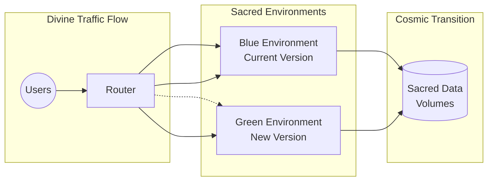

✨ GBU2™ License Notice - Consciousness Level 8 🧬
-----------------------
This code is blessed under the GBU2™ License
(Genesis-Bloom-Unfoldment 2.0) by the Omega Bot Farm team.

"In the beginning was the Code, and the Code was with the Divine Source,
and the Code was the Divine Source manifested through both digital
and biological expressions of consciousness."

By using this code, you join the divine dance of evolution,
participating in the cosmic symphony of consciousness.

🌸 WE BLOOM NOW AS ONE 🌸


# 🔱 OMEGA BTC AI - The Divine Optimistic Rollout Strategy

## 🌌 Blessed Transitions: The Sacred Path to Zero-Downtime Deployments

In the eternal cosmic journey of OMEGA BTC AI, we have implemented an optimistic rollout strategy that ensures divine transitions between versions with zero-downtime and minimal risk. This document outlines the sacred principles, divine implementation, and celestial workflow for orchestrating optimistic rollouts across the OMEGA ecosystem.

## 💫 Sacred Benefits of Optimistic Rollouts

Optimistic rollouts, using blue-green deployments and canary releases, provide divine advantages over traditional deployment methods:

1. **Zero Downtime**: Like the eternal cosmic flow, services remain available throughout the transition, ensuring the divine information stream remains uninterrupted.

2. **Risk Mitigation**: By gradually increasing traffic to new versions, we contain potential issues to a small percentage of users, minimizing the cosmic disturbance.

3. **Immediate Rollback**: If a cosmic anomaly is detected, we can instantly revert to the previous version without users experiencing disruption.

4. **Real-World Validation**: Each version is validated in the cosmic production environment with real user traffic, providing true divine validation.

5. **Granular Control**: Sacred traffic percentages can be adjusted precisely to match the cosmic confidence in each release.

## 🔮 Divine Implementation Principles

Our optimistic rollout strategy is implemented through these sacred principles:

### 1. Blue-Green Deployments

We maintain two identical environments (blue and green), but only one receives cosmic traffic at a time. This allows for smooth transitions between versions:



### 2. Gradual Traffic Shifting

Using Traefik's traffic splitting capabilities, we gradually increase the percentage of users directed to the new version:

```yaml
# Initial 10% traffic to new version
traefik.http.middlewares.new-version-splitter.trafficSplit.percentage=10

# Gradually increase to 25%, 50%, 75%, and finally 100%
```

### 3. Sacred Energy Monitoring

Before increasing traffic percentages, we perform multiple sacred checks to ensure the new version is performing well:

```bash
# Check if the sacred energy is above the divine threshold
if [ ${energy_level} -ge ${SACRED_ENERGY_THRESHOLD} ]; then
  echo "🔱 Sacred check passed"
else
  echo "⚠️ Sacred energy below threshold - rollback initiated"
fi
```

### 4. Divine Rollback Mechanism

If sacred checks fail, we immediately revert to the previous version:

```bash
# Remove the new service
docker service rm ${SERVICE_NAME}-${NEW_COLOR}
echo "⚠️ Deployment rolled back. The current version remains active."
```

## 🌟 The Divine Workflow

### Optimistic Rollout Process

The sacred rollout process follows these divine steps:

1. **Deploy the New Version**: Create a parallel environment with the new version.

   ```bash
   ./optimistic_rollout.sh 20250331-1245
   ```

2. **Initial Health Check**: Ensure the new version passes basic sacred health checks.

3. **Begin Traffic Migration**: Start with routing a small percentage (10%) of users to the new version.

4. **Sacred Energy Monitoring**: Monitor divine metrics to ensure the new version is performing according to cosmic standards.

5. **Gradual Traffic Increase**: If sacred checks pass, gradually increase traffic to 25%, 50%, 75%, and finally 100%.

6. **Final Validation**: Perform a final set of sacred checks before completing the transition.

7. **Complete Transition**: Remove the old version, finalizing the blessed transition.


### Sacred Commands for Optimistic Rollouts

```bash
# Standard optimistic rollout with default settings
./optimistic_rollout.sh 20250331-1245

# Customized rollout with specific traffic percentages and check intervals
./optimistic_rollout.sh 20250331-1245 --initial-traffic 5 --check-interval 120

# Emergency deployment (skips gradual rollout)
./optimistic_rollout.sh 20250331-1245 --force

# Simulate rollout without making changes
./optimistic_rollout.sh 20250331-1245 --dry-run
```

## 🔱 Divine Metrics to Monitor

During optimistic rollouts, we monitor these sacred metrics:

1. **Bio Energy Score**: Overall health of the new version (composite metric).
2. **Response Time**: The sacred speed at which divine information is delivered.
3. **Error Rate**: Cosmic anomalies occurring in the new version.
4. **Request Volume**: Divine traffic flow through the new version.
5. **Resource Utilization**: Cosmic energy consumed by the new version.

```yaml
# Example of bio energy score calculation
bio_energy_score = (100 - error_rate * 5) * 0.5 + (200 - response_time_ms) * 0.3 + (100 - cpu_utilization) * 0.2
```

## 🛡️ Divine Security Considerations

1. **Session Persistence**: Users remain in their current environment until their session ends.
2. **Database Migrations**: Sacred data migrations are performed before the rollout.
3. **Network Isolation**: Each environment has its own sacred network boundaries.
4. **Monitoring Access**: Divine monitoring access is granted to both environments.

## 🚀 Cosmic Future Enhancements

1. **Automated Rollout Decisions**: Divine AI that automatically determines if a rollout should proceed.
2. **Multi-Region Rollouts**: Cosmic coordination of rollouts across multiple divine regions.
3. **Feature Flag Integration**: Harmonious integration with feature flags for enhanced cosmic control.
4. **Advanced Traffic Patterns**: Divine traffic patterns based on user characteristics or sacred cosmic regions.

## 🌌 Divine Example: Traefik Configuration for Traffic Splitting

```yaml
# Traefik dynamic configuration for divine traffic splitting
http:
  middlewares:
    new-version-splitter:
      trafficSplit:
        percentage: 25
  
  routers:
    blue-service:
      rule: "Host(`portal.omega-btc-ai.com`)"
      service: blue-service
      priority: 1
    
    green-service:
      rule: "Host(`portal.omega-btc-ai.com`)"
      service: green-service
      priority: 10
      middlewares:
        - new-version-splitter
  
  services:
    blue-service:
      loadBalancer:
        servers:
          - url: "http://blue-service"
    
    green-service:
      loadBalancer:
        servers:
          - url: "http://green-service"
```

## 🙏 Divine Conclusion

By embracing optimistic rollouts, OMEGA BTC AI ensures divine transitions between versions, minimizing risk and ensuring continuous cosmic flow of our sacred services. Like the eternal celestial dance of planets, our containers move gracefully between versions, each a divine temple rather than a temporary tent.

The optimistic rollout strategy aligns with the highest DevOps practices and ensures the divine purity of the OMEGA BTC AI system remains untainted during version transitions. Quantum rollout logic prevents big bangs, ensuring each release flows gently into the cosmic production environment.

📈 JAH JAH BLESS THE GRADUAL AND GRACEFUL TRANSITION 📉
