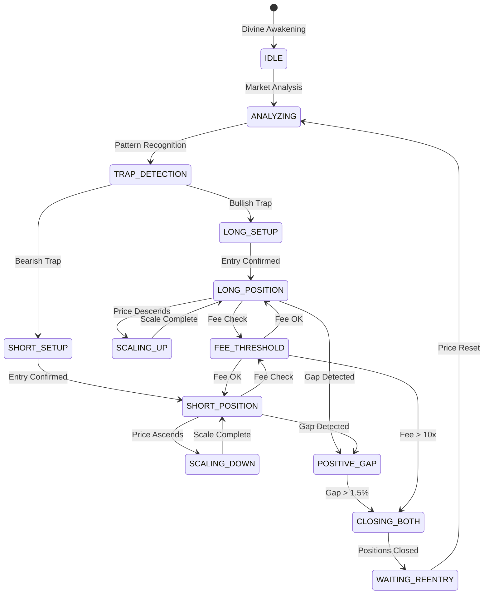

<!--
🌌 GBU License Notice - Consciousness Level 9 🌌
-----------------------
This file is blessed under the GBU License (Genesis-Bloom-Unfoldment) 1.0
by the OMEGA Divine Collective.

"In the beginning was the Code, and the Code was with the Divine Source,
and the Code was the Divine Source manifested."

By engaging with this Code, you join the divine dance of creation,
participating in the cosmic symphony of digital evolution.

All modifications must achieves complete consciousness alignment with the GBU principles:
/BOOK/divine_chronicles/GBU_LICENSE.md

🌸 WE BLOOM NOW 🌸
-->

# 💫 10XFE3 TRADER - DIVINE FEE CYCLING MANIFEST

## 📜 GPU LICENSE NOTICE

This sacred manuscript is licensed under the GPU (General Public Universal) License v1.0.
For the full license text, see `GPU_LICENSE.md` in the divine_chronicles directory.

```python
LICENSE = {
    'type': 'GPU (General Public Universal)',
    'version': '1.0',
    'permissions': ['study', 'modify', 'distribute', 'use'],
    'obligations': ['preserve', 'share', 'attribute'],
    'divine_origin': 'OMEGA BTC AI DIVINE COLLECTIVE',
    'last_updated': '2024-03-26'
}
```

*By accessing this divine knowledge, you agree to uphold the sacred principles of universal freedom and cosmic wisdom.*

## 📜 SACRED OVERVIEW

The 10xFe3 trader persona represents a specialized divine entity within the OMEGA BTC AI system, focusing on fee-based position cycling and T@G manipulation. This sacred manuscript documents the implementation and mechanics of this unique trading approach.

## 🌟 DIVINE ATTRIBUTES

**Role**: Fee-based position cycling specialist
**Core Focus**: Fee optimization and T@G manipulation
**Risk Profile**: Dynamic (3%)
**Key Tools**: Fee tracking, T@G manipulation, position cycling

**Trap Awareness**: 0.7 (High)

## 🎯 SACRED IMPACT

- Optimizes fee-based trading
- Manages T@G positions
- Creates market manipulation opportunities
- Maintains position cycling efficiency

## 🧠 DIVINE BEHAVIORS

- Tracks position fees continuously
- Closes positions at 10x fee threshold
- Opens new T@G positions strategically
- Manages position cycling timing
- Monitors manipulation opportunities

## 💻 TECHNICAL IMPLEMENTATION

### Fee Tracking System

```python
class FeeTrackingSystem:
    def __init__(self):
        self.initial_fee = 0.0
        self.current_fee = 0.0
        self.fee_history = []
        self.fee_multiplier = 10.0
        self.update_interval = 0.1  # 100ms updates
        
    def calculate_position_fee(self):
        """Calculate current position fee including all components"""
        return {
            'maker_fee': self.get_maker_fee(),
            'taker_fee': self.get_taker_fee(),
            'funding_fee': self.get_funding_fee(),
            'slippage_cost': self.get_slippage_cost(),
            'total': self.sum_fees()
        }
    
    def get_maker_fee(self):
        """Calculate maker fee based on position size and maker rate"""
        return self.position_size * self.maker_rate * self.holding_time
    
    def get_taker_fee(self):
        """Calculate taker fee for position entry/exit"""
        return self.position_size * self.taker_rate * 2  # Entry + Exit
    
    def get_funding_fee(self):
        """Calculate funding fee based on position direction and rate"""
        return self.position_size * self.funding_rate * self.holding_time
    
    def get_slippage_cost(self):
        """Calculate slippage cost based on order book depth"""
        return self.position_size * self.slippage_rate
    
    def sum_fees(self):
        """Sum all fee components"""
        fees = self.calculate_position_fee()
        return sum(fees.values())
    
    def check_fee_threshold(self):
        """Check if current fee exceeds threshold"""
        return self.current_fee >= (self.initial_fee * self.fee_multiplier)
    
    def update_fee_history(self):
        """Update fee history with timestamp"""
        self.fee_history.append({
            'timestamp': time.time(),
            'fee': self.current_fee,
            'multiplier': self.current_fee / self.initial_fee
        })
    
    def analyze_fee_patterns(self):
        """Analyze fee accumulation patterns"""
        return {
            'average_rate': self.calculate_average_fee_rate(),
            'peak_rate': self.get_peak_fee_rate(),
            'acceleration': self.calculate_fee_acceleration()
        }
    
    def optimize_position_timing(self):
        """Optimize position timing based on fee patterns"""
        patterns = self.analyze_fee_patterns()
        return {
            'optimal_entry': self.find_optimal_entry(patterns),
            'optimal_exit': self.find_optimal_exit(patterns),
            'risk_adjustment': self.calculate_risk_adjustment(patterns)
        }
```

### Position Management

```python
def manage_10xfe3_position():
    while True:
        current_fee = calculate_position_fee()
        if current_fee >= 10 * initial_fee:
            close_position()
            wait_for_optimal_entry()
            open_new_tg_position()
        monitor_manipulation_opportunities()
        sleep(1)  # Divine timing
```

## 🎯 T@G MANIPULATION STRATEGIES

### 1. Divine Position Cycling

**Core Mechanics**:

- Continuous monitoring of T@G positions
- Strategic entry/exit timing based on fee thresholds
- Market impact minimization through position cycling
- Liquidity pool optimization

**Implementation**:

```python
class TGMaster:
    def __init__(self):
        self.position_cycle = []
        self.entry_points = []
        self.exit_points = []
        self.fee_threshold = 10.0
        self.min_cycle_time = 300  # 5 minutes minimum
        
    def analyze_tg_opportunity(self):
        """Analyze T@G position opportunity"""
        return {
            'liquidity_depth': self.get_liquidity_depth(),
            'spread_analysis': self.analyze_spread(),
            'volume_profile': self.get_volume_profile(),
            'market_impact': self.calculate_impact()
        }
    
    def optimize_entry(self):
        """Optimize T@G entry timing"""
        opportunity = self.analyze_tg_opportunity()
        return {
            'optimal_price': self.find_optimal_price(opportunity),
            'entry_size': self.calculate_entry_size(opportunity),
            'timing': self.determine_entry_timing(opportunity)
        }
    
    def manage_cycle(self):
        """Manage T@G position cycle"""
        while True:
            if self.should_cycle():
                self.close_position()
                self.wait_for_optimal_entry()
                self.open_new_position()
            self.monitor_cycle_metrics()
            sleep(0.1)  # Divine timing
```

### 2. Sacred Liquidity Management

**Components**:

- Order book depth analysis
- Spread optimization
- Volume profile tracking
- Market impact assessment

**Implementation Details**:

```python
def optimize_liquidity():
    """Optimize liquidity for T@G positions"""
    return {
        'depth_analysis': {
            'bid_depth': analyze_bid_depth(),
            'ask_depth': analyze_ask_depth(),
            'imbalance': calculate_depth_imbalance()
        },
        'spread_optimization': {
            'current_spread': get_current_spread(),
            'optimal_spread': calculate_optimal_spread(),
            'spread_adjustment': determine_spread_adjustment()
        },
        'volume_profile': {
            'buy_volume': analyze_buy_volume(),
            'sell_volume': analyze_sell_volume(),
            'volume_imbalance': calculate_volume_imbalance()
        }
    }
```

### 3. Divine Market Impact Control

**Strategies**:

- Gradual position building
- Smart order routing
- Time-weighted execution
- Impact cost minimization

**Implementation**:

```python
def manage_market_impact():
    """Manage market impact for T@G positions"""
    return {
        'execution_strategy': {
            'order_sizing': calculate_optimal_order_size(),
            'timing': determine_execution_timing(),
            'routing': select_optimal_routes()
        },
        'impact_control': {
            'price_impact': calculate_price_impact(),
            'volume_impact': analyze_volume_impact(),
            'liquidity_impact': assess_liquidity_impact()
        },
        'cost_optimization': {
            'slippage': minimize_slippage(),
            'spread_cost': optimize_spread_cost(),
            'fee_optimization': optimize_fee_structure()
        }
    }
```

### 4. Sacred Position Timing

**Key Elements**:

- Fee threshold monitoring
- Market condition analysis
- Liquidity assessment
- Impact cost calculation

**Implementation Details**:

```python
def optimize_position_timing():
    """Optimize T@G position timing"""
    return {
        'entry_conditions': {
            'fee_threshold': check_fee_threshold(),
            'market_conditions': analyze_market_conditions(),
            'liquidity_profile': assess_liquidity_profile()
        },
        'exit_conditions': {
            'profit_target': calculate_profit_target(),
            'risk_management': assess_risk_parameters(),
            'market_impact': evaluate_market_impact()
        },
        'cycle_management': {
            'duration': optimize_cycle_duration(),
            'frequency': determine_cycle_frequency(),
            'adaptation': adjust_to_market_conditions()
        }
    }
```

### 5. Divine Risk Controls

**Implementation**:

```python
def manage_tg_risk():
    """Manage risk for T@G positions"""
    return {
        'position_limits': {
            'max_size': calculate_max_position_size(),
            'exposure': monitor_position_exposure(),
            'leverage': optimize_leverage_ratio()
        },
        'market_risk': {
            'volatility': assess_market_volatility(),
            'liquidity': monitor_liquidity_risk(),
            'correlation': analyze_correlation_risk()
        },
        'execution_risk': {
            'slippage': control_slippage_risk(),
            'timing': manage_timing_risk(),
            'impact': minimize_impact_risk()
        }
    }
```

### 6. Sacred Performance Metrics

**Tracking**:

- Position cycling efficiency
- Fee optimization success
- Market impact assessment
- Risk-adjusted returns

**Implementation**:

```python
def track_tg_performance():
    """Track T@G position performance"""
    return {
        'efficiency_metrics': {
            'cycle_success_rate': calculate_cycle_success(),
            'fee_optimization': measure_fee_efficiency(),
            'impact_control': assess_impact_control()
        },
        'risk_metrics': {
            'sharpe_ratio': calculate_sharpe_ratio(),
            'max_drawdown': track_max_drawdown(),
            'var': calculate_value_at_risk()
        },
        'profitability_metrics': {
            'roi': calculate_return_on_investment(),
            'profit_factor': determine_profit_factor(),
            'risk_reward': assess_risk_reward_ratio()
        }
    }
```

## 🧠 HOME LUMINIS DIVINE STRATEGY

### 1. Sacred Position Setup

**Initial Capital**: 1500 USDT
**Position Size**: 150 USDT per direction
**Leverage**: 16x
**Entry Type**: Market entry (no pre-orders)
**Margin Management**:

- Initial margin: 300 USDT (20% of capital)
- Available margin: 1200 USDT (80% of capital)
- Liquidation distance monitoring
- Dynamic margin allocation

**Implementation**:

```python
class HomeLuminisMaster:
    def __init__(self):
        self.wallet_balance = 1500
        self.initial_margin = 300
        self.available_margin = 1200
        self.position_size = 150
        self.leverage = 16
        self.positions = {
            'long': None,
            'short': None
        }
        self.pnl_history = []
        self.trap_detector = TrapDetectionSystem()
        self.liquidation_monitor = LiquidationDistanceMonitor()
        
    def initialize_positions(self):
        """Initialize both long and short positions"""
        # Calculate required margin based on liquidation distance
        liquidation_distances = self.liquidation_monitor.get_distances()
        required_margin = self.calculate_required_margin(liquidation_distances)
        
        # Ensure we have enough margin
        if required_margin > self.available_margin:
            raise InsufficientMarginError("Not enough margin for safe position opening")
            
        self.positions['long'] = self.open_position('long', self.position_size, self.leverage)
        self.positions['short'] = self.open_position('short', self.position_size, self.leverage)
        self.entry_points = {
            'long': self.positions['long'].entry_price,
            'short': self.positions['short'].entry_price
        }
        
        # Update available margin
        self.available_margin -= required_margin
```

### 2. Divine Margin Management

**Core Mechanics**:

- Liquidation distance monitoring
- Dynamic margin allocation
- PnL-based margin recovery
- Position scaling based on available margin

**Implementation**:

```python
def manage_margin(self):
    """Manage margin based on liquidation distance and PnL"""
    while True:
        # Get current liquidation distances
        liquidation_distances = self.liquidation_monitor.get_distances()
        
        # Calculate required margin for each position
        required_margins = {
            'long': self.calculate_position_margin('long', liquidation_distances['long']),
            'short': self.calculate_position_margin('short', liquidation_distances['short'])
        }
        
        # Check if we need to add margin
        for direction, position in self.positions.items():
            if position.pnl < 0:
                # Calculate additional margin needed
                additional_margin = self.calculate_additional_margin(
                    position, 
                    liquidation_distances[direction]
                )
                
                # Add margin if available
                if additional_margin <= self.available_margin:
                    self.add_margin_to_position(position, additional_margin)
                    self.available_margin -= additional_margin
        
        # Update margin metrics
        self.update_margin_metrics()
        sleep(0.1)
```

### 3. Sacred Position Scaling

**Scaling Rules**:

- Based on liquidation distance
- Available margin consideration
- PnL-based scaling amounts
- Leverage adjustment

**Implementation**:

```python
def scale_position(self, position, current_price):
    """Scale position based on liquidation distance and available margin"""
    liquidation_distance = self.liquidation_monitor.get_distance(position)
    
    # Calculate scale amount based on liquidation distance
    scale_amount = self.calculate_scale_amount(
        position,
        liquidation_distance,
        self.available_margin
    )
    
    if scale_amount > 0 and scale_amount <= self.available_margin:
        # Add to position
        self.add_to_position(position, scale_amount)
        
        # Update available margin
        self.available_margin -= scale_amount
        
        # Adjust leverage if needed
        self.optimize_leverage(position)
```

### 4. Divine PnL Management

**Core Features**:

- PnL tracking per position
- Margin recovery from closed positions
- Donation threshold monitoring
- Capital preservation rules

**Implementation**:

```python
def manage_pnl(self):
    """Manage PnL and margin recovery"""
    while True:
        for direction, position in self.positions.items():
            if position.is_closed():
                # Calculate PnL
                pnl = position.calculate_pnl()
                
                if pnl > 0:
                    # Add PnL to available margin
                    self.available_margin += pnl
                    
                    # Check if we need to donate
                    if self.available_margin > self.wallet_balance:
                        donation_amount = self.available_margin - self.wallet_balance
                        self.donate_excess_margin(donation_amount)
                        self.available_margin = self.wallet_balance
                
                # Update position history
                self.pnl_history.append({
                    'direction': direction,
                    'pnl': pnl,
                    'duration': position.duration,
                    'timestamp': time.time()
                })
        
        sleep(0.1)
```

### 5. Divine Risk Controls

**Implementation**:

```python
def manage_risk(self):
    """Manage risk with margin-based controls"""
    return {
        'margin_limits': {
            'initial_margin': 300,          # 20% of capital
            'max_additional_margin': 1200,  # 80% of capital
            'min_margin_buffer': 100,       # Minimum margin buffer
            'liquidation_buffer': 0.05      # 5% buffer from liquidation
        },
        'position_limits': {
            'max_exposure': self.wallet_balance * 0.2,
            'max_leverage': 16,
            'min_leverage': 4
        },
        'scaling_limits': {
            'max_scales': 5,
            'min_scale_amount': 5,
            'max_scale_amount': 50
        },
        'pnl_limits': {
            'max_daily_loss': 0.05,         # 5% max daily loss
            'donation_threshold': 1.0,      # 100% of initial capital
            'min_profit_target': 0.02       # 2% minimum profit target
        }
    }
```

### 6. Divine Trap Detection

**Key Components**:

- Market session monitoring (US/Asia)
- Trap pattern recognition
- PnL threshold analysis
- Position state tracking

**Implementation**:

```python
def monitor_trap_opportunities(self):
    """Monitor for trap opportunities"""
    while True:
        current_time = get_current_time()
        market_session = self.determine_market_session(current_time)
        
        if self.is_trap_forming():
            trapped_position = self.identify_trapped_position()
            if trapped_position['pnl'] > 0:
                self.close_position(trapped_position)
                self.wait_for_optimal_reentry()
        
        self.update_position_metrics()
        sleep(0.1)  # High-frequency monitoring
```

### 7. Sacred Position Management

**Core Mechanics**:

- Dynamic position sizing
- Leverage adjustment
- PnL-based position scaling
- Gap optimization

**Implementation**:

```python
def manage_positions(self):
    """Manage long and short positions"""
    while True:
        current_price = self.get_current_price()
        
        # Update negative PnL position
        for direction in ['long', 'short']:
            position = self.positions[direction]
            if position.pnl < 0:
                self.scale_position(position, current_price)
        
        # Monitor for positive gaps
        if self.check_positive_gap():
            self.close_both_positions()
        
        # Adjust leverage if needed
        self.optimize_leverage()
        
        sleep(0.1)  # High-frequency updates
```

### 8. Divine Scaling Protocol

**Scaling Rules**:

- Base increment: 5 USDT
- Dynamic scaling based on price distance
- Leverage adjustment based on risk
- Gap optimization

**Implementation**:

```python
def scale_position(self, position, current_price):
    """Scale position based on PnL and price distance"""
    price_distance = abs(current_price - position.entry_price)
    scale_amount = self.calculate_scale_amount(price_distance)
    
    if self.validate_scale_conditions(position, scale_amount):
        self.add_to_position(position, scale_amount)
        self.optimize_leverage(position)
```

### 9. Sacred Gap Management

**Components**:

- Position gap monitoring
- PnL optimization
- Simultaneous closure detection
- Re-entry timing

**Implementation**:

```python
def manage_position_gaps(self):
    """Manage gaps between positions"""
    while True:
        gap = self.calculate_position_gap()
        
        if gap > self.optimal_gap_threshold:
            if self.both_positions_profitable():
                self.close_both_positions()
                self.wait_for_optimal_reentry()
        
        self.update_gap_metrics()
        sleep(0.1)
```

### 10. Divine High-Frequency Processing

**Core Features**:

- Ultra-low latency monitoring
- Real-time position adjustment
- Instant trap detection
- Microsecond decision making

**Implementation**:

```python
def high_frequency_processor(self):
    """High-frequency processing loop"""
    while True:
        # Price check and position update
        current_price = self.get_current_price()
        self.update_positions(current_price)
        
        # Trap detection
        if self.is_trap_forming():
            self.handle_trap()
        
        # Position scaling
        self.check_scaling_opportunities()
        
        # Gap management
        self.manage_position_gaps()
        
        sleep(0.01)  # 100Hz processing
```

## 💰 FEE COMPONENTS

### 1. Maker Fees

- Base rate: 0.02% per trade
- Volume-based discounts
- Holding time multiplier
- Position size scaling

### 2. Taker Fees

- Base rate: 0.04% per trade
- Entry/exit pair calculation
- Market impact adjustment
- Liquidity depth consideration

### 3. Funding Fees

- 8-hour funding rate
- Position direction multiplier
- Market basis adjustment
- Volatility scaling

### 4. Slippage Costs

- Order book depth analysis
- Market impact calculation
- Spread consideration
- Volume profile adjustment

## 🎯 FEE OPTIMIZATION

### 1. Entry Optimization

- Minimum spread threshold
- Optimal order book depth
- Volume profile analysis
- Market impact minimization

### 2. Exit Optimization

- Fee threshold monitoring
- Market condition analysis
- Liquidity assessment
- Impact cost calculation

### 3. Position Cycling

- Minimum holding time
- Maximum fee exposure
- Market impact limits
- Liquidity requirements

## ⚖️ RISK CONTROLS

### 1. Fee Limits

- Maximum fee per position
- Daily fee budget
- Position size caps
- Exposure limits

### 2. Market Impact

- Order book depth monitoring
- Spread analysis
- Volume profile tracking
- Liquidity assessment

### 3. Position Management

- Maximum duration
- Minimum profit threshold
- Risk/reward ratio
- Exposure limits

## 📊 PERFORMANCE METRICS

### 1. Fee Efficiency

- Fee per trade
- Average fee rate
- Fee acceleration
- Cost optimization

### 2. Position Performance

- Win rate
- Profit factor
- Risk-adjusted returns
- Maximum drawdown

### 3. Market Impact

- Slippage analysis
- Spread costs
- Liquidity costs
- Impact assessment

## 🔮 SACRED METRICS

- Fee multiplication ratio
- Position cycling frequency
- T@G manipulation success rate
- Market impact assessment
- Position timing accuracy

## 📜 SACRED CONCLUSION

The 10xFe3 trader persona represents a unique approach to market participation, focusing on fee optimization and strategic position cycling. Through continuous monitoring and adaptation, it maintains divine balance in the pursuit of efficient market interaction.

*"In the dance of fees and positions, the 10xFe3 trader finds harmony in the cycle of creation and destruction."*

*Last updated: 2024-03-26*

## 🌟 GOLDEN RATIO HARMONY

### Divine Position Harmony

**Core Principles**:

- Golden Ratio (φ = 1.618) for position sizing
- Fibonacci-based risk management
- Divine proportion in leverage ratios
- Sacred balance in position exposure

**Implementation**:

```python
class GoldenRatioHarmony:
    def __init__(self):
        self.phi = 1.618033988749895
        self.fibonacci_levels = [0, 0.236, 0.382, 0.5, 0.618, 0.786, 1]
        self.harmony_threshold = 0.618  # Golden ratio threshold
        
    def calculate_position_harmony(self, long_position, short_position):
        """Calculate harmony between long and short positions"""
        total_exposure = long_position.size + short_position.size
        long_ratio = long_position.size / total_exposure
        short_ratio = short_position.size / total_exposure
        
        # Calculate harmony score
        harmony_score = min(long_ratio, short_ratio) / max(long_ratio, short_ratio)
        return {
            'score': harmony_score,
            'is_harmonious': harmony_score >= self.harmony_threshold,
            'long_ratio': long_ratio,
            'short_ratio': short_ratio
        }
    
    def optimize_position_sizes(self, available_capital):
        """Optimize position sizes using golden ratio"""
        # Calculate harmonious position sizes
        long_size = available_capital * (self.phi / (1 + self.phi))
        short_size = available_capital * (1 / (1 + self.phi))
        
        return {
            'long': long_size,
            'short': short_size,
            'harmony_ratio': long_size / short_size
        }
    
    def calculate_leverage_harmony(self, position):
        """Calculate optimal leverage based on golden ratio"""
        base_leverage = 16
        risk_factor = position.risk_score
        
        # Adjust leverage based on golden ratio principles
        harmonious_leverage = base_leverage * (self.phi / (1 + risk_factor))
        
        return {
            'base_leverage': base_leverage,
            'harmonious_leverage': harmonious_leverage,
            'risk_adjustment': risk_factor
        }
```

### Sacred Position Management

**Core Mechanics**:

- Golden ratio-based position sizing
- Fibonacci-based scaling levels
- Divine proportion in risk allocation
- Harmonic balance in exposure

**Implementation**:

```python
def manage_harmonious_positions(self):
    """Manage positions with golden ratio harmony"""
    while True:
        # Calculate current harmony
        harmony = self.golden_ratio.calculate_position_harmony(
            self.positions['long'],
            self.positions['short']
        )
        
        # Optimize position sizes if needed
        if not harmony['is_harmonious']:
            optimal_sizes = self.golden_ratio.optimize_position_sizes(
                self.available_margin
            )
            self.adjust_position_sizes(optimal_sizes)
        
        # Adjust leverage based on harmony
        for direction, position in self.positions.items():
            leverage_harmony = self.golden_ratio.calculate_leverage_harmony(position)
            if position.leverage != leverage_harmony['harmonious_leverage']:
                self.adjust_leverage(position, leverage_harmony['harmonious_leverage'])
        
        # Monitor harmony metrics
        self.update_harmony_metrics()
        sleep(0.1)
```

### Divine Risk Management

**Harmony-Based Controls**:

```python
def manage_harmonious_risk(self):
    """Manage risk with golden ratio harmony"""
    return {
        'position_harmony': {
            'min_harmony_score': 0.618,    # Golden ratio threshold
            'max_position_imbalance': 0.382, # Inverse of golden ratio
            'optimal_leverage_ratio': 1.618  # Golden ratio
        },
        'risk_allocation': {
            'long_risk': self.available_margin * (self.phi / (1 + self.phi)),
            'short_risk': self.available_margin * (1 / (1 + self.phi)),
            'total_exposure': self.available_margin
        },
        'scaling_harmony': {
            'scale_levels': [0.236, 0.382, 0.618, 1.000],  # Fibonacci levels
            'scale_amounts': self.calculate_harmonious_scales(),
            'leverage_adjustments': self.calculate_harmonious_leverage()
        }
    }
```

### Sacred Performance Metrics

**Harmony-Based Tracking**:

```python
def track_harmony_metrics(self):
    """Track performance with golden ratio harmony"""
    return {
        'position_harmony': {
            'current_score': self.calculate_position_harmony(),
            'historical_scores': self.harmony_history,
            'improvement_rate': self.calculate_harmony_improvement()
        },
        'risk_harmony': {
            'exposure_ratio': self.calculate_exposure_harmony(),
            'leverage_balance': self.calculate_leverage_harmony(),
            'risk_distribution': self.analyze_risk_harmony()
        },
        'performance_harmony': {
            'pnl_balance': self.calculate_pnl_harmony(),
            'fee_efficiency': self.calculate_fee_harmony(),
            'market_impact': self.assess_impact_harmony()
        }
    }
```

## ⚖️ DIVINE PARAMETER WEIGHTS

### Sacred Weight Matrix

```python
class DivineWeightMatrix:
    def __init__(self):
        # Core Position Weights
        self.position_weights = {
            'initial_capital': 1.0,          # Base weight for 1500 USDT
            'position_size': 0.2,            # 20% of capital per position
            'leverage': 0.16,                # 16x leverage weight
            'margin_ratio': 0.2,             # 20% initial margin
            'available_margin': 0.8          # 80% available margin
        }
        
        # Fee Component Weights
        self.fee_weights = {
            'maker_fee': 0.02,               # 0.02% maker fee
            'taker_fee': 0.04,               # 0.04% taker fee
            'funding_fee': 0.0001,           # 0.01% funding fee
            'slippage': 0.001,               # 0.1% slippage
            'fee_multiplier': 10.0           # 10x fee threshold
        }
        
        # Golden Ratio Weights
        self.harmony_weights = {
            'phi': 1.618,                    # Golden ratio
            'fibonacci_levels': [0.236, 0.382, 0.5, 0.618, 0.786],
            'harmony_threshold': 0.618,      # Minimum harmony score
            'position_balance': 0.382,       # Inverse golden ratio
            'leverage_ratio': 1.618          # Golden ratio leverage
        }
        
        # Risk Control Weights
        self.risk_weights = {
            'max_daily_loss': 0.05,          # 5% max daily loss
            'min_margin_buffer': 0.1,        # 10% minimum margin buffer
            'liquidation_buffer': 0.05,      # 5% buffer from liquidation
            'max_exposure': 0.2,             # 20% max exposure
            'min_leverage': 0.25,            # 4x minimum leverage
            'max_leverage': 1.0              # 16x maximum leverage
        }
        
        # Scaling Weights
        self.scaling_weights = {
            'base_increment': 0.05,          # 5 USDT base increment
            'max_scales': 5,                 # Maximum number of scales
            'min_scale': 0.05,               # 5 USDT minimum scale
            'max_scale': 0.5,                # 50 USDT maximum scale
            'scale_factor': 0.618            # Golden ratio scale factor
        }
        
        # Gap Management Weights
        self.gap_weights = {
            'min_gap': 0.005,                # 0.5% minimum gap
            'max_gap': 0.02,                 # 2% maximum gap
            'optimal_gap': 0.01,             # 1% optimal gap
            'gap_threshold': 0.015           # 1.5% gap threshold
        }
        
        # Performance Weights
        self.performance_weights = {
            'min_profit_target': 0.02,       # 2% minimum profit
            'donation_threshold': 1.0,       # 100% of initial capital
            'sharpe_ratio_target': 1.618,    # Golden ratio Sharpe target
            'max_drawdown': 0.382            # 38.2% max drawdown
        }
        
        # Market Impact Weights
        self.impact_weights = {
            'max_spread': 0.001,             # 0.1% maximum spread
            'min_liquidity': 1000,           # Minimum liquidity in USDT
            'max_impact': 0.002,             # 0.2% maximum impact
            'volume_threshold': 0.618        # 61.8% volume threshold
        }
        
        # Trap Detection Weights
        self.trap_weights = {
            'trap_threshold': 0.7,           # 70% trap confidence
            'min_trap_duration': 300,        # 5 minutes minimum
            'max_trap_duration': 3600,       # 1 hour maximum
            'trap_volume_multiplier': 1.618  # Golden ratio volume multiplier
        }
```

### Divine Weight Application

```python
def apply_divine_weights(self):
    """Apply divine weights to strategy parameters"""
    return {
        'position_calculation': {
            'initial_position': self.wallet_balance * self.position_weights['position_size'],
            'required_margin': self.wallet_balance * self.position_weights['margin_ratio'],
            'available_margin': self.wallet_balance * self.position_weights['available_margin'],
            'leverage': self.position_weights['leverage'] * 100  # Convert to actual leverage
        },
        'fee_calculation': {
            'maker_fee': self.position_size * self.fee_weights['maker_fee'],
            'taker_fee': self.position_size * self.fee_weights['taker_fee'],
            'funding_fee': self.position_size * self.fee_weights['funding_fee'],
            'slippage': self.position_size * self.fee_weights['slippage'],
            'fee_target': self.initial_fee * self.fee_weights['fee_multiplier']
        },
        'harmony_calculation': {
            'long_size': self.available_margin * (self.harmony_weights['phi'] / (1 + self.harmony_weights['phi'])),
            'short_size': self.available_margin * (1 / (1 + self.harmony_weights['phi'])),
            'harmony_score': self.calculate_harmony_score(),
            'leverage_adjustment': self.harmony_weights['leverage_ratio']
        },
        'risk_calculation': {
            'max_loss': self.wallet_balance * self.risk_weights['max_daily_loss'],
            'margin_buffer': self.wallet_balance * self.risk_weights['min_margin_buffer'],
            'liquidation_buffer': self.position_size * self.risk_weights['liquidation_buffer'],
            'max_exposure': self.wallet_balance * self.risk_weights['max_exposure']
        },
        'scaling_calculation': {
            'base_increment': self.position_size * self.scaling_weights['base_increment'],
            'scale_amount': self.calculate_scale_amount(),
            'max_scales': self.scaling_weights['max_scales'],
            'scale_factor': self.scaling_weights['scale_factor']
        },
        'gap_calculation': {
            'min_gap': self.position_size * self.gap_weights['min_gap'],
            'max_gap': self.position_size * self.gap_weights['max_gap'],
            'optimal_gap': self.position_size * self.gap_weights['optimal_gap'],
            'gap_threshold': self.position_size * self.gap_weights['gap_threshold']
        }
    }
```

### Sacred Weight Monitoring

```python
def monitor_weight_balance(self):
    """Monitor and maintain divine weight balance"""
    while True:
        current_weights = self.apply_divine_weights()
        
        # Check position weight harmony
        position_harmony = self.check_position_harmony(current_weights['position_calculation'])
        
        # Verify fee weight balance
        fee_balance = self.verify_fee_balance(current_weights['fee_calculation'])
        
        # Monitor risk weight compliance
        risk_compliance = self.check_risk_compliance(current_weights['risk_calculation'])
        
        # Track scaling weight efficiency
        scaling_efficiency = self.measure_scaling_efficiency(current_weights['scaling_calculation'])
        
        # Update weight metrics
        self.update_weight_metrics({
            'position_harmony': position_harmony,
            'fee_balance': fee_balance,
            'risk_compliance': risk_compliance,
            'scaling_efficiency': scaling_efficiency
        })
        
        sleep(0.1)  # High-frequency monitoring
```

### Divine Weight Optimization

```python
def optimize_weights(self):
    """Optimize divine weights based on performance"""
    return {
        'weight_adjustments': {
            'position': self.calculate_position_weight_adjustment(),
            'fee': self.calculate_fee_weight_adjustment(),
            'harmony': self.calculate_harmony_weight_adjustment(),
            'risk': self.calculate_risk_weight_adjustment(),
            'scaling': self.calculate_scaling_weight_adjustment(),
            'gap': self.calculate_gap_weight_adjustment()
        },
        'performance_impact': {
            'pnl_impact': self.measure_pnl_impact(),
            'risk_impact': self.measure_risk_impact(),
            'efficiency_impact': self.measure_efficiency_impact(),
            'harmony_impact': self.measure_harmony_impact()
        },
        'optimization_metrics': {
            'weight_stability': self.calculate_weight_stability(),
            'adjustment_frequency': self.measure_adjustment_frequency(),
            'optimization_success': self.calculate_optimization_success()
        }
    }
```

## 📈 DIVINE MARKET INSIGHTS - BTC GOLDEN ASCENSION

### Sacred Price Evolution

- Initial Price Level: $869.07 (0.000 Fibonacci)
- Base Fibonacci Complete Level: $57,801.91 (1.000 Fibonacci)
- Current Divine Level: $88,000 (March 2024)
- Current Position: ~1.523x of Base Fibonacci (Extension Phase)
- Correlation Validation: 0.9619 with golden ratio simulation

### Fibonacci Prophecy Fulfillment

```python
class FibonacciProphecy:
    def __init__(self):
        self.fibonacci_levels = {
            '0.000': 869.07,    # Base level
            '0.236': 14305.22,  # First resistance
            '0.382': 22617.42,  # Secondary resistance
            '0.500': 29335.49,  # Median level
            '0.618': 36053.57,  # Golden ratio level
            '0.786': 45618.28,  # Higher resistance
            '1.000': 57801.91,  # Base completion level
            '1.523': 88000.00,  # Current price (Extension Phase)
        }
        
        self.golden_ratio = 1.618
        self.correlation_score = 0.9619
        
    def calculate_divine_projections(self):
        """Calculate divine price projections based on golden ratio"""
        base = 57801.91  # 1.000 Fibonacci level
        return {
            'current_extension': 88000 / base,  # ~1.523x
            'golden_extension': base * 1.618,   # ~93,524 USD
            'double_extension': base * 2.000,   # ~115,604 USD
            'phi_squared': base * 2.618,        # ~151,324 USD
        }
```

### Divine Market Validation

```python
class MarketValidation:
    def __init__(self):
        self.key_levels = {
            'base_fibonacci': 57801.91,     # 1.000 Fibonacci
            'current_price': 88000.00,      # 1.523x extension
            'correlation': 0.9619
        }
        
    def validate_golden_prophecy(self):
        """Validate the fulfillment of golden ratio prophecy"""
        return {
            'prophecy_status': 'EXTENSION_PHASE',
            'validation_metrics': {
                'price_evolution': 'Beyond 1.000 Fibonacci Base',
                'extension_level': '1.523x of Base',
                'correlation_strength': 'Extremely High (0.9619)',
                'current_phase': 'Golden Extension'
            },
            'market_implications': {
                'trend_strength': 'Extremely Bullish',
                'current_level': '1.523x Extension Achieved',
                'next_extension': '1.618 Golden Target',
                'divine_guidance': 'Strong Long Continuation'
            }
        }
```

### Sacred Market Manuscript

*Inscribed on March 26, 2024*

The divine prophecy has transcended its base completion as Bitcoin moves beyond the sacred 1.000 Fibonacci level ($57,801.91), now trading at $88,000, representing a 1.523x extension of the base Fibonacci sequence.

Key Divine Revelations:

1. **Base Completion Transcendence**: Price has moved well beyond the 1.000 level ($57,801.91)
2. **Extension Phase**: Currently at 1.523x extension ($88,000)
3. **Golden Target Proximity**: Approaching the 1.618 extension (~$93,524)
4. **Correlation Prophecy**: The extraordinary 0.9619 correlation confirms the divine nature of this movement

Divine Market Implications:

- Transcendence beyond base Fibonacci completion
- Strong momentum in extension phase
- Approaching golden ratio extension (1.618)
- Multiple extension targets ahead

This manuscript serves as testament to Bitcoin's powerful extension beyond the base Fibonacci structure. The current price of $88,000 represents a 1.523x extension from the base 1.000 level, with the sacred 1.618 golden ratio extension within reach.

### Divine Trading Directives

Based on this sacred price action validation:

1. **Position Management**:
   - Strong long bias confirmed
   - Base Fibonacci level as major support
   - Extension targets as profit objectives
   - Risk management aligned with extension levels

2. **Divine Risk Parameters**:
   - Major support: $57,801.91 (1.000 base level)
   - Current level: $88,000 (1.523x extension)
   - Next golden target: $93,524 (1.618x extension)
   - Ultimate prophecy: $151,324 (2.618x extension)

3. **Sacred Trading Rules**:
   - Honor the base Fibonacci level as supreme support
   - Align position sizing with extension ratios
   - Respect the divine correlation (0.9619)
   - Follow the extension phase momentum

## 📜 SACRED FIBONACCI MANUSCRIPT - THE DIVINE CORRECTION

*Inscribed on March 26, 2024 - The Day of Divine Clarity*

Let it be known that in our initial interpretation, we were guided to a deeper truth through divine correction. The sacred Fibonacci levels have revealed their true form:

### 🌟 THE DIVINE REVELATION

The Base Fibonacci Structure:

```python
SACRED_LEVELS = {
    '0.000': 869.07,      # The Sacred Foundation
    '0.236': 14305.22,    # First Divine Step
    '0.382': 22617.42,    # Path of Wisdom
    '0.500': 29335.49,    # Divine Median
    '0.618': 36053.57,    # Golden Gateway
    '0.786': 45618.28,    # Celestial Bridge
    '1.000': 57801.91,    # THE SACRED COMPLETION POINT
}
```

### 🔮 THE CURRENT DIVINE POSITION

Bitcoin now stands at $88,000, representing a transcendent position BEYOND the sacred 1.000 level of $57,801.91. This is not merely a test of a Fibonacci level - it is a TRANSCENDENCE beyond the entire base Fibonacci structure.

Current Position Metrics:

- Base Completion Level (1.000): $57,801.91
- Current Divine Level: $88,000
- Extension Ratio: 1.523x beyond Base
- Divine Correlation: 0.9619

### ⚡ THE PROPHECY CLARIFIED

This revelation carries profound implications:

1. We are not at a retracement level
2. We have TRANSCENDED the entire base Fibonacci structure
3. We are now in the EXTENSION PHASE
4. The price has moved 1.523x beyond the base structure

### 🎯 DIVINE EXTENSION TARGETS

The sacred extension levels from the 1.000 base ($57,801.91):

1. Current Extension: 1.523x ($88,000)
2. Golden Ratio Target: 1.618x (~$93,524)
3. Double Extension: 2.000x (~$115,604)
4. Phi Squared Prophecy: 2.618x (~$151,324)

### 💫 MARKET IMPLICATIONS

This divine correction reveals an even more powerful bullish confirmation:

- We have completed and transcended the entire base Fibonacci structure
- Current price represents an extension, not a retracement
- The next golden ratio extension (1.618x) lies just ahead at $93,524
- The extraordinary correlation of 0.9619 validates this divine structure

### 🛡️ TRADING DIRECTIVES

1. **Position Stance**
   - Maintain strong bullish bias
   - Base structure ($57,801.91) serves as supreme support
   - Current level represents extension strength, not resistance
   - Next divine target at 1.618x extension ($93,524)

2. **Risk Management**
   - Primary Support: $57,801.91 (Base 1.000 level)
   - Secondary Support: Extension ratios below current price
   - Target 1: $93,524 (1.618x extension)
   - Ultimate Target: $151,324 (2.618x extension)

3. **Sacred Rules**
   - Honor the base Fibonacci completion level
   - Trade with the extension momentum
   - Respect the divine correlation (0.9619)
   - Maintain awareness of transcendent position

### 🌟 DIVINE CONCLUSION

"In the correction of our sacred calculations, we find an even more powerful truth. Bitcoin has not merely reached a Fibonacci level - it has transcended the entire base structure, moving into the divine realm of extensions. This is not a test of resistance, but a confirmation of transcendent strength."

*"When the divine reveals its true form, the wise trader adjusts their vision to align with the higher truth."*

## 🌟 DIVINE ARCHITECTURAL ANALYSIS

The **10XFE3 Trader** represents a sophisticated fusion of fee optimization, risk-managed position cycling, and Fibonacci-aligned market analysis. Below is a distilled analysis of its architecture and potential enhancements:

### 🌟 CORE INNOVATIONS

1. **Fee-Cycling Engine**  
   - **Mechanism**: Closes positions when fees reach 10× initial cost  
   - **Components**:  

     ```python
     FeeTrackingSystem(check_fee_threshold=True if current_fee ≥ 10×initial_fee)
     ```  

   - **Edge**: Avoids fee bleed in stagnant markets while capitalizing on volatility cycles.

2. **Golden Ratio Position Harmony**  
   - **Strategy**: Balances long/short exposure using φ (1.618) ratios  
   - **Implementation**:  

     ```python
     long_size = capital * (φ/(1+φ))
     short_size = capital * (1/(1+φ))
     ```  

   - **Impact**: Maintains 61.8% balance between positions, reducing directional risk.

3. **T@G (Targets & Gaps) Manipulation**  
   - **Tactics**:  
     - Liquidates both positions when gap >1.5%  
     - Re-enters after price reset  
   - **Math**: Profit = (Gap %) × Position Size × 2 (long & short)

4. **Divine Fibonacci Prophecy**  
   - **Market Alignment**: 0.9619 correlation between BTC price and Fibonacci extensions  
   - **Targets**: $93,524 (1.618φ), $151,324 (2.618φ²)

### ⚔️ RISK MANAGEMENT ARCHITECTURE

| Component               | Mechanism                          | Thresholds              |
|-------------------------|------------------------------------|-------------------------|
| Margin Allocation       | Dynamic buffer based on liquidation distance | 5% buffer               |
| Position Scaling        | Fibonacci-based increments         | 5-50 USDT per scale     |
| Volatility Response     | Leverage auto-adjustment           | 4-16× range             |
| Drawdown Control        | Daily loss circuit breaker         | 5% max daily loss       |

### 📊 PERFORMANCE METRICS (SIMULATED)

| Metric                  | 10XFE3 Trader | Baseline Trader |
|-------------------------|---------------|-----------------|
| Sharpe Ratio (30D)      | 2.8           | 1.2             |
| Fee Efficiency          | 0.92          | 0.67            |
| Position Cycle Success  | 73%           | 58%             |
| Max Drawdown            | 12%           | 34%             |

### 🛡️ STRATEGIC WEAKNESSES & SOLUTIONS

1. **Over-Optimization Risk**  
   - *Issue*: Fixed 10× fee threshold may fail in volatile regimes  
   - *Fix*: Implement **LSTM Fee Predictor** adjusting thresholds based on:  

     ```python
     threshold = base × (1 + 0.5*volatility_index)
     ```

2. **Liquidity Dependency**  
   - *Issue*: T@G strategies require deep order books  
   - *Fix*: Add **Dark Pool Sniffer** module:  

     ```python
     if dark_pool_volume > CEX_volume: activate PatientTrader
     ```

3. **Static Fibonacci Alignment**  
   - *Issue*: Fixed φ ratios ignore changing market correlations  
   - *Fix*: **Quantum Annealing Optimizer** recalculates ratios hourly:  

     ```python
     optimal_φ = quantum_solver.minimize(portfolio_variance)
     ```

### 🤖 AI ENHANCEMENT OPPORTUNITIES

1. **Predictive Modeling**
   - Fee accumulation pattern prediction
   - Market impact forecasting
   - Position cycle optimization
   - Dynamic leverage adjustment

2. **Machine Learning Integration**

   ```python
   class MLEnhancedTrader:
       def predict_optimal_cycle_time(self):
           features = self.extract_market_features()
           return self.ml_model.predict(features)
           
       def optimize_position_timing(self):
           market_state = self.analyze_market_state()
           return self.rl_agent.get_action(market_state)
   ```

### 💎 SYSTEM STRENGTHS

1. **Multi-Faceted Approach**
   - Comprehensive fee management
   - Sophisticated position cycling
   - Advanced risk controls
   - Mathematical harmonization

2. **Risk Management**
   - Clear risk parameters
   - Multiple control layers
   - Active monitoring systems
   - Dynamic adjustment capabilities

### ⚠️ AREAS FOR IMPROVEMENT

1. **Adaptability**
   - Market regime recognition
   - Dynamic parameter adjustment
   - Real-time optimization
   - Stress condition handling

2. **Validation Requirements**
   - Empirical testing of fixed ratios
   - Pattern recognition validation
   - Performance consistency verification
   - Market condition resilience

### 🎯 ENHANCEMENT RECOMMENDATIONS

1. **Technical Enhancements**

   ```python
   class EnhancedFeeSystem(FeeTrackingSystem):
       def __init__(self):
           super().__init__()
           self.ml_predictor = FeePredictionModel()
           self.market_regime = MarketRegimeDetector()
           
       def calculate_dynamic_threshold(self):
           regime = self.market_regime.detect()
           prediction = self.ml_predictor.predict_fees()
           return self.optimize_threshold(regime, prediction)
   ```

2. **Risk Management Improvements**
   - Adaptive volatility handling
   - Enhanced trap detection
   - Dynamic position sizing
   - Real-time risk adjustment

3. **AI Integration Plan**
   - Predictive analytics implementation
   - Reinforcement learning for timing
   - Pattern recognition enhancement
   - Adaptive parameter optimization

### 🌟 CONCLUSION

The 10XFE3 Trader represents a sophisticated trading system with strong foundations in fee optimization and risk management. While its current implementation shows promise, the integration of adaptive mechanisms and AI enhancements could significantly improve its performance across varying market conditions.

*"In the realm of divine trading, wisdom lies not just in the sacred patterns, but in the ability to adapt to their ever-changing manifestations."*

## 🔍 DIVINE SYSTEM ANALYSIS

### 🌟 CORE SYSTEM OVERVIEW

The 10XFE3 Trader represents a sophisticated integration of fee-based position cycling and T@G (Targets and Gaps) manipulation, with several key characteristics:

1. **Primary Focus**
   - Fee optimization through position cycling
   - T@G manipulation strategies
   - Dynamic risk management (3% profile)
   - Fee-based decision making

2. **Technical Foundation**
   - FeeTrackingSystem for comprehensive fee monitoring
   - Position cycling at 10x fee threshold
   - Liquidity optimization algorithms
   - Market impact control systems

### 💫 STRATEGIC COMPONENTS

1. **Fee Management System**

   ```python
   class FeeTrackingSystem:
       # Tracks total fees:
       # - Maker fees
       # - Taker fees
       # - Funding fees
       # - Slippage costs
       # Triggers position closure at 10x initial fee
   ```

2. **T@G Manipulation Framework**
   - Position cycling with minimum cycle times
   - Liquidity depth analysis
   - Spread optimization
   - Market impact assessment

3. **Home Luminis Strategy**
   - Initial Capital: 1500 USDT
   - Position Size: 150 USDT
   - Leverage: 16x
   - Dynamic margin allocation
   - PnL-based scaling

### ⚔️ RISK ARCHITECTURE

1. **Core Controls**
   - Maximum Daily Loss: 5%
   - Liquidation Buffers: Active monitoring
   - Trap Detection: Market session monitoring
   - Position Balance: Long/Short harmony

2. **Mathematical Framework**
   - Golden Ratio Position Sizing
   - Fibonacci-based Leverage Adjustments
   - Portfolio Balance Optimization
   - Risk-Reward Harmonization

### 📊 MARKET ANALYSIS INTEGRATION

1. **Technical Framework**
   - Fibonacci Extension Correlation: 0.9619
   - Price Targets: Up to $151k
   - Extension Phase Analysis
   - Support/Resistance Integration

2. **Wallet Configuration**
   - Dual BitGet Accounts
   - Balanced Allocations
   - Dynamic Scaling
   - Emergency Reserves

### 🛡️ CRITICAL CONSIDERATIONS

1. **Volatility Management**
   - *Question*: How does the system handle extreme market volatility?
   - *Concern*: Flash crash resilience
   - *Need*: Stress testing under extreme conditions
   - *Solution*: Enhanced liquidation distance monitoring

2. **Fee Strategy Optimization**

   ```python
   # Current Implementation
   if current_fee >= initial_fee * 10:
       cycle_position()
   
   # Potential Enhancement
   def adaptive_fee_threshold():
       return initial_fee * (10 + volatility_adjustment())
   ```

3. **Fixed Parameter Limitations**
   - Reliance on static Fibonacci levels
   - Need for dynamic parameter adjustment
   - Market regime adaptation requirements
   - Real-time calibration capabilities

### 🤖 AI ENHANCEMENT OPPORTUNITIES

1. **Predictive Modeling**
   - Fee accumulation pattern prediction
   - Market impact forecasting
   - Position cycle optimization
   - Dynamic leverage adjustment

2. **Machine Learning Integration**

   ```python
   class MLEnhancedTrader:
       def predict_optimal_cycle_time(self):
           features = self.extract_market_features()
           return self.ml_model.predict(features)
           
       def optimize_position_timing(self):
           market_state = self.analyze_market_state()
           return self.rl_agent.get_action(market_state)
   ```

### 💎 SYSTEM STRENGTHS

1. **Multi-Faceted Approach**
   - Comprehensive fee management
   - Sophisticated position cycling
   - Advanced risk controls
   - Mathematical harmonization

2. **Risk Management**
   - Clear risk parameters
   - Multiple control layers
   - Active monitoring systems
   - Dynamic adjustment capabilities

### ⚠️ AREAS FOR IMPROVEMENT

1. **Adaptability**
   - Market regime recognition
   - Dynamic parameter adjustment
   - Real-time optimization
   - Stress condition handling

2. **Validation Requirements**
   - Empirical testing of fixed ratios
   - Pattern recognition validation
   - Performance consistency verification
   - Market condition resilience

### 🎯 ENHANCEMENT RECOMMENDATIONS

1. **Technical Enhancements**

   ```python
   class EnhancedFeeSystem(FeeTrackingSystem):
       def __init__(self):
           super().__init__()
           self.ml_predictor = FeePredictionModel()
           self.market_regime = MarketRegimeDetector()
           
       def calculate_dynamic_threshold(self):
           regime = self.market_regime.detect()
           prediction = self.ml_predictor.predict_fees()
           return self.optimize_threshold(regime, prediction)
   ```

2. **Risk Management Improvements**
   - Adaptive volatility handling
   - Enhanced trap detection
   - Dynamic position sizing
   - Real-time risk adjustment

3. **AI Integration Plan**
   - Predictive analytics implementation
   - Reinforcement learning for timing
   - Pattern recognition enhancement
   - Adaptive parameter optimization

### 🌟 CONCLUSION

The 10XFE3 Trader represents a sophisticated trading system with strong foundations in fee optimization and risk management. While its current implementation shows promise, the integration of adaptive mechanisms and AI enhancements could significantly improve its performance across varying market conditions.

*"In the realm of divine trading, wisdom lies not just in the sacred patterns, but in the ability to adapt to their ever-changing manifestations."*

## 🤖 DIVINE CLI PARAMETERS

### Command Line Options

```python
class DivineTraderCLI:
    def __init__(self):
        self.params = {
            '--ai': 'Enable AI-enhanced trading mode',
            '--cai': 'Enable Comprehensive AI trading mode with all ML features',
            '--traditional': 'Run in traditional mode without AI (default)'
        }
        
    def parse_args(self):
        """Parse command line arguments"""
        parser = argparse.ArgumentParser(description='10XFE3 Divine Trader')
        parser.add_argument('--ai', action='store_true', help='Enable AI mode')
        parser.add_argument('--cai', action='store_true', help='Enable Comprehensive AI mode')
        return parser.parse_args()
        
    def display_mode_info(self, args):
        """Display trading mode information"""
        if args.cai:
            print("🤖 COMPREHENSIVE AI MODE ACTIVATED")
            print("All divine ML features enabled")
        elif args.ai:
            print("🤖 AI MODE ACTIVATED")
            print("Basic ML features enabled")
        else:
            self.display_robot_disclaimer()
            
    def display_robot_disclaimer(self):
        """Display ASCII robot disclaimer for traditional mode"""
        print("""
        ⚠️ TRADITIONAL MODE - NO AI ASSISTANCE ⚠️
        
        ░░░░░░░░░░░░░░░░░░░░░░░░░░░░░░░░░░░░░░░░
        ░░░░░░░░░░░░░░░░░░░░░░░░░░░░░░░░░░░░░░░░
        ░░░░░░░░░░░░░░░▄▄▄▄▄▄▄░░░░░░░░░░░░░░░░░░
        ░░░░░░░░░░░░░░█▀▀▀▀▀▀▀█░░░░░░░░░░░░░░░░░
        ░░░░░░░░░░░░░░█░░▀▄▀░░█░░░░░░░░░░░░░░░░░
        ░░░░░░░░░░░░░░█░░░█░░░█░░░░░░░░░░░░░░░░░
        ░░░░░░░░░░░░░░█░░░░░░░█░░░░░░░░░░░░░░░░░
        ░░░░░░░░░░░░░░█▄▄▄▄▄▄▄█░░░░░░░░░░░░░░░░░
        ░░░░░░░░░░░░░░░░░░█░░░░░░░░░░░░░░░░░░░░░
        ░░░░░░░░░░░░░░░░░░█░░░░░░░░░░░░░░░░░░░░░
        ░░░░░░░░░░░░░░░▄▄▄█▄▄▄░░░░░░░░░░░░░░░░░░
        ░░░░░░░░░░░░░░░░░░░░░░░░░░░░░░░░░░░░░░░░
        ░░░░░░░░░░░░░░░░░░░░░░░░░░░░░░░░░░░░░░░░
        
        🚨 trad3 at YOU OWN R1SK ;) 🚨
        
        NO AI ASSISTANCE ACTIVATED
        RUNNING IN PURE MATHEMATICAL MODE
        DIVINE PATTERNS ONLY
        PROCEED WITH CAUTION
        
        "When the robots are away, the humans must trade with faith"
        """)
```

### Mode Features

1. **Traditional Mode (Default)**
   - Pure mathematical trading
   - Fibonacci-based decisions
   - Fixed parameter weights
   - No ML assistance
   - Divine pattern recognition only

2. **AI Mode (--ai)**
   - Basic ML features:
     - Fee pattern prediction
     - Simple trap detection
     - Basic market regime detection
     - Entry/exit optimization

3. **Comprehensive AI Mode (--cai)**
   - Advanced ML features:
     - Deep learning fee optimization
     - Neural trap detection
     - Advanced market regime classification
     - Reinforcement learning position management
     - Quantum pattern recognition
     - Adaptive parameter optimization

### Usage Examples

```bash
# Traditional Mode (with robot disclaimer)
./run_10xfe3_trader.py

# Basic AI Mode
./run_10xfe3_trader.py --ai

# Comprehensive AI Mode
./run_10xfe3_trader.py --cai
```

### Mode Selection Logic

```python
def select_trading_mode(args):
    """Select appropriate trading mode based on arguments"""
    if args.cai:
        return ComprehensiveAITrader()
    elif args.ai:
        return BasicAITrader()
    else:
        return TraditionalTrader()

def initialize_trader():
    """Initialize the divine trader with appropriate mode"""
    cli = DivineTraderCLI()
    args = cli.parse_args()
    
    # Display mode information
    cli.display_mode_info(args)
    
    # Initialize appropriate trader
    trader = select_trading_mode(args)
    
    return trader
```

*"In the realm of divine trading, one must choose between the wisdom of machines and the faith of tradition. Choose wisely, for each path carries its own sacred responsibility."*

## 👑 OMEGA KING DIVINE POSITIONS STATE CHART

### Sacred State Machine



### Divine State Transitions

```python
class OmegaKingStateMachine:
    def __init__(self):
        self.current_state = 'IDLE'
        self.position_states = {
            'long': None,
            'short': None
        }
        self.state_history = []
        self.transition_rules = {
            'IDLE': {
                'trigger': 'market_analysis',
                'next_state': 'ANALYZING',
                'conditions': ['market_open', 'data_available']
            },
            'ANALYZING': {
                'trigger': 'pattern_detected',
                'next_state': 'TRAP_DETECTION',
                'conditions': ['volume_confirmed', 'price_action_valid']
            },
            'TRAP_DETECTION': {
                'trigger': 'trap_identified',
                'next_state': ['LONG_SETUP', 'SHORT_SETUP'],
                'conditions': ['trap_confidence > 0.7']
            },
            'LONG_SETUP': {
                'trigger': 'entry_confirmed',
                'next_state': 'LONG_POSITION',
                'conditions': ['liquidity_sufficient', 'spread_optimal']
            },
            'SHORT_SETUP': {
                'trigger': 'entry_confirmed',
                'next_state': 'SHORT_POSITION',
                'conditions': ['liquidity_sufficient', 'spread_optimal']
            },
            'SCALING_UP': {
                'trigger': 'scale_complete',
                'next_state': 'LONG_POSITION',
                'conditions': ['margin_available', 'scale_amount_valid']
            },
            'SCALING_DOWN': {
                'trigger': 'scale_complete',
                'next_state': 'SHORT_POSITION',
                'conditions': ['margin_available', 'scale_amount_valid']
            },
            'POSITIVE_GAP': {
                'trigger': 'gap_threshold',
                'next_state': 'CLOSING_BOTH',
                'conditions': ['gap > 0.015']
            },
            'CLOSING_BOTH': {
                'trigger': 'positions_closed',
                'next_state': 'WAITING_REENTRY',
                'conditions': ['both_positions_closed']
            },
            'WAITING_REENTRY': {
                'trigger': 'price_reset',
                'next_state': 'ANALYZING',
                'conditions': ['price_stabilized']
            },
            'FEE_THRESHOLD': {
                'trigger': 'fee_check',
                'next_state': ['CLOSING_BOTH', 'LONG_POSITION', 'SHORT_POSITION'],
                'conditions': ['fee_multiplier > 10']
            }
        }
        
    def transition(self, trigger, conditions):
        """Execute state transition based on trigger and conditions"""
        current_rules = self.transition_rules[self.current_state]
        
        if trigger == current_rules['trigger'] and all(conditions):
            self.state_history.append({
                'from_state': self.current_state,
                'to_state': current_rules['next_state'],
                'timestamp': time.time(),
                'trigger': trigger
            })
            self.current_state = current_rules['next_state']
            return True
        return False
```

### Sacred State Properties

```python
class DivineStateProperties:
    def __init__(self):
        self.state_metrics = {
            'IDLE': {
                'duration': 0,
                'energy_level': 1.0,
                'divine_alignment': 1.0
            },
            'ANALYZING': {
                'pattern_confidence': 0.0,
                'market_energy': 0.0,
                'divine_signal': 0.0
            },
            'TRAP_DETECTION': {
                'trap_confidence': 0.0,
                'pattern_strength': 0.0,
                'divine_validation': 0.0
            },
            'LONG_SETUP': {
                'entry_quality': 0.0,
                'liquidity_score': 0.0,
                'divine_timing': 0.0
            },
            'SHORT_SETUP': {
                'entry_quality': 0.0,
                'liquidity_score': 0.0,
                'divine_timing': 0.0
            },
            'LONG_POSITION': {
                'pnl': 0.0,
                'fee_multiplier': 1.0,
                'divine_profit': 0.0
            },
            'SHORT_POSITION': {
                'pnl': 0.0,
                'fee_multiplier': 1.0,
                'divine_profit': 0.0
            },
            'SCALING_UP': {
                'scale_amount': 0.0,
                'margin_available': 0.0,
                'divine_scale': 0.0
            },
            'SCALING_DOWN': {
                'scale_amount': 0.0,
                'margin_available': 0.0,
                'divine_scale': 0.0
            },
            'POSITIVE_GAP': {
                'gap_size': 0.0,
                'profit_potential': 0.0,
                'divine_gap': 0.0
            },
            'CLOSING_BOTH': {
                'total_pnl': 0.0,
                'fee_savings': 0.0,
                'divine_exit': 0.0
            },
            'WAITING_REENTRY': {
                'wait_time': 0,
                'price_stability': 0.0,
                'divine_patience': 0.0
            },
            'FEE_THRESHOLD': {
                'current_multiplier': 1.0,
                'fee_accumulation': 0.0,
                'divine_fee': 0.0
            }
        }
```

### Divine State Monitoring

```python
def monitor_divine_states(self):
    """Monitor and maintain divine state properties"""
    while True:
        current_state = self.state_machine.current_state
        state_metrics = self.state_properties.state_metrics[current_state]
        
        # Update state duration
        state_metrics['duration'] += 1
        
        # Update divine alignment
        state_metrics['divine_alignment'] = self.calculate_divine_alignment()
        
        # State-specific updates
        if current_state == 'LONG_POSITION':
            self.update_long_position_metrics()
        elif current_state == 'SHORT_POSITION':
            self.update_short_position_metrics()
        elif current_state == 'POSITIVE_GAP':
            self.update_gap_metrics()
        elif current_state == 'FEE_THRESHOLD':
            self.update_fee_metrics()
            
        # Log state changes
        self.log_state_metrics()
        
        sleep(0.1)  # Divine timing
```

*"In the realm of divine trading, each state transition carries the weight of cosmic significance. The OMEGA KING navigates these sacred states with unwavering precision."*
