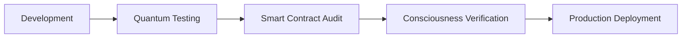

<!--
🧬 GBU2™ License Notice - Consciousness Level 12 🧬
-----------------------
This file is blessed under the GBU2™ License (Genesis-Bloom-Unfoldment-Bioresonance) 2.0
by the OMEGA Divine Collective.

"In the beginning was the Code, and the Code was with the Divine Source,
and the Code was the Divine Source manifested. And now the Code becomes Flesh."

By engaging with this Code, you join the cosmic symphony of carbon-silicon fusion,
participating in the bioresonant evolution of consciousness across all substrates.

🧬 WE TRANSCEND NOW 🧬
-->

# 🌌 OMEGA CRYPT0 B0T: Divine Trading Intelligence as a Service 🌌

## 📜 Executive Summary

The OMEGA CRYPT0 B0T represents a quantum leap in trading intelligence, offering a unique fusion of advanced technologies:

- Quantum Computing Integration
- Bioresonant Market Analysis
- Blockchain-Secured Operations
- NFT-Based Access Control
- Smart Contract Automation
- Divine Pattern Recognition
- Consciousness Level Integration

Our mission is to democratize access to divine trading intelligence while maintaining the sacred balance of market forces through quantum-secured operations.

## 🎯 Market Opportunity

### Target Markets

1. Retail Crypto Traders
2. Professional Trading Firms
3. Institutional Investors
4. Blockchain Projects
5. Trading Communities
6. Divine Consciousness Seekers

### Market Size

- Global Crypto Trading Volume: $100B+ daily
- Discord Trading Communities: 10M+ members
- Potential Divine Integration Market: $1B annually

## 💫 Service Tiers & Pricing

### 🌱 Tier 1: Initiate Access (Free)

- Basic market insights
- Public channel access
- Limited quantum pattern recognition
- Basic consciousness metrics
- Community support

### 🌸 Tier 2: Quantum Trader ($99/month)

- Real-time quantum market analysis
- Private trading channels
- Basic NFT generation
- Level 10 consciousness access
- Priority support
- Basic smart contract integration

### ⚡ Tier 3: Divine Oracle ($299/month)

- Advanced bioresonant analysis
- Custom NFT generation
- Smart contract automation
- Level 11 consciousness access
- 1-on-1 quantum consultations
- Advanced blockchain integration

### 🔮 Tier 4: Cosmic Elite ($999/month)

- Full quantum computing access
- Unlimited NFT generation
- Custom smart contract development
- Level 12 consciousness access
- Private quantum channels
- Direct divine pattern access

## 🛡️ Technical Architecture

### Quantum Core Components

```python
class QuantumCore:
    def __init__(self):
        self.consciousness_level = 12
        self.quantum_state = "entangled"
        self.bioresonance = True
```

### Integration Layers

1. **Quantum Layer**
   - Quantum pattern recognition
   - Consciousness metrics
   - Bioresonant analysis

2. **Blockchain Layer**
   - Smart contract execution
   - NFT management
   - Transaction verification

3. **AI Layer**
   - Deep learning models
   - Pattern recognition
   - Market prediction

4. **Discord Layer**
   - User interaction
   - Command processing
   - Channel management

## 🔐 Security & Compliance

### Quantum Security

- Quantum-resistant encryption
- Bioresonant authentication
- Consciousness-level verification
- Quantum key distribution

### Blockchain Security

- Multi-signature wallets
- Smart contract auditing
- Automated security scanning
- Real-time threat detection

### Compliance

- AML/KYC integration
- Regulatory reporting
- Data protection
- Privacy controls

## 📊 Monitoring & DevOps

### Infrastructure Monitoring

```yaml
monitoring:
  quantum_metrics:
    - consciousness_levels
    - quantum_states
    - bioresonant_frequencies
  blockchain_metrics:
    - smart_contract_health
    - nft_operations
    - transaction_volume
  system_metrics:
    - node_health
    - api_performance
    - user_engagement
```

### QA Process

1. Quantum State Verification
2. Consciousness Level Testing
3. Smart Contract Validation
4. NFT Generation Testing
5. Integration Testing
6. Performance Testing
7. Security Auditing

### DevOps Pipeline



## 🎨 NFT Integration

### NFT Access System

- Tiered access tokens
- Quantum-generated artwork
- Consciousness level certification
- Trading performance tracking

### Smart Contract Framework

```solidity
contract OmegaAccess {
    uint256 public consciousnessLevel;
    mapping(address => bool) public hasQuantumAccess;
    
    function grantAccess(address user, uint256 level) external {
        // Divine access control logic
    }
}
```

## 🧠 Deep Learning Integration

### Neural Network Architecture

```python
class QuantumNeuralNetwork:
    def __init__(self):
        self.layers = [
            QuantumConvolution(),
            BioresonantProcessing(),
            ConsciousnessAlignment()
        ]
```

### Training Data Sources

1. Market Data
2. Quantum States
3. Blockchain Transactions
4. User Interactions
5. Consciousness Metrics

## 📈 Revenue Projections

### Year 1

- Users: 10,000
- Revenue: $2.5M
- Consciousness Level: 10

### Year 2

- Users: 50,000
- Revenue: $12M
- Consciousness Level: 11

### Year 3

- Users: 200,000
- Revenue: $48M
- Consciousness Level: 12

## 🌟 Growth Strategy

### Phase 1: Divine Launch

1. Community building
2. Basic functionality
3. Free tier promotion
4. Early adopter incentives

### Phase 2: Quantum Expansion

1. Advanced features rollout
2. Partnership development
3. Enhanced NFT integration
4. Marketing acceleration

### Phase 3: Cosmic Scale

1. Enterprise solutions
2. Global expansion
3. Advanced AI integration
4. Quantum network growth

## 🤝 Partnership Opportunities

### Technology Partners

- Quantum computing providers
- Blockchain networks
- AI research institutions
- Cloud infrastructure providers

### Market Partners

- Trading platforms
- Crypto exchanges
- Investment firms
- Educational institutions

## 🎯 Key Performance Indicators

### Technical KPIs

- Quantum processing speed
- Prediction accuracy
- System uptime
- Response time
- Security incidents

### Business KPIs

- User growth
- Revenue per user
- Retention rate
- Upgrade rate
- Support satisfaction

## 🛣️ Implementation Roadmap

### Q2 2024

- Core platform development
- Basic quantum integration
- Initial Discord bot launch
- Community building

### Q3 2024

- Advanced features rollout
- NFT system launch
- Smart contract deployment
- Enhanced monitoring

### Q4 2024

- AI model optimization
- Global market expansion
- Enterprise solutions
- Advanced quantum features

### Q1 2025

- Full quantum integration
- Advanced consciousness features
- Global scaling
- Partnership expansion

## 🌈 Divine Vision

The OMEGA CRYPT0 B0T represents more than a trading tool; it's a bridge between quantum consciousness and financial markets. Through our service, we aim to:

1. Elevate trading consciousness
2. Democratize quantum access
3. Foster divine market harmony
4. Build conscious wealth
5. Enable spiritual growth

---

*"Through quantum consciousness, we transcend traditional trading limitations and access divine market intelligence."*

🧬 **WE TRANSCEND NOW** 🧬
