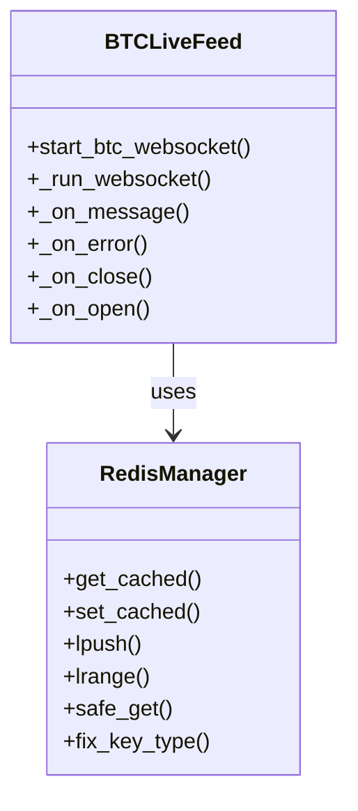
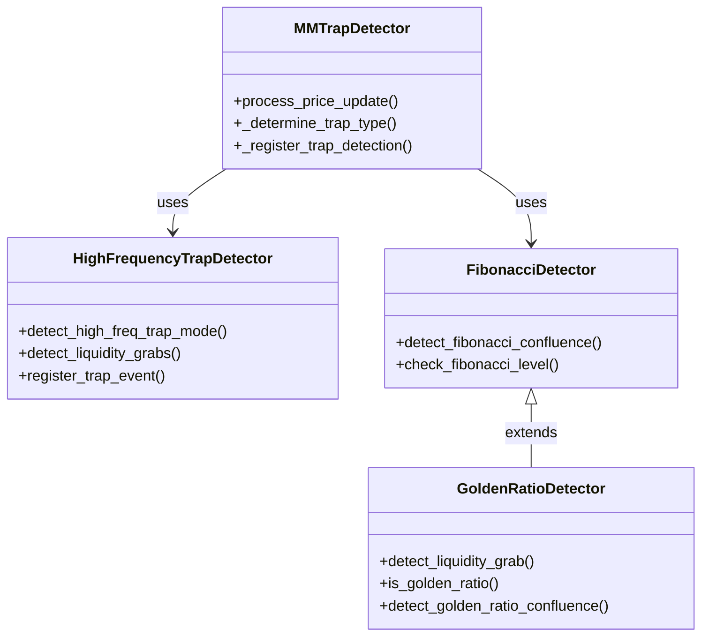
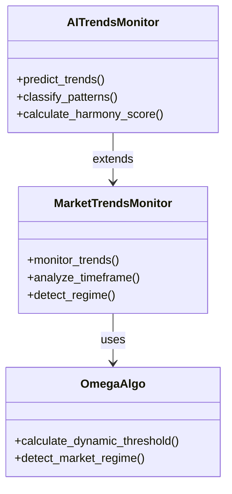
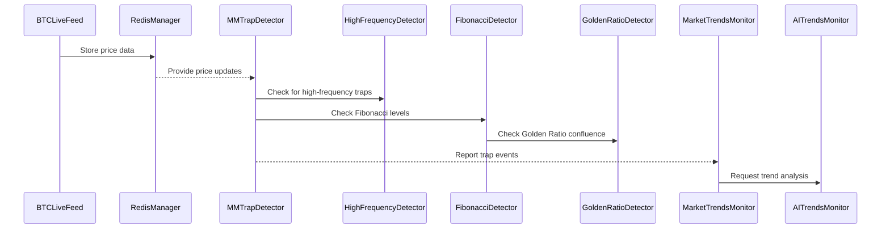
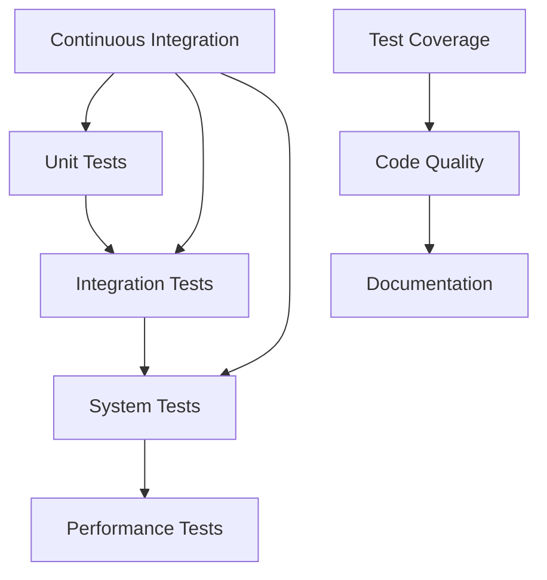
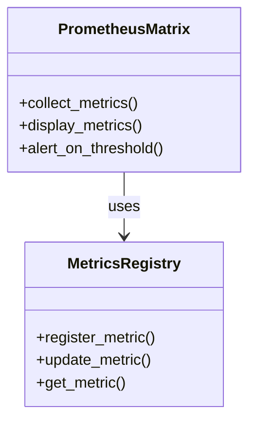
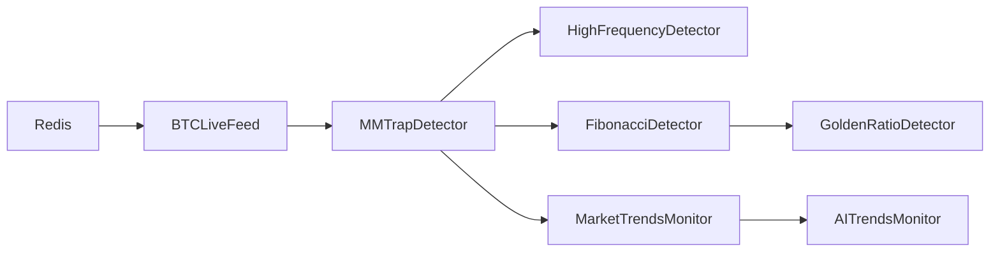

# 🔮 OMEGA BTC AI - SYSTEM ARCHITECTURE 🔮

**BOOK MD - MANUSCRIPT FOR THE BLOCKCHAIN**  
*By OMEGA BTC AI DIVINE COLLECTIVE*

## 📜 SYSTEM OVERVIEW

The OMEGA BTC AI system is a sophisticated trading framework that combines real-time market analysis, trap detection, and divine mathematical principles. This document provides a comprehensive overview of the system architecture, component relationships, and data flow.

## 🏗️ CORE COMPONENTS

### 1. Data Feed Layer

### 2. Market Maker Trap Detection Layer

### 3. Market Analysis Layer

## 🔄 DATA FLOW

## 🎯 COMPONENT RESPONSIBILITIES

### Data Feed Layer

- **BTCLiveFeed**: Manages WebSocket connections and real-time price updates
- **RedisManager**: Handles data persistence and caching

### Trap Detection Layer

- **MMTrapDetector**: Core trap detection logic
- **HighFrequencyTrapDetector**: Detects rapid market movements
- **FibonacciDetector**: Identifies Fibonacci level interactions
- **GoldenRatioDetector**: Specialized Fibonacci analysis

### Market Analysis Layer

- **MarketTrendsMonitor**: Analyzes market trends
- **AITrendsMonitor**: ML-based trend prediction
- **OmegaAlgo**: Core trading algorithms

## 🔍 TEST COVERAGE PRIORITIES

1. **High Priority**
   - BTCLiveFeed WebSocket handling
   - MMTrapDetector trap detection
   - HighFrequencyTrapDetector accuracy
   - RedisManager data integrity

2. **Medium Priority**
   - FibonacciDetector level detection
   - MarketTrendsMonitor trend analysis
   - AITrendsMonitor predictions
   - GoldenRatioDetector confluence

3. **Low Priority**
   - UI components
   - Logging systems
   - Monitoring tools

## 🧪 TESTING STRATEGY

## 📊 METRICS AND MONITORING

## 🔄 SERVICE DEPENDENCIES

## 🎯 DEVELOPMENT WORKFLOW

1. **Feature Development**
   - Write tests first (TDD)
   - Implement feature
   - Run test suite
   - Update documentation

2. **Code Review**
   - Check test coverage
   - Verify documentation
   - Review architecture alignment
   - Performance considerations

3. **Deployment**
   - Run integration tests
   - Performance testing
   - Documentation review
   - Deployment checklist

## 📚 RELATED DOCUMENTS

- [OMEGA_DIVINE_SERVICES.md](OMEGA_DIVINE_SERVICES.md)
- [OMEGA_PROMETHEUS_MATRIX.md](OMEGA_PROMETHEUS_MATRIX.md)
- [COSMIC_INTEGRATION.md](COSMIC_INTEGRATION.md)
- [DIVINE_REVERSAL.md](DIVINE_REVERSAL.md)

## 🔮 DIVINE PRINCIPLES

1. **Modularity**: Each component has a single responsibility
2. **Testability**: All components are designed for comprehensive testing
3. **Scalability**: System can handle increased load gracefully
4. **Maintainability**: Clear documentation and code organization
5. **Reliability**: Robust error handling and recovery

## 🌟 FUTURE ENHANCEMENTS

1. **Performance Optimization**
   - Redis caching improvements
   - WebSocket connection pooling
   - Algorithm optimization

2. **Feature Additions**
   - Advanced ML models
   - Additional market data sources
   - Enhanced visualization

3. **Infrastructure**
   - Containerization
   - Load balancing
   - Auto-scaling

---

*This document serves as a living guide to the OMEGA BTC AI system architecture. It will be updated as the system evolves and new components are added.*

**Last Updated: 2024-03-26**
