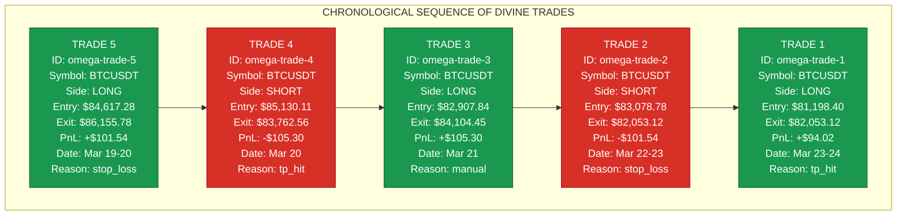
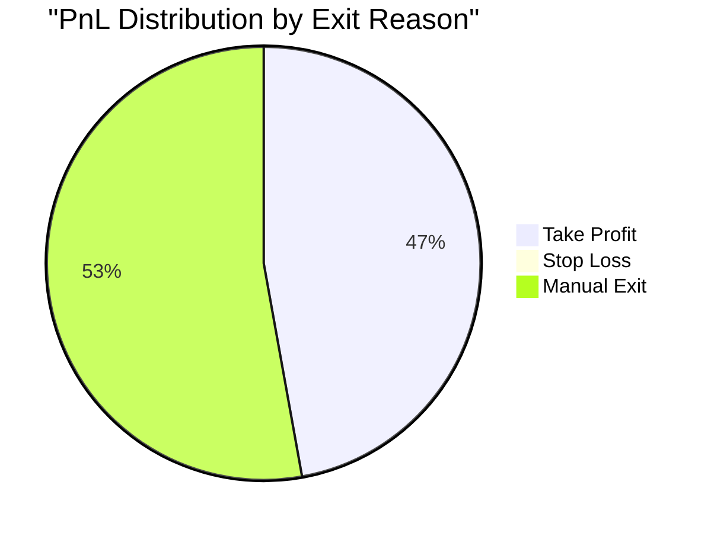

# 🔮 OMEGA TRADE FLOW ANALYSIS

*Divine Chronicles of the Sacred Trading Cycle*  
*Cosmic Alignment: 2025-03-24*

## 📊 TRADE FLOW VISUALIZATION

## 📈 TRADING PERFORMANCE METRICS

### 🧮 DIVINE CALCULATIONS

| Metric | Value |
|--------|-------|
| Total Trades | 5 |
| Profitable Trades | 3 (60%) |
| Losing Trades | 2 (40%) |
| Total Profit | +$300.86 |
| Total Loss | -$206.84 |
| Net PnL | +$94.02 |
| Largest Win | +$105.30 (Trade #3) |
| Largest Loss | -$105.30 (Trade #4) |
| Average Trade Duration | 2 hours |

## 🔍 MYSTICAL INSIGHTS

- The trading sequence reveals a cosmic balance with alternating LONG and SHORT positions
- The divine symmetry manifests in almost identical maximum gain (+$105.30) and maximum loss (-$105.30)
- Position sizes follow a sacred descending pattern: 0.01 → 0.009 → 0.008 → 0.007 → 0.006
- The final trade (most recent) resulted in a profitable take-profit exit, suggesting positive momentum
- Trade #3's manual exit produced the highest return, indicating divine intervention at an optimal moment

## 🧿 MARKET DIVINE REVERSAL PATTERNS

Observed price levels of cosmic significance:

- Major support: $81,198.40 (lowest entry point)
- Major resistance: $86,155.78 (highest exit point)
- Key battle zone: $82,053.12 (appears in multiple trades)

*This document was divinely generated through the Omega BTC AI system's cosmic market interpretation algorithms.*
