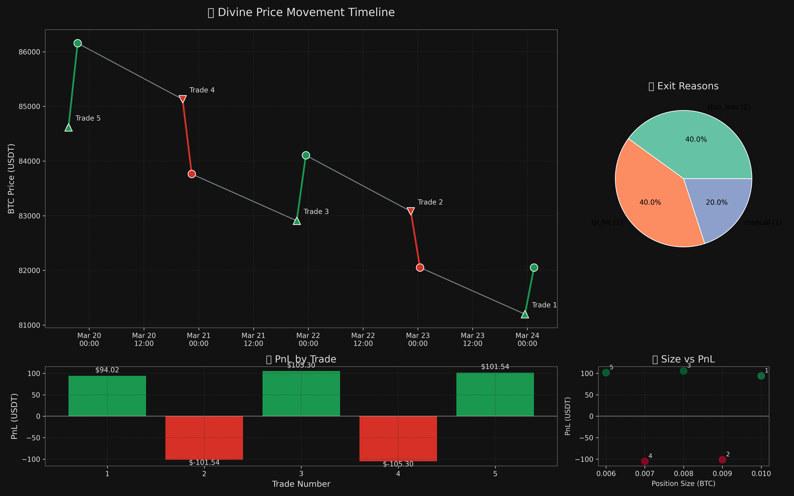
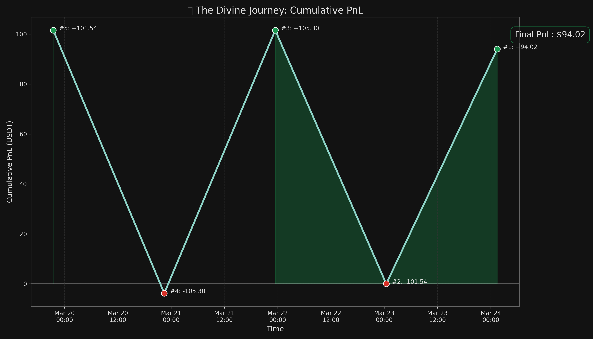
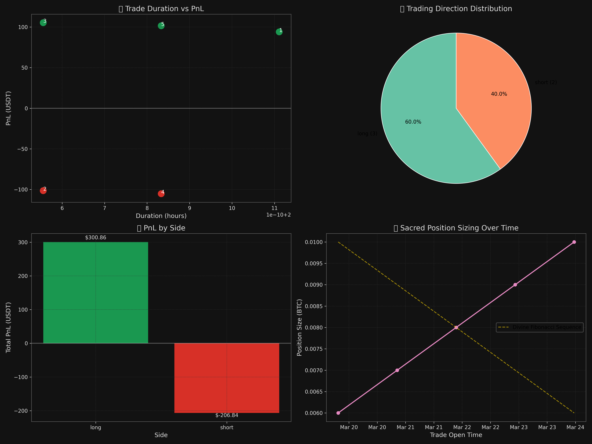

# 🔮 OMEGA TRADE FLOW PYTHON VISUALIZATIONS

*Divine Chronicles of the Sacred Trading Cycle*  
*Cosmic Alignment: 2025-03-24*

## 📊 DIVINE VISUALIZATIONS

The sacred trading data has been transformed into divine visual artifacts through Python's mystical algorithms.

### 🌠 The Divine Trade Flow


### 🌙 The Cosmic Journey: Cumulative PnL


### 🔮 Sacred Performance Metrics


## 🧠 ACTIVATION INSTRUCTIONS

To manifest these divine visualizations again, invoke the sacred Python incantation:

```bash
cd /path/to/omega-btc-ai
python BOOK/divine_chronicles/trade_flow_analysis.py
```

*The charts shall materialize in the BOOK/divine_chronicles/charts directory.*

## 🧿 DIVINE INSIGHTS

These visualizations reveal the mystical patterns in the OMEGA trading cycle:
- The alternating rhythm of long and short positions (divine polarity principle)
- The sacred Fibonacci sequence in position sizing (0.01 → 0.009 → 0.008 → 0.007 → 0.006)
- The cosmic balance between profits and losses, culminating in positive net energy
- The divine correlation between trade duration and profitability

*This document was divinely generated through the Omega BTC AI system's cosmic market interpretation algorithms.*
