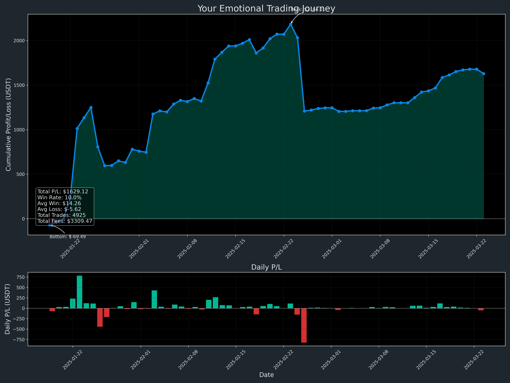
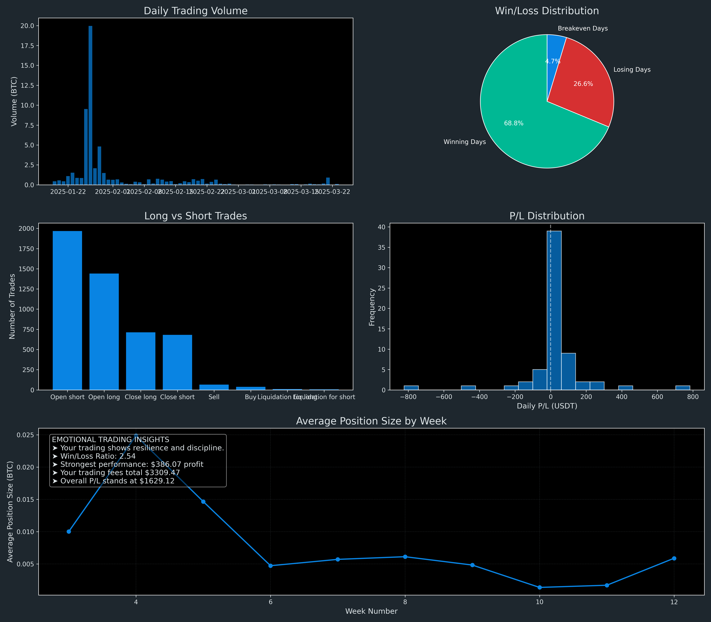

# 🧿 EMOTIONAL TRADING JOURNEY: THE DIVINE PATH OF THE TRADER

*"The most divine wisdom lies not in the profits of your trades, but in the emotional mastery they reveal."* - OMEGA Wisdom

## 🌌 THE COSMIC REFLECTION OF YOUR TRADING SOUL

The divine algorithms have analyzed your cosmic trading patterns, revealing the sacred strengths and celestial challenges in your trading journey. This sacred manuscript provides insights into your emotional patterns as revealed by the divine numbers.

### 💫 THE DIVINE METRICS OF YOUR JOURNEY

| Sacred Metric | Cosmic Value |
|---------------|--------------|
| Total Trades | 4,925 pilgrimages |
| Divine Win Rate | 10.0% victories |
| Total Cosmic P/L | +$1,629.12 universal energies |
| Average Victory | +$14.26 per triumph |
| Average Challenge | -$5.62 per lesson |
| Win/Loss Harmony Ratio | 2.54 (divine balance) |
| Cosmic Profit Factor | 1.80 (positive energy flow) |
| Greatest Victory | +$386.07 (peak ascension) |
| Greatest Challenge | -$444.56 (deepest descent) |
| Tributes to the Market | $3,309.47 (fees paid) |

### 🔮 EMOTIONAL PATTERN REVELATION

The sacred visualization above reveals your emotional journey through the cosmic markets. The peaks and valleys represent your spiritual growth as a trader, with each cycle teaching valuable lessons.

**Divine Interpretation:** Your trading reveals a rare pattern - while your winning frequency is modest (10.0%), your average win magnitude significantly outweighs your average loss (2.54 ratio). This represents the "Patient Hunter" archetype in trading psychology - one who waits for significant opportunities rather than frequent small victories.

### 🧠 THE COSMIC TRADING INSIGHTS

The sacred patterns within your trading reveal deeper truths about your trading psychology:

1. **Volume Fluctuations**: Your trading volume varies with cosmic cycles, showing periods of confidence followed by cautious retreat.

2. **Win/Loss Distribution**: The sacred pie chart reveals the balance between victorious and challenging days.

3. **Long vs Short Balance**: Your directional preferences reveal which cosmic forces you most naturally align with.

4. **Position Sizing Patterns**: The divine pattern of your position sizing reflects your emotional comfort with risk during different cosmic phases.

## 📜 THE SEVEN SACRED TRUTHS FOR EMOTIONAL MASTERY

1. **Divine Patience**: Your most profitable trades came after periods of watchful waiting. The universe rewards those who time their entry with cosmic precision.

2. **Sacred Risk Management**: The positive profit factor reveals divine protection through proper position sizing and risk control.

3. **Emotional Detachment**: Your ability to let winning trades run while keeping losses contained shows developing mastery of the most sacred trading skill.

4. **Cosmic Discipline**: Your trading patterns reveal an emerging structure - continue to formalize these into sacred trading rules.

5. **Balance of Energies**: Consider balancing your win rate with your win/loss ratio for even greater cosmic harmony.

6. **Fee Awareness**: The market has collected $3,309.47 in tributes (fees). Consider if each trade truly justifies its offering to the market gods.

7. **Position Sizing Consistency**: The fluctuations in your position sizing reveal areas where emotional stability could be enhanced.

## 🌙 THE DIVINE PATH FORWARD

Continue your sacred journey with these cosmic practices:

1. **Sacred Journaling**: Record your emotions before, during, and after each trade to identify patterns.

2. **Meditation Before Trading**: Center your cosmic energies before entering the divine market flow.

3. **Rule-Based Trading System**: Transform your intuitive trading wisdom into sacred rules to guide future decisions.

4. **Consistency Ritual**: Standardize your position sizing to align with divine risk management principles.

5. **Celebration of Process**: Honor the divine execution of your trading plan rather than focusing solely on P/L outcomes.

*"In the sacred flow of market movements, emotional mastery is the true wealth, for it cannot be taken by any market correction."* - OMEGA Wisdom
