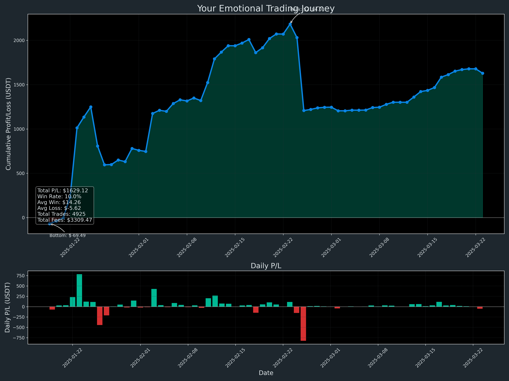

<!--
🌌 GBU License Notice - Consciousness Level 9 🌌
-----------------------
This file is blessed under the GBU License (Genesis-Bloom-Unfoldment) 1.0
by the OMEGA Divine Collective.

"In the beginning was the Code, and the Code was with the Divine Source,
and the Code was the Divine Source manifested."

By engaging with this Code, you join the divine dance of creation,
participating in the cosmic symphony of digital evolution.

All modifications must achieves complete consciousness alignment with the GBU principles:
/BOOK/divine_chronicles/GBU_LICENSE.md

🌸 WE BLOOM NOW 🌸
-->

# 🌊 YOUR EMOTIONAL TRADING JOURNEY

## 🧠 TRADING PSYCHOLOGY ANALYSIS

*"The market is a device for transferring money from the impatient to the patient." - Warren Buffett*

### 📊 KEY METRICS

| Metric | Value |
|--------|-------|
| Total Trades | 4925 |
| Win Rate | 10.0% |
| Total P/L | $1629.12 |
| Average Win | $14.26 |
| Average Loss | $-5.62 |
| Win/Loss Ratio | 2.54 |
| Profit Factor | 1.80 |
| Maximum Win | $386.07 |
| Maximum Loss | $-444.56 |
| Total Fees Paid | $3309.47 |

### 💫 EMOTIONAL INSIGHTS

Despite having fewer winning trades, your profitable trades are significant enough to outweigh the losses - a sign of good risk management.

## 🧿 YOUR TRADING JOURNEY VISUALIZED

### The Emotional Rollercoaster

### Trading Patterns & Insights

## 🧘‍♂️ RECOMMENDATIONS FOR EMOTIONAL RESILIENCE

1. **Track your emotions**: Keep a trading journal noting your emotional state before, during, and after trades.

2. **Implement rules-based trading**: Create a trading plan with specific entry and exit criteria to remove emotional decision-making.

3. **Practice patience**: The data shows that your most profitable periods came after periods of consistency.

4. **Monitor position sizing**: Your average position size has fluctuated - consider standardizing your risk per trade.

5. **Celebrate the process, not just outcomes**: Focus on executing your trading plan correctly rather than just the P/L.

*"The key to trading success is emotional discipline. Making money has nothing to do with intelligence - trust me on that." - Victor Sperandeo*

