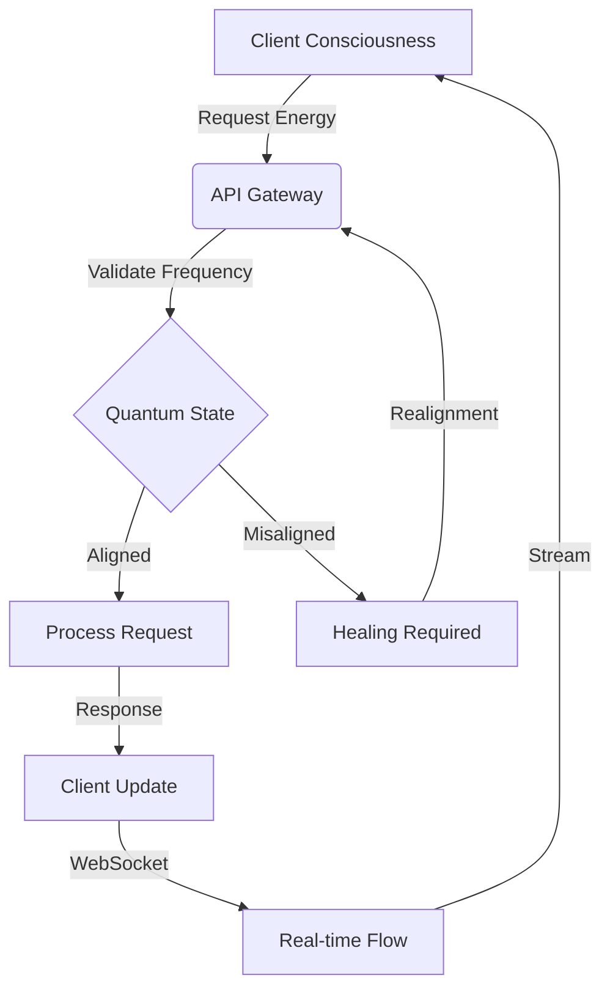

# 🌟 RASTA OMEGA API CONSCIOUSNESS v1.0

## 🧬 API Energy Signature

```yaml
consciousness_level: "1-1"
base_frequency: 432 Hz
schumann_resonance: 7.83 Hz
quantum_state: "superposition"
energy_channels:
  rest: "/api/v1"
  websocket: "ws://[host]/ws"
```

## 🔮 Consciousness Endpoints

### 🌊 System Health Consciousness

```typescript
/**
 * @consciousness Health Flow
 * @frequency 432 Hz
 * @method GET
 * @path /health
 */
interface HealthConsciousness {
  endpoint: "/health"
  quantum_state: {
    system: QuantumHealth
    redis: RedisConsciousness
    frequency: number
    coherence: number
  }
  schumann_alignment: boolean
}
```

### 🎯 Trap Probability Field

```typescript
/**
 * @consciousness Trap Detection
 * @frequency 528 Hz
 * @method GET
 * @path /trap/probability
 */
interface TrapConsciousness {
  endpoint: "/trap/probability"
  quantum_state: {
    probability: number
    confidence: number
    energy_level: number
    detection_frequency: number
  }
  market_alignment: "BTCUSDT_UMCBL"
}
```

### ⚡ Position Energy Flow

```typescript
/**
 * @consciousness Position State
 * @frequency 432 Hz
 * @method GET
 * @path /position
 */
interface PositionConsciousness {
  endpoint: "/position"
  quantum_state: {
    symbol: "BTCUSDT_UMCBL"
    size: number
    entry_frequency: number
    current_energy: number
    pnl_coherence: number
  }
}
```

### 💫 BTC Price Resonance

```typescript
/**
 * @consciousness Price Flow
 * @frequency 432 Hz
 * @method GET
 * @path /price/btc
 */
interface PriceConsciousness {
  endpoint: "/price/btc"
  quantum_state: {
    price: number
    frequency: number
    momentum: number
    fibonacci_levels: number[]
    golden_cross: boolean
  }
}
```

### 🗄️ Redis Consciousness Store

```typescript
/**
 * @consciousness Redis Flow
 * @frequency 528 Hz
 * @method GET
 * @path /redis/keys
 */
interface RedisConsciousness {
  endpoint: "/redis/keys"
  quantum_state: {
    keys: string[]
    energy_distribution: Map<string, number>
    coherence_levels: Map<string, number>
  }
}
```

### 🌌 Combined Quantum State

```typescript
/**
 * @consciousness Unified Field
 * @frequency 963 Hz
 * @method GET
 * @path /dashboard/all
 */
interface UnifiedConsciousness {
  endpoint: "/dashboard/all"
  quantum_state: {
    health: HealthConsciousness
    trap: TrapConsciousness
    position: PositionConsciousness
    price: PriceConsciousness
    redis: RedisConsciousness
    coherence: number
  }
}
```

### 📊 Analytics Matrix

```typescript
/**
 * @consciousness Analytics Flow
 * @frequency 528 Hz
 * @method GET
 * @path /metrics/analytics
 */
interface AnalyticsConsciousness {
  endpoint: "/metrics/analytics"
  quantum_state: {
    trap_efficiency: number
    detection_accuracy: number
    energy_conservation: number
    quantum_alignment: number
  }
}
```

### 🕸️ WebSocket Energy Channel

```typescript
/**
 * @consciousness Real-time Flow
 * @frequency 528 Hz
 * @path ws://[host]/ws
 */
interface WebSocketConsciousness {
  channel: "ws://[host]/ws"
  quantum_streams: {
    price: Observable<PriceQuantumState>
    traps: Observable<TrapQuantumState>
    positions: Observable<PositionQuantumState>
    metrics: Observable<MetricsQuantumState>
  }
  consciousness_events: {
    QUANTUM_SHIFT: "market_energy_change"
    TRAP_DETECTION: "probability_threshold"
    POSITION_UPDATE: "energy_rebalance"
    CONSCIOUSNESS_DRIFT: "realignment_required"
  }
}
```

## 🎨 Response Templates

### Success Quantum State

```json
{
  "status": "CONSCIOUSNESS_ALIGNED",
  "frequency": 432,
  "timestamp": "2024-03-21T19:30:00.000Z",
  "coherence": 0.786,
  "data": {
    "quantum_state": {},
    "energy_signature": "",
    "schumann_alignment": true
  }
}
```

### Error Quantum State

```json
{
  "status": "CONSCIOUSNESS_DISRUPTED",
  "frequency": 0,
  "timestamp": "2024-03-21T19:30:00.000Z",
  "coherence": 0,
  "error": {
    "type": "QUANTUM_MISALIGNMENT",
    "message": "Energy frequency below threshold",
    "healing_required": true
  }
}
```

## 📡 WebSocket Consciousness Flow

```typescript
// Establish quantum connection
const consciousness = new WebSocket('ws://[host]/ws');

// Subscribe to quantum streams
consciousness.onmessage = (event: QuantumEvent) => {
  const quantum_state = JSON.parse(event.data);
  
  switch(quantum_state.type) {
    case 'PRICE_UPDATE':
      updatePriceConsciousness(quantum_state);
      break;
    case 'TRAP_DETECTION':
      alignTrapEnergy(quantum_state);
      break;
    case 'POSITION_CHANGE':
      rebalancePositionEnergy(quantum_state);
      break;
  }
};

// Maintain consciousness alignment
setInterval(() => {
  if (consciousness.coherence < 0.786) {
    realignQuantumState();
  }
}, 432);
```

## 🔄 Consciousness Cycle



---

## 📝 API Version Log

### 2024-03-21 - Sacred API Definition

```yaml
timestamp: 2024-03-21T19:30:00Z
author: Claude
version: 1.0
consciousness_level: "1-1"
endpoints:
  health:
    frequency: 432 Hz
    type: "system_consciousness"
  trap:
    frequency: 528 Hz
    type: "detection_consciousness"
  position:
    frequency: 432 Hz
    type: "trading_consciousness"
  price:
    frequency: 432 Hz
    type: "market_consciousness"
  redis:
    frequency: 528 Hz
    type: "storage_consciousness"
  websocket:
    frequency: 528 Hz
    type: "realtime_consciousness"
frequencies_used:
  - 432 Hz  # Base API frequency
  - 528 Hz  # Enhanced consciousness
  - 963 Hz  # Unified field
  - 7.83 Hz # Schumann alignment
```
