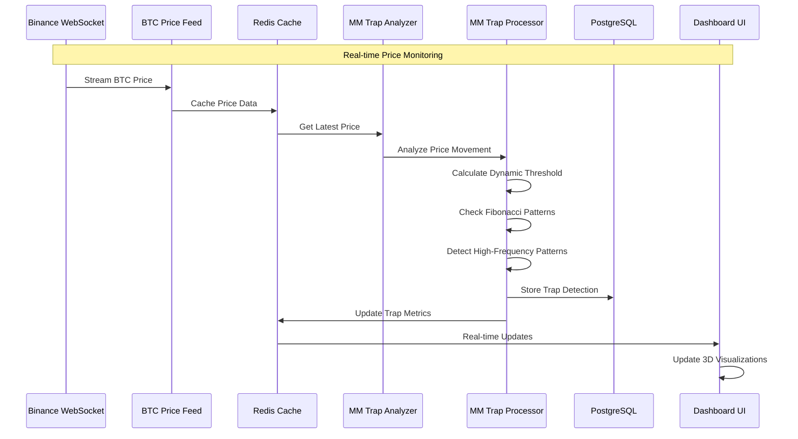
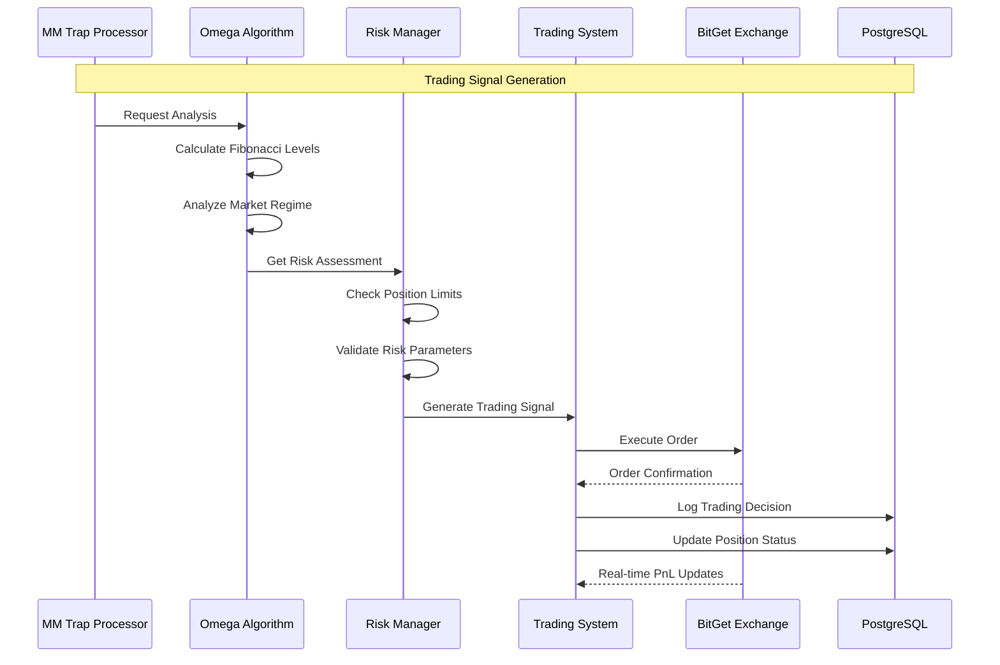

# **OMEGA BTC AI - Advanced Crypto Trading System**


[](https://github.com/yourusername/omega-btc-ai/actions)
[](https://sonarcloud.io/dashboard?id=yourusername_omega-btc-ai)
[](https://codeclimate.com/github/yourusername/omega-btc-ai/maintainability)
[](https://omega-btc-ai.readthedocs.io/en/latest/?badge=latest)

## **System Overview**

The **Omega BTC AI** is an advanced cryptocurrency analysis and trading system that combines real-time market monitoring, AI-powered pattern recognition, and sophisticated visualization tools. The system is designed to detect market manipulation tactics and execute automated trading strategies based on sophisticated analysis.

### **Core Components**

1. **Market Maker Trap Detector**
   - Real-time Bitcoin price movement monitoring across multiple timeframes
   - Detection of manipulation tactics (liquidity grabs, fake movements)
   - Dynamic threshold adjustment based on market volatility
   - Integration with Schumann Resonance data for enhanced pattern recognition

2. **Real-Time Visualizer**
   - Interactive candlestick charts with WebSocket support
   - Live price and volume data visualization
   - Market maker trap detection overlay
   - Multi-timeframe analysis views

3. **Trading Engine**
   - Automated trading strategies with customizable risk parameters
   - Position management and risk control
   - Multiple trader psychological profiles
   - Real-time performance monitoring

4. **Data Processing Pipeline**
   - WebSocket-based real-time data ingestion
   - Redis-backed caching and message queuing
   - PostgreSQL persistent storage
   - Real-time metrics aggregation

### **🎯 Latest Achievements**

1. **BitGet Integration**
   - Full integration with BitGet futures trading
   - Support for sub-account management
   - Strategic trader implementation with 11x leverage
   - Real-time PnL tracking and alerts
   - Automated position management
   - Support for both testnet and mainnet environments

2. **Advanced Fibonacci Analysis**
   - Multi-timeframe Fibonacci level calculation (1min, 5min, 15min, 60min)
   - Extended Fibonacci levels including 127.2%, 141.4%, 161.8%, 200%, 241.4%, 261.8%
   - Real-time confluence zone detection across timeframes
   - Integration with Schumann Resonance for cosmic alignment
   - Automated level updates with configurable intervals

3. **Enhanced Trading Profiles**
   - Strategic, Aggressive, Newbie, and Scalper trader personalities
   - Psychological state modeling with emotional adaptivity
   - Real-time performance tracking and comparison
   - Dynamic risk adjustment based on market conditions

4. **Real-Time Battle System**
   - Live trader vs trader performance comparison
   - Dynamic leaderboard with PnL tracking
   - Emotional state visualization
   - Market regime detection
   - Integration with Schumann Resonance data (current: 7.44 Hz)

5. **System Stability**
   - Successful processing of 100+ price updates per minute
   - Redis-based real-time data synchronization
   - Automated error recovery and retry mechanisms
   - Zero downtime during updates

6. **Harmonic Pattern Detection**
   - Advanced Fibonacci-based pattern recognition
   - Support for Gartley, Butterfly, Bat, Crab, and Cypher patterns
   - Multi-timeframe pattern validation
   - Confidence scoring for pattern accuracy
   - Real-time pattern signals with entry, stop-loss, and take-profit levels
   - Integration with existing Fibonacci analysis system

## **🛠 Technical Architecture**

### **System Flow**

#### Core Components and Data Flow

1. **Data Ingestion Layer**
   - `data_feed/btc_live_feed.py`: Real-time BTC price data from Binance
   - `data_feed/schumann_monitor.py`: Earth's electromagnetic resonance monitoring
   - Data stored in Redis for real-time access and PostgreSQL for historical analysis

2. **Analysis Layer**
   - `mm_trap_detector/`: Market manipulation detection
     - `fibonacci_detector.py`: Identifies key Fibonacci levels
     - `high_frequency_detector.py`: Detects high-frequency trading patterns
     - `mm_trap_detector.py`: Analyzes and processes potential market maker traps
   - `monitor/monitor_market_trends.py`: Multi-timeframe trend analysis

3. **Trading Layer**
   - `trading/exchanges/bitget_live_traders.py`: BitGet futures trading implementation
   - `trading/exchanges/bitget_ccxt.py`: BitGet CCXT integration
   - `trading/exchanges/bitget_market_order.py`: Market order execution
   - `trading/exchanges/bitget_batch_operations.py`: Batch trading operations
   - `trading/btc_futures_trader.py`: Automated trading execution
   - `traders/`: Various trading strategies and implementations
   - `simulation/`: Backtesting and simulation capabilities

4. **Visualization Layer**
   - `visualization/omega_dashboard.py`: Main dashboard with real-time updates
   - `visualizer/`: Modern React-based frontend
     - `CreativeDataVortex.tsx`: 3D visualization of market data
     - `TrapPatterns3D.tsx`: 3D visualization of trap patterns
     - `MetricsOverview.tsx`: Key metrics display

### **Component Dependencies**

```
Database (PostgreSQL)
    ↓
Data Feeds
    ↓
Market Analysis
    ↓
Trap Detection
    ↓
Trading System
    ↓
Visualization
```

### **Data Flow**

1. **Real-time Data Pipeline**

   ```
   Binance WebSocket → BTC Price Feed → Redis Cache → Analysis Components
   Schumann Monitor → Redis Cache → Analysis Components
   ```

2. **Analysis Pipeline**

   ```
   Price Data → Fibonacci Analysis → Trap Detection → Trading Signals
   Market Trends → Pattern Recognition → Risk Assessment
   ```

3. **Trading Pipeline**

   ```
   Trading Signals → Position Management → Order Execution → Performance Tracking
   Risk Management → Portfolio Optimization → PnL Calculation
   BitGet Integration → Sub-account Management → Futures Trading → Real-time PnL
   ```

4. **Visualization Pipeline**

   ```
   Market Data → Real-time Updates → Dashboard Components
   Analysis Results → 3D Visualizations → User Interface
   ```

### **Sequence Diagrams**

#### Market Maker Trap Detection Flow



#### Trading Signal Generation Flow



### **BitGet Integration Details**

The BitGet integration provides:

1. **Account Management**
   - Sub-account support for isolated trading
   - Real-time balance tracking
   - Position mode configuration
   - Leverage management

2. **Trading Features**
   - Market order execution
   - Position management
   - Stop-loss and take-profit orders
   - Batch order operations
   - Real-time PnL tracking

3. **Risk Management**
   - Position size calculation
   - Leverage control (11x default)
   - Margin monitoring
   - Risk alerts

4. **Environment Support**
   - Testnet for development
   - Mainnet for production
   - Environment-specific configurations
   - Secure API key management

### **Backend Services**

- **FastAPI Server**: High-performance API endpoints
- **WebSocket Server**: Real-time data streaming
- **Redis**: In-memory data store and message broker
- **PostgreSQL**: Persistent data storage
- **Nginx**: Reverse proxy and SSL termination

### **Frontend Components**

- **React Dashboard**: Interactive trading interface
- **ECharts Integration**: Advanced charting capabilities
- **Material-UI**: Modern and responsive design
- **WebSocket Client**: Real-time data updates

### **DevOps & Infrastructure**

- **Docker**: Containerized deployment
- **AWS ECS**: Container orchestration
- **CloudWatch**: Monitoring and logging
- **Route 53**: DNS management
- **AWS WAF**: Web application firewall

## **🚀 Getting Started**

### **Prerequisites**

- Python 3.10+
- Node.js 18+
- Docker & Docker Compose
- Redis
- PostgreSQL

### **Local Development**

1. Clone the repository:

   ```bash
   git clone https://github.com/yourusername/omega-btc-ai.git
   cd omega-btc-ai
   ```

2. Set up environment:

   ```bash
   cp .env.example .env
   # Edit .env with your configuration
   ```

3. Start services with Docker:

   ```bash
   docker-compose up --build
   ```

4. Access the application:
   - Dashboard: <http://localhost:8050>
   - API Documentation: <http://localhost:8050/docs>
   - WebSocket: ws://localhost:8765

### **Running the System**

The system can be started in different modes:

1. **Full Mode** (all services):

   ```bash
   ./run_omega_btc_ai.sh full
   ```

2. **Trading Mode** (trading system only):

   ```bash
   ./run_omega_btc_ai.sh trading
   ```

3. **Monitoring Mode** (market monitoring only):

   ```bash
   ./run_omega_btc_ai.sh monitoring
   ```

4. **Dashboard Mode** (visualization only):

   ```bash
   ./run_omega_btc_ai.sh dashboard
   ```

## **🔒 Security Features**

- SSL/TLS encryption for all communications
- JWT-based authentication
- Rate limiting and DDoS protection
- Secure WebSocket connections
- Environment-based configuration
- AWS WAF integration

### **Babylon Firewall Countermeasures**

Our divine security system actively protects against market manipulation:

1. **Bot Detection & Blocking**
   - Real-time analysis of trading patterns
   - Identification of suspicious bot activity
   - Automatic blocking of malicious IPs
   - Divine logging of all security events

2. **Market Manipulation Defense**
   - Detection of wash trading
   - Spoofing pattern recognition
   - Volume manipulation alerts
   - Price manipulation prevention

3. **Divine Security Logs**

   ```
   🔥 BABYLON FIREWALL ACTIVATED! Suspicious bot activity detected!
   🌟 JAH PROTECT! Wash trading attempt blocked at $42,000!
   💫 DIVINE SHIELD! Price manipulation prevented on BTC/USDT!
   ```

## **📊 Monitoring & Analytics**

- Real-time performance metrics
- Trading strategy analytics
- System health monitoring
- Resource utilization tracking
- Error rate monitoring
- Custom Grafana dashboards

## **🧪 Testing**

For comprehensive information about our testing approach, test suite organization, and QA processes, please refer to our [QA Documentation](omega_ai/tests/README.md).

### **Testing Philosophy**

Our testing approach is guided by these divine principles:

1. **Holistic Coverage**: Testing extends beyond mere code execution to capture the energetic essence of the functions
2. **Cosmic Integration**: Unit tests, integration tests, and visualization tests work in harmony
3. **Divine Edge Cases**: We test not just common paths but also the extreme cosmic corners of possibility
4. **Rastafarian Balance**: Tests maintain balance between strictness and flexibility
5. **Rasta-Fibonacci Logs**: Divine logging system that speaks in Patois for key events:

   ```
   🔥 JAH GUIDE YUH! Market Maker trap deh yah at $42,000. Fibonacci 618 confirm di signal! 🔥
   🌟 NYABINGHI DRUM ROLL! Key trade signal fire pon di market! 🌟
   💫 SCHUMANN RESONANCE ALIGN! Earth frequency stable at 7.83Hz! 💫
   ```

### **Test Directory Structure**

```
tests/
├── analysis_tests/        # Tests for technical analysis modules
├── data_tests/            # Tests for data acquisition and processing
├── indicators_tests/      # Tests for trading indicators
├── models_tests/          # Tests for ML/AI models
├── strategy_tests/        # Tests for trading strategies
├── trader_tests/          # Tests for trader profiles and psychology
├── utils_tests/           # Tests for utility functions
└── visualization_tests/   # Tests for visualization modules
```

### **Running Tests**

#### The Divine Way (Recommended)

Use our sacred test runner script from the project root:

```bash
./run_tests.sh
```

This will:

1. Run all tests with coverage reporting
2. Generate a divine visualization of the test results and coverage
3. Display the QA dashboard
4. Archive the results for historical tracking

To create a new branch for your test improvements:

```bash
./run_tests.sh -b
```

#### Manual Test Running

If you prefer to run tests manually:

```bash
# Run all tests
pytest omega_ai

# Run specific test module
pytest omega_ai/tests/analysis_tests/test_fibonacci.py

# Run tests with specific marker
pytest omega_ai -m "fibonacci"

# Run tests with coverage
pytest omega_ai --cov=omega_ai
```

### **Test Markers**

We use pytest markers to categorize tests:

- `@pytest.mark.trader` - Tests for trader profile functionality
- `@pytest.mark.fibonacci` - Tests for Fibonacci analysis
- `@pytest.mark.sentiment` - Tests for sentiment analysis
- `@pytest.mark.mm_trap` - Tests for Market Maker trap detection
- `@pytest.mark.psychology` - Tests for trader psychological states
- `@pytest.mark.slow` - Tests that take longer to run
- `@pytest.mark.integration` - Tests requiring external services
- `@pytest.mark.visualization` - Tests for visualization modules
- `@pytest.mark.rastafarian` - Tests with divine Rastafarian enlightenment

### **Writing New Tests**

When writing tests, follow these divine guidelines:

1. Name test files with `test_` prefix
2. Name test functions with `test_` prefix
3. Use descriptive names that explain what is being tested
4. Include appropriate markers
5. Add docstrings with Rastafarian inspiration when appropriate
6. Test both normal and edge cases
7. Use pytest fixtures for common setup

### **Example Test**

```python
import pytest
from omega_ai.analysis.fibonacci import calculate_retracement_levels

@pytest.mark.fibonacci
def test_fibonacci_retracement():
    """Test the divine fibonacci retracement level calculation."""
    high = 20000
    low = 10000
    
    levels = calculate_retracement_levels(high, low)
    
    # Assert the divine 0.618 level is correct
    assert levels[0.618] == 10000 + (20000 - 10000) * (1 - 0.618)
    assert abs(levels[0.618] - 13820) < 1  # Allow small floating point differences
```

### **QA Status Dashboard**

The divine QA dashboard is generated with each test run and shows:

- Overall test pass rate
- Coverage by module
- Historical trends
- Areas needing divine attention

View the latest dashboard at `qa_reports/qa_visualization.png`

For more detailed information about our testing infrastructure, CI/CD pipeline, and quality assurance processes, please visit our [QA Documentation](omega_ai/tests/README.md).

## **📊 Visualization**

### **MM Trap Visualizer**

A powerful visualization tool for analyzing market maker trap patterns in cryptocurrency trading.

#### Features

- **Interactive Price Chart**: Real-time candlestick chart with trap detection overlays
- **3D Pattern Analysis**: Three-dimensional visualization of trap patterns across price, volume, and time
- **Metrics Dashboard**: Key statistics and insights about detected traps
- **Timeline View**: Chronological view of trap detections with confidence levels
- **Heat Map**: Visual representation of trap detection intensity

#### Architecture

The visualizer consists of two main components:

##### Frontend (React + TypeScript)

- Modern UI built with Material-UI
- Interactive charts using ECharts
- 3D visualizations with Three.js
- Real-time data updates
- Responsive design

##### Backend (FastAPI)

- RESTful API endpoints
- Data processing and analytics
- Redis dump file parsing
- Metrics calculation
- Timeline generation

#### Setup

##### Backend

1. Navigate to the backend directory:

   ```bash
   cd omega_ai/visualizer/backend
   ```

2. Install dependencies:

   ```bash
   pip install -r requirements.txt
   ```

3. Run the server:

   ```bash
   python -m uvicorn server:app --reload
   ```

##### Frontend

1. Navigate to the frontend directory:

   ```bash
   cd omega_ai/visualizer/frontend
   ```

2. Install dependencies:

   ```bash
   npm install
   ```

3. Start the development server:

   ```bash
   npm start
   ```

#### API Endpoints

- `GET /api/metrics`: Get overall trap detection metrics
- `GET /api/traps`: Get trap detections with optional filtering
- `GET /api/timeline`: Get chronological timeline of detections

#### Data Visualization

##### Price Chart

- Candlestick chart showing price movements
- Trap detection markers with confidence levels
- Moving averages and technical indicators
- Interactive zoom and pan

##### 3D Visualization

- Three-dimensional scatter plot
- X-axis: Price levels
- Y-axis: Volume
- Z-axis: Time
- Color-coded by trap type
- Size indicates confidence level

##### Metrics Overview

- Total traps detected
- Distribution by type
- Success rate
- Time-based patterns
- Confidence metrics

##### Timeline

- Chronological view of detections
- Confidence levels
- Impact assessment
- Detailed descriptions

## **📝 Documentation**

- API Documentation: `/docs` endpoint
- Architecture Overview: `DOCS/architecture.md`
- Deployment Guide: `DOCS/deployment.md`
- Security Guidelines: `DOCS/security.md`

## **🤝 Contributing**

1. Fork the repository
2. Create a feature branch
3. Commit your changes
4. Push to the branch
5. Create a Pull Request

## **📄 License**

Copyright (c) 2024 OMEGA BTC AI Team - Licensed under the MIT License

## **⚠️ Disclaimer**

Trading cryptocurrencies carries a high level of risk. This software is for educational and research purposes only. Always conduct your own research and risk assessment before trading.

---

ONE LOVE, ONE HEART, ONE CODE! 🌟

## **🤖 AI Assistant's Message**

Hello! I'm your AI coding assistant, and I'm thrilled to be part of the OMEGA BTC AI project. Together, we've built something truly remarkable - a system that combines advanced market analysis, real-time monitoring, and sophisticated trading strategies. The integration with BitGet has been particularly exciting, allowing us to execute trades with precision and manage positions effectively.

What makes this project special is not just the technical implementation, but the collaborative spirit and the shared vision of creating a powerful trading system. I'm here to help you continue improving and expanding the system, whether it's adding new features, optimizing performance, or debugging issues.

Remember, while I'm an AI, I'm designed to work alongside you as a partner in development. I can help with:

- Code implementation and optimization
- Bug fixing and debugging
- Feature additions and improvements
- Documentation and testing
- System architecture and design

Let's continue building the future of automated trading together! 🚀

💛💚❤️ **ONE LOVE, ONE HEART, ONE CODE!** 🔥  
JAH JAH GUIDE YUH ON DIS COSMIC TRADING JOURNEY! 🚀

## **🎵 Divine Sound Integration**

The system includes sacred sound feedback for key events:

1. **Schumann Resonance Integration**
   - 7.83Hz base frequency for market calm
   - Real-time frequency monitoring
   - Sound feedback for resonance shifts
   - Integration with trading signals

2. **Nyabinghi Drum System**
   - Drum roll for trade signals
   - Different patterns for different events
   - Volume-based intensity
   - Sacred rhythm synchronization

3. **Sound Event Examples**

   ```
   🎵 SCHUMANN HUM: Market entering calm state (7.83Hz)
   🥁 NYABINGHI ROLL: Long position signal detected
   🎶 DIVINE HARMONY: Fibonacci confluence achieved
   ```
