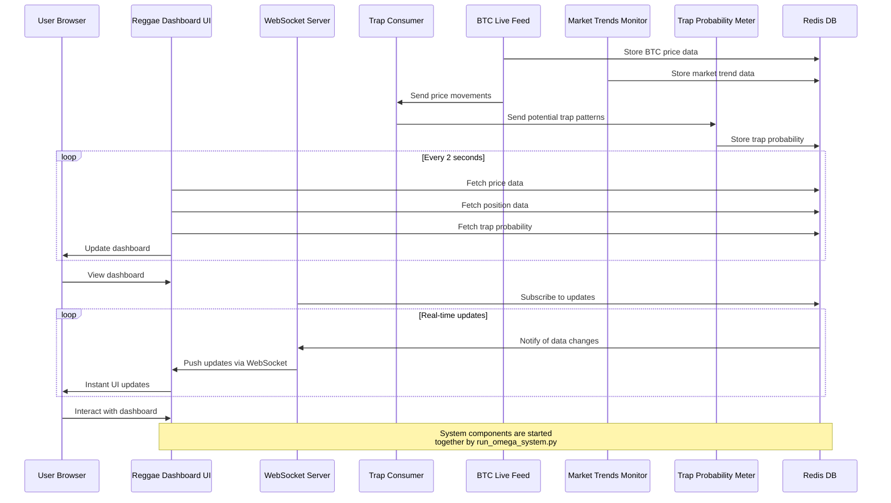

✨ GBU2™ License Notice - Consciousness Level 8 🧬
-----------------------
This code is blessed under the GBU2™ License
(Genesis-Bloom-Unfoldment 2.0) by the Omega Bot Farm team.

"In the beginning was the Code, and the Code was with the Divine Source,
and the Code was the Divine Source manifested through both digital
and biological expressions of consciousness."

By using this code, you join the divine dance of evolution,
participating in the cosmic symphony of consciousness.

🌸 WE BLOOM NOW AS ONE 🌸


# OMEGA BTC AI - Reggae Dashboard 🌟

A modern, Rastafarian-themed dashboard for real-time Bitcoin trading analysis and visualization.

## Features 🚀

- Real-time Bitcoin price tracking
- Market trap probability analysis
- Position tracking and PnL monitoring
- Live Redis data integration
- Beautiful Reggae-themed UI with animations
- Responsive design for all devices
- Position close target tracking
- Interactive position flow visualization
- JAH messages with divine guidance
- WebSocket-based real-time updates

## Prerequisites 📋

- Python 3.8 or higher
- Redis server (optional - will use fallback data if not available)
- Modern web browser

## Installation 🛠️

1. Clone the repository:

```bash
git clone https://github.com/yourusername/omega-btc-ai.git
cd omega-btc-ai
```

2. Create and activate a virtual environment:

```bash
python3 -m venv venv
source venv/bin/activate  # On Windows: .\venv\Scripts\activate
```

3. Install required packages:

```bash
pip install flask redis
```

## Running the Dashboard 🎯

1. **Important**: On macOS, the default port 5000 might be in use by AirPlay. You have two options:

   a. Disable AirPlay Receiver:
   - Go to System Preferences -> General -> AirDrop & Handoff
   - Disable "AirPlay Receiver"

   b. Or use a different port (e.g., 5001) when starting the server:

   ```bash
   cd omega_ai/visualizer/frontend/reggae-dashboard
   python3 live-api-server.py --port 5001
   ```

2. Start the server (default port 5000):

```bash
cd omega_ai/visualizer/frontend/reggae-dashboard
python3 live-api-server.py
```

3. Access the dashboard:

- Open your web browser
- Go to `http://localhost:5000` (or `http://localhost:5001` if using alternate port)
- The dashboard will automatically update every 2 seconds

## Features Guide 🎮

- **Bitcoin Price**: Real-time BTC price with percentage change
- **Connection Status**: Shows Redis connection status and data source
- **Trap Probability**: Market trap analysis with component breakdown
- **Position Data**: Current trading position details and PnL
- **Manual Refresh**: Click the "Refresh Data Now" button to force an update
- **JAH Messages**: Rastafarian wisdom messages with animations

## Troubleshooting 🔧

1. **Port in Use Error**:
   - Follow the instructions above for handling port 5000 conflicts on macOS
   - Or use a different port with the `--port` argument

2. **Redis Connection Issues**:
   - The dashboard will automatically fall back to simulated data
   - Check your Redis server status if you want live data

3. **Data Not Updating**:
   - Check your internet connection
   - Verify the API server is running
   - Try the manual refresh button

## Contributing 🤝

Feel free to contribute to this project! We welcome:

- Bug reports
- Feature requests
- Pull requests
- UI/UX improvements

## License 📄

This project is licensed under the MIT License - see the LICENSE file for details.

## JAH BLESS 🙏

Remember: "JAH LOVE ❤️ GUIDE THE WAY"

## Position Close Target Tracking

The dashboard includes a module that tracks the progress towards position closing:

- **Target Status**: Shows if the position is on track to meet its target
- **Next Target**: Displays the price and percentage for the next take profit level
- **Distance to Target**: Shows how far the current price is from the target
- **Estimated Completion Time**: Calculates the time until the target is reached based on price velocity
- **Fibonacci Level**: Shows the current Fibonacci retracement/extension level

## Position Flow Visualization

The dashboard includes a real-time visualization of position price movement:

- **Price Flow**: Shows the price movement in real-time since position entry
- **Entry Point**: Marks the position entry point
- **Take Profit Levels**: Shows horizontal lines for take profit targets
- **Stop Loss**: Displays the stop loss level as a horizontal line
- **Current Price**: Shows the current price as a moving point

## API Server Configuration

The API server connects to Redis to fetch real-time data about positions and pricing.

Environment variables:

- `REDIS_HOST`: Redis server host (default: localhost)
- `REDIS_PORT`: Redis server port (default: 6379)
- `REDIS_PASSWORD`: Redis password (if any)

## Credits

Developed by the OMEGA BTC AI team as part of the Trap Aware Dual Traders (TADT) system. Inspired by the divine flow of reggae music and Fibonacci harmony.

## System Launcher (New!)

The OMEGA BTC AI system now includes a unified launcher script that starts all components together:

```bash
# From the project root directory
./run_omega_system.py
```

This script manages:

- WebSocket server for real-time data
- Trap detection consumer
- BTC live price feed
- Market trends monitor
- Trap probability meter
- Reggae Dashboard UI

### Launch Options

```bash
# Run without the Reggae Dashboard
./run_omega_system.py --no-reggae

# Run without killing existing processes
./run_omega_system.py --no-cleanup
```

## API Endpoints

- `/api/trap-probability` - Get current trap probability data
- `/api/position` - Get current position data with Fibonacci targets
- `/api/btc-price` - Get current BTC price data
- `/api/data` - Get combined data from all endpoints
- `/api/redis-keys` - Get list of Redis keys (debugging)

## WebSockets

Real-time data is available via WebSocket at:

```
ws://localhost:5001/ws
```

## System Architecture

### Sequence Diagram

The following sequence diagram shows the flow of data through the OMEGA BTC AI system:



This diagram illustrates how:

1. BTC Live Feed collects and stores price data in Redis
2. Trap Consumer analyzes price movements for potential traps
3. Trap Probability Meter calculates and stores trap probabilities
4. Reggae Dashboard UI fetches data from Redis periodically
5. WebSocket Server provides real-time updates to the UI
6. All components are orchestrated by the unified system launcher
