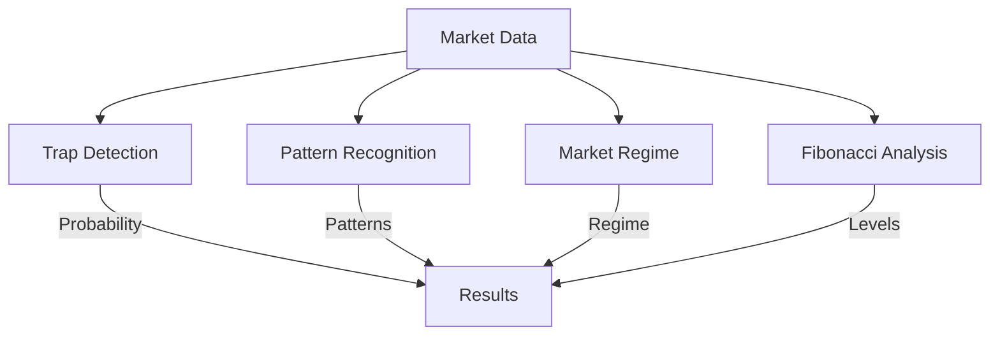

# AIXBT Neural Analysis Model

## Overview

The AIXBT interface integrates multiple AI models for market analysis:

1. Trap Detection Model
2. Pattern Recognition Network
3. Market Regime Classifier
4. Fibonacci Sequence Analyzer

## Model Architecture

### 1. Trap Detection Model

Multi-component neural network that analyzes:
- Price patterns (25%)
- Volume spikes (20%)
- Fibonacci levels (15%)
- Historical matches (15%)
- Order book imbalances (15%)
- Market regime context (10%)

### 2. Pattern Recognition Network

Convolutional neural network trained on:
- Historical price data
- Volume profiles
- Market microstructure
- Order flow patterns

Features:
- Multiple timeframe analysis
- Pattern confidence scoring
- Real-time pattern detection
- Correlation analysis

### 3. Market Regime Classifier

LSTM network for market state classification:
- Trending vs ranging
- Momentum analysis
- Volatility regimes
- Market psychology

### 4. Fibonacci Sequence Analyzer

Specialized neural network for:
- Golden ratio detection
- Price level alignment
- Harmonic patterns
- Support/resistance zones

## Data Flow

## Model Training

### Data Sources
- Historical BTC price data
- Order book snapshots
- Trade flow records
- Market maker activity

### Training Process
1. Feature engineering
2. Model training
3. Cross-validation
4. Performance testing
5. Live validation

## Model Updates

- Real-time parameter updates
- Adaptive learning
- Performance monitoring
- Auto-optimization