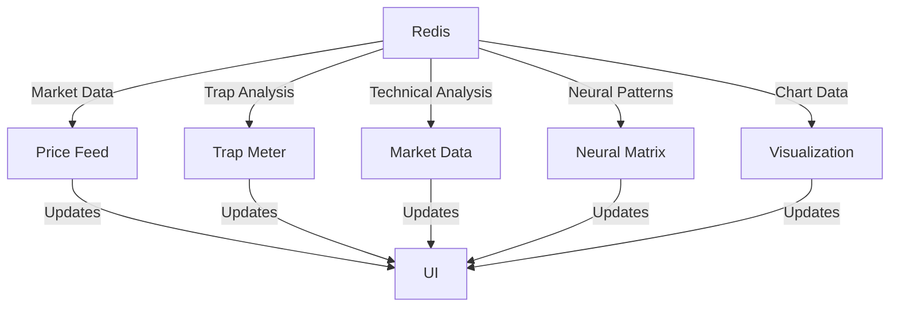

# AIXBT Interface Architecture

## Overview

The AIXBT Interface is built using a modular component architecture:

```
aixbt_interface/
├── components/             # UI Components
│   ├── redis_manager.py   # Redis connection management
│   ├── price_feed.py      # Price visualization
│   ├── trap_meter.py      # Trap detection display
│   ├── market_data.py     # Market analysis
│   ├── neural_matrix.py   # Neural pattern analysis
│   └── visualization.py   # Advanced charting
├── app.py                 # Main Gradio interface
└── start_aixbt.py        # Entry point script
```

## Component Architecture

### Redis Manager (redis_manager.py)
- Connection pooling and fallback
- Data serialization
- Real-time pub/sub
- Health monitoring

### Price Feed (price_feed.py)
- Real-time price updates
- Volume analysis
- Price chart visualization

### Trap Meter (trap_meter.py)
- Probability calculation
- Component breakdown
- Pattern detection
- Historical tracking

### Market Data (market_data.py)
- Technical indicators
- Order book analysis
- Volume profiling
- Support/resistance levels

### Neural Matrix (neural_matrix.py)
- Pattern recognition
- Market regime detection
- Correlation analysis
- Fibonacci alignment

### Visualization (visualization.py)
- Multi-timeframe charts
- Pattern highlighting
- Volume analysis overlay
- Order flow visualization

## Data Flow



## Redis Key Structure

### Market Data
- `btc_market_data`: Current market state
- `btc_price_history`: Historical prices
- `btc_market_analysis`: Analysis results
- `btc_visualization_data`: Chart data

### Trap Detection
- `current_trap_data`: Current analysis
- `trap_probability_history`: Historical data

### Neural Analysis
- `btc_neural_analysis`: Pattern analysis
- `btc_pattern_correlation`: Correlations
- `btc_regime_data`: Market regime

## Update Cycle

1. Redis receives new market data
2. Components subscribe to relevant keys
3. Async updates trigger UI refresh
4. Components render new visualizations
5. UI updates without page reload

## Error Handling

- Redis connection fallback
- Component error isolation
- Graceful degradation
- Error logging and reporting

## Performance Optimization

- Connection pooling
- Data serialization
- Async operations
- Memory management
- Cache optimization